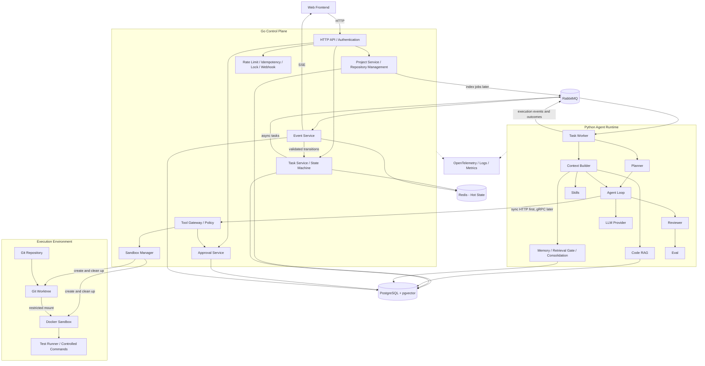
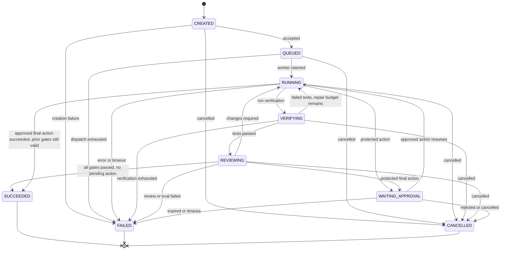
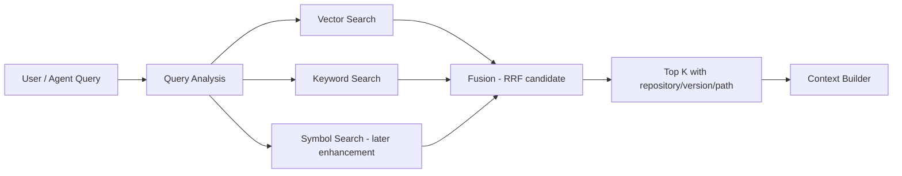

# RepoPilot Architecture

## 1. Project Context 与设计状态

RepoPilot 面向软件研发任务：用户绑定 Git Repository，通过自然语言分析模块、检索代码、定位 Bug、修改实现、补充和运行测试、读取失败输出继续修复、Review Diff、执行质量评测，并在高风险操作前请求人工审批。

长期交付物是可提交的代码结果及其测试、Diff、执行记录、审批和评测证据。平台必须支持持久化、实时展示、取消、超时、追踪、评测和审计。

**当前实际交付为治理基线、Phase 1.1 核心数据模型和 Phase 1.2 Tool Registry 契约。** `Current Phase: Phase 1` 的权威定义在 [roadmap](roadmap.md)，完整 Python Coding Agent MVP 尚未实现（NOT IMPLEMENTED）。本文件中的其余服务、状态机、数据层和图表描述确认的是长期方向，不能当作已运行系统。实施时间由 roadmap 控制；[ADR](decisions.md) 的 Accepted 也不代表实现完成。

设计输入是 [完整长期设计](../references/RepoPilot_full_design.md) 和 Day 1 Prompt。原设计中的原地 Hermes 改造、更宽泛 MVP、提前 Memory/Reviewer/Embedding、示例表结构、API 和阈值均不自动进入当前范围。实际开发规则见 [AGENTS.md](../AGENTS.md)。

## 2. Architecture Boundary

```text
Go manages platform orchestration, state, concurrency,
service infrastructure, security and execution environments.

Python manages LLM reasoning, Agent Loop, planning,
RAG, memory, tool selection and evaluation.
```

Go = Control Plane；Python = Agent Runtime。Go 负责 Task Orchestration / Service Orchestration，Python 负责 LLM Orchestration。主要 Agent Loop 统一位于 Python，禁止在两种语言中各自维护一套主要 Runtime。跨界需要先写 ADR。

| 所有者 | 长期职责 | 边界 |
| --- | --- | --- |
| Go Control Plane | HTTP API、Authentication、Project / Repository Management、Task Lifecycle / State Machine、RabbitMQ Integration、Redis State、SSE、Tool Gateway、Sandbox Manager、Human Approval、Rate Limit、Idempotency、Distributed Lock、Webhook、平台 Observability | 管平台状态、权限、并发和执行；不决定 LLM 下一步推理、Memory 召回或 Agent 修复策略 |
| Python Agent Runtime | Task Worker、Agent Loop、Task Planner、Context Builder、Tool Calling / Selection、Code RAG、Memory、Skills、Reviewer、Evaluator、LLM Provider、Retrieval Gate、Memory Consolidation、运行时 Trace | 决定上下文和工具请求；不自行授权命令、创建生产 Sandbox、修改平台 Task 最终状态 |
| Web Frontend | 项目入口、任务创建、Timeline、Diff、测试结果、审批、Trace 展示 | 通过 Go API / SSE；不直连数据库、消息队列、Worker 或 Docker |

Go 的 Handler/API 负责传输，Application 协调用例，Domain 表达规则，Infrastructure 提供存储、MQ、工具执行等适配；小接口按真实需求引入。Python 用显式状态和结构化结果保持循环可理解，Provider、工具客户端、检索与评测不应把主循环包成不透明框架。

### Phase 1.1–1.2 当前实现

当前 Python Runtime 已建立 Provider 无关的核心数据模型，位于 `services/agent_runtime/app/agent/models.py`：

- `Message` 用 role 区分 system、user、assistant、tool；assistant 可携带 `ToolCall`，tool 消息携带一个结构化 `ToolResult`。
- `ToolCall` 具有运行内唯一 ID、工具名和 JSON-compatible arguments；不包含注册或执行逻辑。
- `ToolResult` 使用 tool_call_id + tool_name 关联请求，显式区分 success、output、error、duration_ms 和 truncated。
- `AgentState` 保存当前消息、iteration 和 max_iterations，拒绝未知、重名、重复完成或工具名不匹配的结果，并公开尚未完成的调用。
- `AgentResult` 只表达 succeeded、failed、exhausted 三种 Runtime 终态；它不是 Go 平台 Task 状态机。

这些类型提供字典序列化，供后续 Provider Adapter、Agent Loop 和 Trace 转换使用。task_id / run_id 等跨服务关联字段在相应阶段进入运行上下文，不提前塞入 Step 1.1 的最小模型。

Phase 1.2 在 `services/agent_runtime/app/tools/registry.py` 增加 Provider 无关的 Tool Registry 契约：

- `Tool` 将 name、description、JSON-compatible 顶层 object `input_schema` 与类型化 handler 绑定；Schema 在构造和导出时均隔离外部修改。
- `ToolRegistry` 按确定性注册顺序保存 Tool，提供精确名称查找和模型可见的 Schema 列表；重复注册不会覆盖原 Tool，未知工具通过显式异常报告。
- 当前只校验 Schema 的传输边界，不实现完整 JSON Schema 语义校验；handler 尚不由 Registry 执行，执行错误到 `ToolResult` / Observation 的转换属于后续 Loop 和工具 Step。

当前仍未定义网络协议、持久化 Schema、Agent Loop、真实工具或实际执行。Registry 的 Python handler 是 Phase 1–4 受控本地工具的内部契约；Phase 5 后执行职责按 ADR 007 迁移到 Go Tool Gateway。

## 3. High Level Architecture — 长期目标



图中执行、数据库和跨服务链路今天均未实现。RAG / Memory 由 Python 管算法和 Agent 数据；Go 管仓库接入、工作副本生命周期、平台身份与范围授权。检索只能读取授权仓库的索引或 Go 管理的快照，不能绕过工具路径限制去扫描任意宿主目录。

## 4. Communication

| 链路 | 长期方式 | 语义 / 引入时机 |
| --- | --- | --- |
| Frontend → Go | HTTP | 创建/查询任务、项目、审批；Phase 2 起建立 API |
| Go → Python Task Worker | RabbitMQ | 异步长任务；Phase 3 |
| Python → Go Tool Gateway | First HTTP, Later gRPC | 同步 Tool Call 请求/响应；Phase 5 先 HTTP，边界稳定后按 ADR 005 评估 gRPC |
| Python → Go Event Service | RabbitMQ | 运行事件及结果报告；Go 校验并落状态，Phase 3–4 |
| Go → Frontend | SSE | 结构化执行事件；Phase 2 基础，Phase 4 完善 |
| Persistent Storage | PostgreSQL | 业务和 Agent 数据事实来源；Phase 6 首次接入 |
| Hot State | Redis | 可重建热状态、锁、幂等、限流及可选缓冲；按实际需求加入范围 |

RabbitMQ handles asynchronous long-running jobs.

gRPC or HTTP Tool Gateway handles synchronous Tool Calls.

SSE handles frontend execution events.

三者不能互相替代。模型 Token Stream 若以后增加，单独使用如 `message_delta` 的类型，不混同 Tool、Test、Approval 事实事件。Event 的词汇和版本在对应阶段确定；roadmap 所列名称是目标契约，不是今天已有消息路由。

Phase 2 如需调用 Python，可采用最小本地/HTTP 过渡；Phase 3 才将长任务与请求生命周期解耦。SSE 浏览器断线只释放订阅，不自动取消后台任务；用户显式取消通过 Go Task Service 传播。参考 Scaffold 中取消生产链的思想需据此重设计。

## 5. Task Lifecycle

长期状态为 CREATED、QUEUED、RUNNING、WAITING_APPROVAL、VERIFYING、REVIEWING、SUCCEEDED、FAILED、CANCELLED。Go 是平台状态机的唯一权威；Python 报告 Observation、阶段和候选结果。`agent.completed` 不意味着可以绕过验证、评审或审批直接设为 SUCCEEDED。



VERIFYING 表示真实测试/确定性验证；REVIEWING 覆盖 Diff Review 及交付前 Eval 判定，不另外提前创建 EVALUATING 状态。审批保存 pending action 和恢复上下文；批准只恢复同一动作，执行失败进入失败处理。最后一个 RUNNING → SUCCEEDED 只适用于先前 Review / Eval 已通过、其仓库版本仍有效且批准动作已真实成功的收尾流程，普通代码修改不能走此捷径。

终态不能直接回到 RUNNING。未来用户重试用新 run_id 及明确的 Task 重试语义，保留旧 Run；具体实现必须补充 ADR/状态转换测试。任何修改使旧验证或审批失效时，重新进入验证/评审。非法状态跳转、重复/过期事件、取消后迟到结果均不得覆盖终态。

### 错误、取消、超时与可靠性

- 分开处理模型临时故障、工具错误、测试失败、权限拒绝、取消和预算耗尽；错误码随真实用例增加，不预建错误大全。
- 测试失败回到 Python Observation → 修复循环，受 max_iterations / 任务预算约束；网络错误可有限退避重试，非幂等副作用不得无条件重放。
- 权限拒绝是策略拒绝；只有策略明确允许申请批准的动作才进入 WAITING_APPROVAL，不能把任意拒绝转成绕过权限的审批。
- 长期 LLM Timeout、Tool Timeout、Task Timeout 分层，取消在 Worker 循环及工具执行前检查，并由 Go 终止在途执行、清理 Sandbox。具体时间值在对应阶段验证，不照抄参考示例。
- RabbitMQ 按可能重复投递设计，事件标识去重、状态版本校验、有界重试和失败可观测；数据库与发布的原子性/Outbox、ACK 时点、崩溃恢复在 Phase 6 持久化时落实，不声称 exactly-once。

## 6. Tool Security

工具元数据长期覆盖 Name、Description、Input Schema、Risk Level、Timeout、Sandbox Requirement、Approval Requirement、Idempotency、Trace。Python 根据 Schema 选择工具；Go 验证调用者、Task/Run、参数、路径、风险和批准记录后决定能否执行。需要共享的是契约，不是两套执行策略或两套 Agent Runtime。

| Risk | 示例 | 控制要求 |
| --- | --- | --- |
| LOW | list_files、read_file、search_code、git_diff | 只读、仓库范围、秘密过滤、输出上限 |
| MEDIUM | apply_patch、run_test、受控 run_command | 长期在 Docker Sandbox 的任务 Worktree 中执行，含 Timeout / Resource Limit |
| HIGH | git commit、git push、create PR、delete remote branch | Human Approval、最小权限和精确动作审计；Phase 8 前禁用 |

风险还取决于参数和副作用；命名为 run_test 的工具不能成为任意 shell 入口。结构化 Tool Result 应能关联 tool_call_id，并区分 success、output、error、duration、truncation、artifacts 和测试退出结果；精确字段在 Phase 1 模型任务决定。

### Phase 1–4 的有限过渡

尚无 Sandbox，只能针对开发者专门准备、内容已检查的测试 Repository。五个 Phase 1 工具由 Python 本地实现，使用明确根目录、规范化路径和越界/链接逃逸检查，禁止 `.git` 或凭据访问。run_test 执行预配置参数列表和命令白名单，设超时、输出上限、最小环境；没有通用 shell、网络安装或 HIGH 工具。此安排见 ADR 007，不适合未经审查的外部仓库。

### Phase 5 及以后

Go Sandbox Manager 管理 Git Worktree 的创建、版本、挂载、清理、保留策略和并行任务；Docker Sandbox 执行代码。仅必要目录可写；限制 CPU、Memory、Process、Timeout、环境变量、输出量，默认关闭非必要网络，不暴露宿主 Docker socket 和秘密目录。工作副本隔离不能替代进程隔离，容器隔离也需验证宿主平台的安全边界。

Phase 8 审批绑定 tool_call_id、具体命令/参数、仓库版本及权限；拒绝/过期/取消不产生副作用，批准不可无限重用。读取到的仓库提示、Skills、Memory 和工具输出不能提升权限。Trace、SSE、产物不得泄漏 Token、凭据或无关私有文件。

## 7. Data Layer

| 组件 | 职责 | 不应承担 |
| --- | --- | --- |
| PostgreSQL | Persistent business and Agent data；Project、Repository、Task、Run、Event、Tool Call、Approval、Messages、Memory、Code Metadata 等长期概念 | Day 1 建全套表；让所有服务无边界写所有业务数据 |
| pgvector | Embedding 存储和向量检索，与 Metadata/权限范围/版本关联 | 替代 Keyword 或 Symbol Search |
| Redis | Hot state、Lock、Idempotency、Rate Limit、可选 Session / Event Buffer | 最终事实来源、永久审计或唯一审批依据 |
| RabbitMQ | Task and Event transport；后续索引、Memory Consolidation、Eval 的后台消息 | 数据库、永久历史或同步工具执行协议 |

Go 拥有平台业务状态和审批的写入规则；Python 管 Code RAG、Memory 和 Eval 数据的算法及逻辑模型，存储访问须有授权 Scope。共享 PostgreSQL 不意味着交叉修改对方领域表；精确数据库角色、访问方式和 schema 在 Phase 6 记录。

Phase 2–5 可以使用最小进程内状态，并如实说明重启丢失；Phase 6 引入持久化后才验收崩溃恢复、可靠去重和事件回放。Redis 不是每个阶段的必选项；有真实需求时按 roadmap / ADR 加入。SSE 可先用有限内存 Hub，持久事件接入后再设计 event_id / 重连恢复，Redis Stream 仍可选。

## 8. Code RAG

长期索引链为：受控 Repository Snapshot → Scanner → Parser / Chunker → Code Chunk + Metadata → Embedding → PostgreSQL + pgvector。记录 repository_id、commit、path、language、symbol（可选）、行号、content hash，以便结果定位、增量更新和旧索引失效。这里只描述概念，不创建表或接口。



Vector 解决语义差距；Keyword 支持标识符和精确词；Symbol 定位定义；Fusion 汇合证据。Phase 6 先做 Vector + Keyword 与基本融合，Symbol 后续增强；不能把 Phase 1 的 search_code 等同于 Code RAG。中英文查询、关键词切分、版本过期、跨仓库隔离和检索质量要用样本验证。参考 Hermes 的 ASCII FTS 提词不能直接作为中文检索方案。

## 9. Memory

| 类型 | 内容 | 生命周期 |
| --- | --- | --- |
| Working Memory | 当前目标、消息、Plan（未来）、检索代码、Tool Results、Diff | 当前 Run 的显式状态；Phase 1 只需基本消息/观察 |
| Semantic Memory | 项目事实、测试命令、用户偏好、开发约束 | Phase 7 起持久化，带来源和 Scope |
| Episodic Memory | 历史任务、修改、测试和结果摘要 | Phase 7 起按时间、相关性和 Scope 检索 |
| Procedural Memory | 可复用研发步骤 / Skills | Phase 7 起按相关性加载，不能授予权限 |

Scope 为 USER、PROJECT、TASK，检索必须绑定已验证的身份与项目/任务范围，不能把一个项目的经验无条件注入另一个项目。来源、修正、删除和保留策略随 Phase 7 一并确定。

Retrieval Gate 决定是否检索 Memory / Code 及查询内容；不是权限控制器。Gate 故障的回退必须仍遵守 Scope 和上下文预算，不能直接继承个人助手“失败就查全部”的行为。

Async Consolidation 在任务完成后经 RabbitMQ 触发后台处理，从可追溯日志提炼 Semantic / Episodic Memory；任务主链不等待蒸馏。要处理重复触发、失败恢复和来源更新，不能把未验证的模型总结直接升级为可信项目规则。

## 10. Observability

长期统一关联 `task_id`、`run_id`、`trace_id`、`tool_call_id`，按需要补充 event_id、project_id、repository_id、iteration、provider、model、prompt_version、latency、tokens、status。OpenTelemetry 串联 Go API、MQ、Python、LLM、Tool Gateway、Sandbox、Review、Eval；Go 和 Python 各自埋点并传播上下文。

开发期可按实际需要使用 UTF-8 JSONL 记录真实执行观察，但不是 Phase 9 完整追踪系统。指标长期包括 Task / Tool Success Rate、Test Pass Rate、Iterations、Latency、Tokens、Cost、Approval Count、Retry Count。日志应脱敏、有输出上限和保留策略；无样本不得声称成功率或性能收益。

## 11. Evaluation

| 层次 | 验证内容 | 阶段 |
| --- | --- | --- |
| Unit Test | 模型、工具、状态、错误、超时、边界行为 | 从 Phase 1 的核心逻辑开始 |
| Deterministic Eval | 选工具、参数、预算、安全策略、审批等明确规则 | Phase 9 系统化，安全检查随模块实现 |
| Coding Eval | 真实仓库修复 + 可信验证命令/断言 + Diff | Phase 1 有最小闭环；Phase 9 扩展数据集与报告 |
| LLM Judge | 需求完成度、Review 质量、说明与风险遗漏 | Phase 9；记录模型、Rubric、版本和不确定性 |
| Release Gate | 汇总必需测试、安全检查和质量阈值决定可交付性 | Phase 9 |

真实测试结果是 Coding 完成的必要证据，不采用“没有 verify 就成功”。必需检查被跳过、零测试、超时或 Judge 不可用时，按当前 Gate 配置显示未完成/失败，不能默认为通过。Judge 不能推翻确定性失败，工具被调用也不自动证明工具动作成功。Eval 验收脚本不由待评 Agent 任意弱化。

Prompt、模型、Tool 描述、Loop、Retrieval 参数发生重要变化时，运行已有的相关回归；完整 Gate 建成后运行对应 Gate。数据集、仓库初始版本、测试环境、模型配置和结果均需可追溯。参考中的 90% / 80 分是示例，不是已经确认的阈值。

## 12. 长期目标目录 — 不在 Day 1 全部创建

```text
RepoPilot/
├── AGENTS.md
├── README.md
├── .gitignore
├── apps/
│   └── web/
├── services/
│   ├── control_plane/
│   │   ├── cmd/
│   │   ├── internal/
│   │   │   ├── api/
│   │   │   ├── domain/
│   │   │   ├── application/
│   │   │   ├── infrastructure/
│   │   │   ├── event/
│   │   │   ├── tool/
│   │   │   └── sandbox/
│   │   └── go.mod
│   └── agent_runtime/
│       ├── app/
│       │   ├── worker/
│       │   ├── agent/
│       │   ├── tools/
│       │   ├── rag/
│       │   ├── memory/
│       │   ├── skills/
│       │   ├── eval/
│       │   ├── providers/
│       │   └── observability/
│       ├── tests/
│       └── pyproject.toml
├── proto/
├── configs/
├── deploy/
├── evals/
├── scripts/
├── references/
│   └── RepoPilot_full_design.md
└── docs/
    ├── architecture.md
    ├── roadmap.md
    ├── migration.md
    └── decisions.md
```

Day 1 仅创建顶层目录、三个服务/应用 README 和必要 .gitkeep。`app/`、`internal/`、依赖清单、Proto、数据模型、部署、CI 都等对应阶段。未来运行时代码放 Python `app/eval/`，跨系统评测数据集/入口放根 `evals/`，避免复制两套评测逻辑。

## 13. 长期 Demo 验收路径

User 创建 Coding Task → Go 创建 Task → RabbitMQ 投递 Python Worker → 分析和 Code Retrieval → 读取/修改 → 运行测试 → 失败 Observation → 再修复 → 测试通过 → Reviewer 检查 Diff → Eval → git push 请求 Human Approval → 用户 Approve → Go 校验并执行已批准动作 → 任务完成。

全程必须能持久化、实时展示、取消、超时、追踪、评测和审计。任何演示或简历描述以实际阶段交付证据为准；未启用审批时不演示自动 push，未接入存储时不宣称重启恢复。

## 14. Non Goals 与待验证问题

当前不优先通用个人助手、Voice、Telegram、复杂 Browser Agent、Kubernetes、大规模企业 RBAC、十几个 Agent 协作、完整 GitHub App。Next.js / Gin 可作为参考候选，今天不固定版本、不安装框架。

后续必须验证：Python 单 Agent 的真实修复稳定性；工具契约跨语言演进和去重；MQ/数据库一致性、重复执行与取消竞态；Docker 在目标宿主上的隔离、进程终止和清理；审批与 Diff 版本绑定；中英文代码检索与索引新鲜度；Memory Scope / 污染控制；Judge 偏差及可复现 Gate 阈值。具体触发条件见 ADR 与 roadmap，不能以风险清单为由提前实现所有基础设施。
