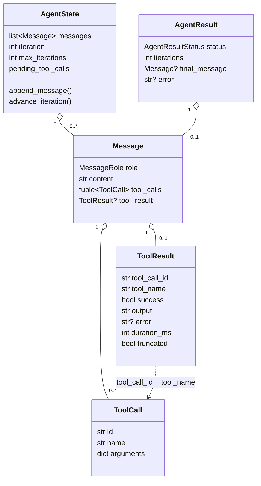
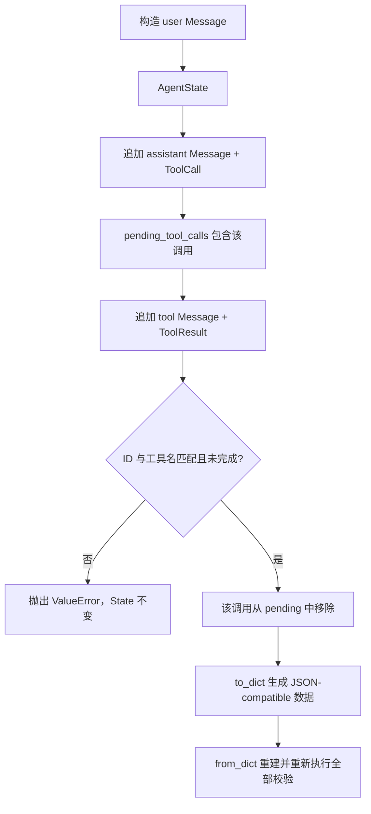

# Step 1.1 — Core Runtime Data Models

## 1. Step Overview

- **Current Phase**：Phase 1 — Python Coding Agent MVP。
- **Current Step**：Phase 1.1 — Core Runtime Data Models。
- **Step Status**：实现和本地验证已完成，等待用户验收；roadmap 尚未推进到 1.2。
- **目标**：用一组 Provider 无关、可序列化且能拒绝矛盾状态的数据模型，定义 Agent Loop 未来处理的数据语言。
- **新增能力**：代码现在能表达四种消息角色、模型发起的工具调用、工具的成功或失败结果、当前循环状态，以及成功/失败/迭代耗尽三种终态。

Phase 0 只有治理文档和目录。Step 1.1 是第一块运行时代码。下一 Step 1.2 会用 `ToolCall.name` 和 `arguments` 定义 Tool Registry 契约；Step 1.3 才会真正运行循环并把 `ToolResult` 作为 Observation 放回 `AgentState`。当前没有 Registry、Loop、工具或模型调用。

## 2. Problem

Agent Loop 表面上是一个 while / for 循环，真正容易失控的是循环中流动的数据。如果直接使用某家 LLM SDK 的 dict 或内容块，后续会出现这些问题：

- Provider 更换时，Loop、工具和测试同时被迫修改。
- 工具返回字符串后，无法稳定判断它对应哪一次调用、是否成功、是否被截断。
- “达到最大迭代数”和“Agent 正常完成”都可能变成普通文本，调用方无法可靠区分。
- 恢复或反序列化历史时，未知 ToolResult、重复结果和工具名不匹配可能悄悄污染上下文。
- 任意 Python 对象进入 tool arguments 后，直到发送 JSON 时才失败，错误位置离根因很远。

Step 1.1 把这些风险收敛到模型构造边界。后续代码拿到对象时，可以依赖它已经满足基本不变量。

## 3. Design

### 3.1 核心对象关系



### 3.2 角色与载荷规则

| MessageRole | 允许的载荷 | 拒绝的状态 |
| --- | --- | --- |
| `system` | 非空文本 | 空文本、ToolCall、ToolResult |
| `user` | 非空文本 | 空文本、ToolCall、ToolResult |
| `assistant` | 非空文本、一个或多个 ToolCall，或两者同时存在 | 文本和调用都为空、ToolResult、同一消息内重复 call ID |
| `tool` | 恰好一个 ToolResult | 文本、ToolCall、缺少 ToolResult |

内部模型不使用 Anthropic 或 OpenAI 的消息类。未来 Provider Adapter 负责在内部结构和厂商协议之间转换。

### 3.3 ToolCall 与 ToolResult

`ToolCall.id` 是一次调用的关联键，`name` 是 Registry 查找键，`arguments` 只允许 JSON-compatible 值。构造时会递归复制参数，避免调用者随后修改原始 dict 影响已创建对象。

`ToolResult` 同时保存 `tool_call_id` 和 `tool_name`。ID 负责精确关联，工具名提供额外一致性校验和可读性。`success=True` 时不能有 error；`success=False` 时必须有非空 error。`output` 可以在成功或失败时存在，因为测试失败的 stdout/stderr 正是下一轮修复需要的 Observation。

`duration_ms` 和 `truncated` 是当前就有明确语义的执行事实：前者不得为负数，后者告诉 Agent 输出是否因上限被截断。Step 1.1 没有提前加入 artifact、risk、approval 或 trace 等未来字段。

### 3.4 AgentState 与 AgentResult

`AgentState` 是一个 Loop Invocation 的可变 Working State：

- `messages` 保存规范化的对话和 Observation。
- `iteration` 表示已经进入的迭代次数，从 0 开始。
- `max_iterations` 是正整数预算。
- `pending_tool_calls` 从完整 transcript 计算尚无结果的调用。

`AgentResult` 是 Python Runtime 的终态，不是 Go Task 状态机。三种状态互斥：

| 状态 | 必需数据 | 禁止数据 | 含义 |
| --- | --- | --- | --- |
| `succeeded` | 最终 assistant 纯文本 Message | error、仍带 ToolCall 的最终消息 | Loop 正常产生最终回答 |
| `failed` | 非空 error | final_message | Provider、协议或运行时错误使执行失败 |
| `exhausted` | 至少一次 iteration | final_message、error | 没有运行时异常，但迭代预算用完，不能冒充成功 |

## 4. Execution Flow

当前 Step 没有执行 Agent Loop。真实存在的数据流是模型构造、消息追加和序列化：



未来 Step 1.3 会在每次模型调用前使用 `advance_iteration()`，把 assistant ToolCall 和对应 ToolResult 依次追加到 State。当前只提供这些操作的模型边界，没有写 Loop 控制流。

## 5. File Changes

| 文件 | 职责 | 协作关系 |
| --- | --- | --- |
| `services/agent_runtime/app/__init__.py` | 标记 Runtime Python package | 允许从服务目录导入 `app` |
| `services/agent_runtime/app/agent/__init__.py` | 导出 Step 1.1 公共类型 | 后续 Registry / Loop 通过这里使用稳定名称 |
| `services/agent_runtime/app/agent/models.py` | 五个核心模型、两个 Enum、校验与字典序列化 | 当前唯一业务实现文件 |
| `services/agent_runtime/tests/__init__.py` | 标记测试 package | 支持标准库 unittest discovery |
| `services/agent_runtime/tests/test_models.py` | 17 个构造、关联、序列化和边界测试 | 只依赖真实模型和 Python 标准库 |
| `docs/architecture.md` | 记录当前已确认的数据边界 | 区分 Runtime 终态与 Go Task 状态 |
| `docs/roadmap.md` | 保持 Step 锁，记录等待验收状态 | 没有推进到 1.2 |
| `docs/migration.md` | 记录从 Hermes 采用的思想及重设计 | 明确没有复制源码 |
| `README.md`、`services/agent_runtime/README.md` | 如实更新 Implemented / NOT IMPLEMENTED | 不宣称完整 Agent 可运行 |

`docs/decisions.md` 没有修改，因为本 Step 落实已有 ADR 002 / 003，没有新增长期架构选择或依赖。

## 6. Core Code Walkthrough

### 6.1 工具结果的不变量

核心逻辑位于 `ToolResult.__post_init__`：

```python
if self.success:
    if self.error is not None:
        raise ValueError("a successful ToolResult must not contain an error")
else:
    _require_non_empty(self.error, "a failed ToolResult.error")
```

这里没有根据 `output` 是否为空推断成功。许多有效工具执行可能没有 stdout；反过来，失败测试通常有非常重要的输出。`success` 是明确状态，`error` 是失败摘要，`output` 是 Observation 内容，三者职责不同。

### 6.2 工具调用关联

`AgentState._pending_calls` 顺序扫描 transcript：

```python
for call in message.tool_calls:
    if call.id in seen_ids:
        raise ValueError(...)
    seen_ids.add(call.id)
    pending[call.id] = call

result = message.tool_result
call = pending.get(result.tool_call_id)
if call is None:
    raise ValueError(...)
if call.name != result.tool_name:
    raise ValueError(...)
del pending[result.tool_call_id]
```

`seen_ids` 保证同一 Run 的 call ID 永不复用；`pending` 只保存尚未收到结果的调用。收到结果时，先查 ID，再比较名字，最后删除。第二个相同结果会因 ID 已不在 pending 中被拒绝。

`append_message` 先在候选列表上完成整段校验，再修改原列表：

```python
candidate = [*self.messages, message]
self._validate_transcript(candidate)
self.messages.append(message)
```

因此无效追加不会让 State 处于半更新状态。测试专门验证了这一点。

### 6.3 迭代预算

```python
if self.is_exhausted:
    raise RuntimeError("agent iteration limit is exhausted")
self.iteration += 1
return self.iteration
```

`iteration >= max_iterations` 表示已经用完预算。检查发生在递增前，保证最多成功进入 `max_iterations` 次，下一次立即失败。它只管理计数，不在本 Step 决定调用 Provider 或生成结果。

### 6.4 明确终态

```python
AgentResult.succeeded(final_message, iterations)
AgentResult.failed(error, iterations)
AgentResult.exhausted(iterations)
```

三个命名构造器让未来 Loop 的退出路径直接对应一个状态。最终仍由 `__post_init__` 校验，因此直接调用 dataclass 构造器或 `from_dict` 也不能绕过不变量。尤其是 exhausted 不携带伪造的最终回复；调用方必须把它当作非成功结果。

### 6.5 序列化边界

所有核心对象都提供显式 `to_dict` / `from_dict`。不用 `dataclasses.asdict` 的原因是：Enum 要输出稳定字符串、嵌套模型要重新执行自己的规则、字段格式需要显式可读。`from_dict` 并不信任输入，重建对象时会再次运行构造校验。

## 7. Key Concepts

### dataclass

`dataclass` 自动生成构造、比较和表示方法，适合字段清楚的数据契约。ToolCall、ToolResult、Message、AgentResult 使用 `frozen=True` 防止字段被重新赋值；AgentState 必须追加消息和推进迭代，所以保持可变。

`frozen=True` 是浅层冻结。ToolCall.arguments 内部仍是 dict；实现通过构造时和 `to_dict` 时深复制隔离常见的别名修改，但没有把嵌套集合改成完全不可变结构。这是当前最小实现的限制。

### str Enum

`MessageRole` 和 `AgentResultStatus` 同时继承 `str` 与 `Enum`，在代码中提供有限取值，在序列化时使用稳定的小写字符串。它避免散落的魔法字符串，也没有引入第三方验证库。

### Invariant

Invariant 是对象一旦构造成功就必须成立的条件，例如失败 ToolResult 必须有 error。将规则放在模型边界，比让每个 Loop 分支重复检查更可靠；反序列化、测试和未来适配器共用同一组规则。

### Correlation ID

`tool_call_id` 将异步语义上的请求与结果配对。即使 Step 1.1 还没有 MQ，它已经是 Tool Calling 的必要概念。只按工具名配对会在同一轮多次调用 `read_file` 时产生歧义，所以 ID 是主关联键，名称是额外一致性检查。

### Provider-neutral model

内部模型表达 RepoPilot 的业务语义，Provider Adapter 才处理厂商字段。这种 Anti-Corruption Layer 思路可以让核心 Loop 的测试不依赖 SDK，也让未来只替换适配器而不是整个运行时。

### Runtime state 与 Platform state

AgentState 管一轮 LLM 推理所需 Working State；AgentResult 是该 Runtime 调用的结果。CREATED / QUEUED / RUNNING / WAITING_APPROVAL 等长期 Task Lifecycle 属于 Go Control Plane。两类状态不能混成一个 Enum，否则 Python 会逐步接管平台职责。

## 8. Design Decisions

### 选择标准库 dataclass，而不是 Pydantic

备选方案是 Pydantic 或 TypedDict。Pydantic 有成熟验证和 JSON Schema，但 Step 1.1 不需要外部输入 API，也不值得为五个内部模型引入依赖。TypedDict 只做静态形状提示，运行时不能阻止矛盾状态。标准库 dataclass 保持依赖为零，代价是手写校验和序列化。

未来当模型成为稳定的 HTTP / MQ 公共协议，并且 schema 生成和严格解析产生真实收益时，可以重新评估 Pydantic；这需要对应阶段和依赖决策。

### Message 携带结构化 ToolResult，而不是字符串

字符串容易接入，但会丢失 success、error、duration 和 call 关联。结构化结果为 Observation、Trace、Timeline 和 Eval 提供共同事实。代价是 Provider Adapter 必须将其转换成厂商要求的 tool message 形式，这正是 Adapter 应承担的工作。

### AgentState 每次从 transcript 计算 pending calls

备选方案是额外维护 mutable pending dict。当前消息量很小，扫描的 O(n) 成本可忽略；从单一 transcript 推导可以避免两个状态源不一致。未来真实负载表明扫描成为问题时，才考虑缓存，并保持校验测试。

### exhausted 独立于 failed

耗尽是预算正常生效，不是 Provider 异常；它也绝不是成功。独立状态使上层可以给出“缩小任务或提高预算”的处理，同时不会把普通错误和预算控制混为一谈。

这些选择落实 ADR 002 / 003，不构成新的跨系统 ADR。

## 9. Error and Edge Cases

| 情况 | 当前行为 | 测试 |
| --- | --- | --- |
| 空 ToolCall ID / name | `ValueError` | 覆盖 |
| arguments 有非字符串 key、set、NaN / Infinity | `ValueError` | 覆盖 |
| 成功结果却有 error | `ValueError` | 覆盖 |
| 失败结果没有 error | `ValueError` | 覆盖 |
| duration 为负数 | `ValueError` | 覆盖 |
| Message role 与载荷矛盾 | `ValueError` | 四类典型矛盾已覆盖 |
| 同一 assistant 消息重复 call ID | `ValueError` | 覆盖 |
| 整个 State 中复用 call ID | `ValueError` | 覆盖 |
| ToolResult 引用未知或已完成 call | `ValueError` | 覆盖 |
| ToolResult 的工具名与 call 不同 | `ValueError` | 覆盖 |
| 无效 append 导致半更新 | 先验证后追加，State 保持原样 | 覆盖 |
| iteration 为 bool、负数或超过 max | `ValueError` | 关键边界覆盖 |
| 超预算继续 advance | `RuntimeError` | 覆盖 |
| success 没有最终 assistant 文本 | `ValueError` | 覆盖 |
| failed 没 error 或 exhausted 带 error | `ValueError` | 覆盖 |

当前不校验“所有 pending call 必须立即完成后才能出现下一条 user/assistant 消息”。某些 Provider 支持并行 ToolCall，严格的轮次顺序要在 Step 1.3 根据真实 Loop 协议确定，不能在数据层提前假设。

## 10. Testing

测试文件：`services/agent_runtime/tests/test_models.py`。

最终命令在 `services/agent_runtime/` 下执行：

```powershell
python -B -m unittest discover -s tests -v
```

最终结果：**17 tests，全部 PASS，最终全量运行耗时约 0.010 秒，Python 3.10.9。** `-B` 禁止生成 bytecode，避免当前受限环境无法创建 `__pycache__` 影响检查；测试仍真实导入并执行全部源码。

测试分组：

- ToolCall：JSON round-trip、输入深复制、无效 ID/name、非 JSON 数据。
- ToolResult：成功/失败 round-trip、互相矛盾的状态、负 duration。
- Message：四种角色 round-trip、载荷规则、重复调用 ID。
- AgentState：pending 推导、完整 State round-trip、未知/错名/重复结果、原子追加、迭代耗尽。
- AgentResult：三个命名构造器与 round-trip、成功最终消息约束、失败/耗尽差异。

首次运行有 16 项通过、1 项 error，原因是测试把 `options` 错写成序列化顶层字段；实现正确地将它保存在 `arguments.options`。修正测试读取路径后全量重跑通过，没有弱化断言。

额外实现检查原计划使用 `compileall`，但受限 Windows 环境拒绝创建 `__pycache__`，因此该命令不是有效代码结论。最终测试使用 `-B` 成功导入、解析并执行实现；后续文档一致性和 no-index whitespace 检查另行执行。

## 11. What I Should Be Able to Explain

1. 为什么 RepoPilot 不能直接让 Agent Loop 使用某个 LLM SDK 的 message 类型？
2. Message 四种 role 各自允许什么载荷，为什么 tool message 不再重复保存 content？
3. ToolCall 和 ToolResult 为什么既要 call ID，又要工具名？
4. 为什么失败 ToolResult 可以有 output，而且必须另有 error？
5. JSON-compatible arguments 的边界解决了什么问题？为什么拒绝 NaN？
6. AgentState 如何从 transcript 推导 pending calls？为什么当前不额外保存一份 pending dict？
7. `append_message` 为什么先验证候选列表，再修改原 State？
8. `iteration` 和 `max_iterations` 的边界语义是什么？最多能成功 advance 几次？
9. AgentResult 为什么要区分 succeeded、failed、exhausted？
10. 为什么 succeeded 要求一条没有 ToolCall 的最终 assistant 文本？
11. dataclass `frozen=True` 能保证多深的不可变性？当前 arguments 有什么限制？
12. `to_dict` / `from_dict` 为什么显式实现，而不是直接调用 `asdict`？
13. AgentState / AgentResult 与 Go Task Lifecycle 有什么不同？
14. 为什么本 Step 使用标准库 unittest 和 dataclass，没有引入 pytest / Pydantic？
15. Step 1.2 和 1.3 将分别如何使用这些模型，而当前为什么不提前实现？

## 12. Step Summary

Step 1.1 建立了 RepoPilot Python Runtime 的内部数据语言。最应掌握的内容是：用显式类型表达 Tool Calling；用 call ID 维护请求/结果关联；在模型边界拒绝矛盾状态；把迭代耗尽作为独立非成功终态；将 Provider 协议留在 Adapter 层。

当前代码只能构造、验证和序列化数据，不能注册或执行工具，也不能调用 LLM。用户验收并推进 Current Step 后，Step 1.2 将在这组模型之上实现最小 Tool Registry Contract。
