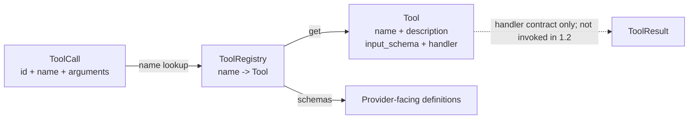

# Phase 1.2 学习笔记：Tool Registry Contract

## 1. Step Overview

- **Current Phase**：Phase 1 — Python Coding Agent MVP。
- **Current Step**：Phase 1.2 — Tool Registry Contract。
- **Step Status**：Implemented and locally verified / Awaiting Acceptance。
- **目标**：建立一个 Provider 无关、行为确定、可测试的最小工具注册边界，使后续 Agent Loop 能根据模型生成的工具名找到唯一 Tool，并能把工具定义安全地交给 Provider Adapter。
- **最终新增能力**：Tool 定义、类型化 handler 契约、Schema 传输边界、注册、查找、确定性顺序、重复注册错误和未知工具错误。

Step 1.1 已提供 `ToolCall`、`ToolResult` 等 Runtime 数据模型，但还没有回答“一个工具如何被定义、保存和找到”。Step 1.2 填补这个空白。下一步 Planned 的 Step 1.3 可以使用 Registry 查找 fake Tool 来测试最小 Agent Loop，但本 Step 没有实现 Loop 或执行工具。

## 2. Problem

模型发出的 `ToolCall` 只有字符串名称和 JSON-compatible arguments。例如：

```python
ToolCall(id="call-1", name="read_file", arguments={"path": "src/app.py"})
```

如果 Runtime 直接用一组散落的 `if/elif` 或全局函数处理这个名称，会产生几个问题：

1. 模型看到的 name、description、input_schema 可能与 Runtime 实际调用的函数不一致。
2. 同名工具可能被后注册者静默覆盖，执行行为随装配顺序变化。
3. 未知工具可能混成普通字符串输出，Loop 无法区分“路由失败”和“工具自身运行失败”。
4. 可变 Schema 可能被 Provider Adapter 或调用方意外修改，导致同一 Registry 在不同迭代暴露不同契约。
5. 直接绑定某个 LLM SDK 的工具类型，会让核心 Runtime 过早依赖 Provider。

因此，Step 1.2 需要的不是实际文件工具，而是工具发现和定义的一致性边界。

## 3. Design

### 3.1 核心对象



`Tool` 是一个冻结的契约对象：

- `name`：模型调用和 Registry 查找使用的精确名称。
- `description`：提供给模型理解工具用途的非空说明。
- `_input_schema`：内部保存的 JSON-compatible Schema 快照。
- `handler`：类型为 `Callable[[ToolCall], ToolResult]`，表达后续执行边界。

`ToolRegistry` 是一个进程内注册表：

- 内部字典 `_tools` 以工具名为 key。
- `register()` 只允许每个名称注册一次。
- `get()` 精确查找，找不到时抛出 `UnknownToolError`。
- `names` 和 `schemas()` 保留注册顺序，保证测试、日志和 Provider 输入稳定。

### 3.2 Schema 边界

本 Step 只验证以下传输不变量：

1. `input_schema` 必须是 Mapping / JSON object。
2. 所有内容必须是 JSON-compatible，不能包含 set、class、NaN、Infinity 或非字符串 object key。
3. Schema 顶层 `type` 必须是 `object`，与 Step 1.1 的 `ToolCall.arguments: dict[str, Any]` 对齐。
4. 构造时复制调用方输入，读取或导出时再次复制，避免外部修改 Registry 内的契约。

本 Step **没有**实现完整 JSON Schema 语义校验，例如 required 字段是否存在、字符串格式、数值范围或 `additionalProperties`。自行写一个残缺的 JSON Schema 引擎会制造错误安全感；这部分应在真正的调用边界结合后续需求和依赖策略实现。

### 3.3 错误类型

```text
ToolRegistryError
├── DuplicateToolError
└── UnknownToolError
```

重复注册与未知工具都是 Registry 自身的确定性错误，不等于真实工具执行失败。它们使用独立异常类型，使 Step 1.3 的 Loop 可以有针对性地转换成结构化 Observation，而不是解析错误字符串。

## 4. Execution Flow

### 4.1 装配阶段

```text
Create Tool
→ validate non-empty name and description
→ validate/copy input_schema
→ validate handler is callable
→ ToolRegistry.register(tool)
→ reject duplicate name or store exact Tool
```

构造 `Tool` 时，Schema 先经过递归 JSON-compatible 检查并形成内部副本。注册时，Registry 先检查对象类型和名称是否存在，只有全部通过才写入 `_tools`。所以失败的重复注册不会覆盖原 Tool。

### 4.2 模型定义导出

```text
ToolRegistry.schemas()
→ iterate tools in registration order
→ Tool.to_dict()
→ return detached name/description/input_schema dictionaries
```

返回值不包含 Python handler，因此它是 Provider 无关的模型可见定义。后续 Provider Adapter 可以把该字典转换为某个 SDK 需要的格式，但不能修改 Registry 内部 Schema。

### 4.3 名称查找

```text
ToolCall.name
→ ToolRegistry.get(name)
→ registered: return the exact Tool
→ missing: raise UnknownToolError
```

当前流程到“返回 Tool”即停止。handler 调用、异常捕获、返回值校验、`ToolResult` 关联和 Observation 回填尚未实现，属于后续 Step。

## 5. File Changes

### 5.1 新增代码文件

| 文件 | 具体增加的代码 | 文件职责与协作方式 |
| --- | --- | --- |
| `services/agent_runtime/app/tools/registry.py` | 新增 `ToolHandler` 类型别名；`ToolRegistryError`、`DuplicateToolError`、`UnknownToolError`；JSON-compatible 防御性复制函数；冻结的 `Tool` 契约；`ToolRegistry.register/get/names/schemas/__len__` | 连接 Step 1.1 的 `ToolCall/ToolResult` 与后续 Loop。当前只负责定义、注册和查找，不执行 handler |
| `services/agent_runtime/app/tools/__init__.py` | 统一导出 Tool、Registry、handler 类型和错误类型 | 为测试和后续 Runtime 提供稳定的 `app.tools` 导入入口，避免依赖内部模块路径 |
| `services/agent_runtime/tests/test_tool_registry.py` | 新增 6 个测试，覆盖 Tool 定义、Schema 防御性复制、无效契约、正常注册/查找、重复名称、未知名称和非法注册对象 | 直接验证 Step 1.2 的真实内存行为，并与 `test_models.py` 一起执行完整回归 |

### 5.2 修改的文档文件

| 文件 | 具体修改内容 |
| --- | --- |
| `docs/roadmap.md` | 将 Step 1.1 标为 Completed；把 Current Step 更新为 1.2、状态保持 Awaiting Acceptance；记录 1.2 的已实现能力、23 个测试和未实现边界 |
| `README.md` | 将项目状态更新为 Steps 1.1–1.2 已部分实现；补充 Tool Registry 能力、23 个测试、Git 真实状态和下一推荐 Step 1.3 |
| `services/agent_runtime/README.md` | 补充 `app/tools/registry.py`、测试位置、契约边界和当前限制 |
| `docs/architecture.md` | 将当前实现扩展为 Phase 1.1–1.2，说明 Tool、Registry、Schema 边界以及 Phase 5 Go Gateway 的长期执行边界 |
| `docs/migration.md` | 将 H-02 从 Candidate 更新为 Step 1.2 Pattern adopted；新增 M-002，记录 Hermes 文件 hash、通用思想、重设计、许可判断、测试证据和限制 |
| `docs/learning/phase-01/step-1.2-tool-registry-contract.md` | 新增本学习笔记，解释 Step 1.2 的实际代码、测试和权衡 |

### 5.3 明确未修改

- `services/agent_runtime/app/agent/models.py`：Step 1.1 模型已满足本 Step 需要，不为复用少量校验函数而重构稳定代码。
- `services/agent_runtime/tests/test_models.py`：原 17 个测试原样保留，并作为回归测试继续执行。
- `docs/decisions.md`：本 Step 符合 ADR 002、003、007，没有新基础设施、跨语言职责变化或重大架构决定，因此没有新增 ADR。
- `references/RepoPilot_full_design.md` 与两个参考项目：只读，不修改，不复制源码。

## 6. Core Code Walkthrough

### 6.1 handler 的输入输出契约

真实代码：

```python
ToolHandler = Callable[[ToolCall], ToolResult]
```

handler 接收完整 `ToolCall`，因此执行层能获得稳定的 call ID、工具名和 arguments；返回 `ToolResult`，从类型方向上避免把正常输出和错误都压成字符串。Python 类型提示不是运行时安全检查，后续实际调用者仍需要验证 handler 是否真的返回匹配 call ID/name 的 `ToolResult`。

### 6.2 Tool 构造时建立不变量

真实核心代码：

```python
if not isinstance(input_schema, Mapping):
    raise ValueError("Tool.input_schema must be an object")
schema = _copy_json(input_schema, "Tool.input_schema")
if schema.get("type") != "object":
    raise ValueError("Tool.input_schema.type must be 'object'")
if not callable(handler):
    raise ValueError("Tool.handler must be callable")
```

检查顺序先保证容器类型，再递归验证 JSON 数据，最后确认顶层参数形态与 `ToolCall.arguments` 一致。handler 只验证 callable，因为本 Step 不执行它，无法诚实验证返回结果。

`@dataclass(frozen=True, init=False)` 使 name、description、handler 等字段不能被正常重新赋值；自定义 `__init__` 则允许在写入冻结对象前完成验证和复制。

### 6.3 防御性复制

真实代码：

```python
@property
def input_schema(self) -> dict[str, Any]:
    return deepcopy(self._input_schema)

def to_dict(self) -> dict[str, Any]:
    return {
        "name": self.name,
        "description": self.description,
        "input_schema": self.input_schema,
    }
```

构造时已经断开原始 Schema，读取时再返回副本。两道边界分别防止“调用方之后修改原对象”和“调用方修改导出结果”。内部 `_input_schema` 以下划线标记为实现细节，不向正常调用者暴露。

### 6.4 重复注册不能覆盖

真实代码：

```python
if tool.name in self._tools:
    raise DuplicateToolError(f"tool is already registered: {tool.name!r}")
self._tools[tool.name] = tool
```

检查发生在写入前，因此异常后 Registry 仍保留原对象。这比字典直接赋值更适合 Agent Runtime：模型可见定义与实际 handler 不会因装配顺序悄悄变化。

### 6.5 未知工具是明确的路由失败

真实代码：

```python
try:
    return self._tools[name]
except KeyError:
    raise UnknownToolError(f"unknown tool: {name!r}") from None
```

`from None` 隐藏内部字典 `KeyError` 上下文，对外只暴露领域错误。Registry 不在这里创建伪造的 `ToolResult`，因为正确的 tool_call_id、迭代状态和 Observation 策略由后续 Loop 掌握。

## 7. Key Concepts

### Registry Pattern

Registry 将“名称到实现”的映射集中管理。模型只依赖稳定名称，Loop 不需要了解每个工具的具体类或模块。它比散落条件分支更容易扩展和测试，但必须防止全局可变状态；当前 Registry 是显式创建并通过依赖传入的普通对象，不是单例。

### Provider-neutral contract

核心 Runtime 使用普通 Python 类型和 JSON-compatible 字典，不导入 Anthropic、OpenAI 或其他 SDK。Provider Adapter 未来只负责格式转换，不能反向控制核心 Tool 定义。

### Callable type contract

`Callable[[ToolCall], ToolResult]` 描述 handler 的预期输入输出，使 IDE、静态检查器和维护者可以理解边界。它不是运行时验证器：Python 允许一个 callable 返回错误类型，所以实际执行路径仍必须进行结果校验。

### Defensive Copy

可变对象跨模块传递时，所有权不清会产生隐蔽 Bug。Schema 在 Tool 内部是契约数据，不应被导出方拥有，因此构造和导出两侧都复制。代价是每次导出有少量内存和 CPU 成本；工具数量很小，当前更重视确定性。

### JSON Schema transport versus semantics

“能安全序列化成 JSON”不等于“参数满足 JSON Schema”。本 Step 只保证前者和顶层 object 形态；required、type、range 等语义校验尚未实现。把两者分开可以避免错误地宣称已有完整参数安全。

### Domain Errors

`DuplicateToolError` 和 `UnknownToolError` 让调用者按错误类型决策，不需要解析字符串。它们与 handler 的 `ToolResult(success=False)` 属于不同层次：前者是 Registry 路由/装配错误，后者才是一次已找到工具的执行观察。

## 8. Design Decisions

### 8.1 为什么 Tool 同时包含元数据和 handler

备选方案是 Registry 只保存 Schema，再维护另一张名称到函数的映射。两张表容易不同步。当前将定义和 handler 聚合成一个 `Tool`，保证查到的模型定义与执行入口来自同一对象。

代价是 Tool 同时被 Provider 展示路径和 Runtime 执行路径使用。为避免泄漏，`to_dict()` 明确不导出 handler。

### 8.2 为什么不允许同名覆盖

配置系统有时允许后注册覆盖，但 Agent 工具属于行为和安全边界。同名覆盖会让模型看到的描述与真正执行的逻辑不可预测，因此当前选择 fail-fast。未来若确需替换，应设计显式 replace API 和审计，而不是弱化 `register()`。

### 8.3 为什么未知工具抛异常而不是返回错误字符串

Hermes 参考实现把未知名称转换为 `"Error: unknown tool"`。RepoPilot 需要结构化 `ToolResult` 和明确 Observation，字符串会混淆系统错误与正常工具输出。本 Step 抛出领域异常，后续 Loop 再结合原始 `ToolCall` 生成正确关联的失败结果。

### 8.4 为什么暂不加入 risk/timeout/approval/idempotency

长期 Tool Metadata 需要这些字段，但当前还没有真实工具或 Go Gateway 策略。现在填默认值会形成未经验证的安全声明。风险和执行策略会随对应工具、Phase 5 Gateway 与 Phase 8 Approval 逐步加入。

### 8.5 为什么不引入 jsonschema 依赖

当前验收只需要稳定定义、注册、查找和传输边界。第三方 Schema 引擎会增加依赖和行为面，而真实参数调用尚未出现。等调用边界明确后再决定采用成熟库还是受限 Schema 子集。

### 8.6 与参考实现的关系

本 Step 参考了 Hermes Registry 的通用 `name + description + input_schema + handler` 思想，但没有复制源码。RepoPilot 明确重设计了重复注册、未知工具和结构化结果方向。详细来源、SHA-256 和许可判断记录在 `docs/migration.md` 的 M-002。

## 9. Error and Edge Cases

| 情况 | 当前行为 | 测试证据 |
| --- | --- | --- |
| name 或 description 为空/空白 | 构造 `Tool` 时抛 `ValueError` | `test_rejects_invalid_definition_boundaries` |
| input_schema 不是 object | 抛 `ValueError` | 同上 |
| Schema 顶层 type 不是 object | 抛 `ValueError` | 同上 |
| Schema 含 set 等非 JSON 值 | 抛 `ValueError` | 同上 |
| Schema 含 NaN/Infinity | 抛 `ValueError` | 同上 |
| handler 不可调用 | 抛 `ValueError` | 同上 |
| 外部修改原 Schema | Tool 内部快照不变 | `test_definition_is_provider_neutral_and_detached` |
| 外部修改导出 Schema | 后续导出不变 | 同上 |
| 注册同名 Tool | 抛 `DuplicateToolError`，原对象保留 | `test_duplicate_registration_is_rejected_without_replacement` |
| 查找未知名称 | 抛 `UnknownToolError` | `test_unknown_tool_is_an_explicit_lookup_failure` |
| 查找空白名称 | 抛 `ValueError` | 同上 |
| 注册非 Tool 对象 | 抛 `ValueError` | `test_registry_rejects_values_outside_the_tool_contract` |

尚未处理的边界包括：Schema 语义错误、handler 抛异常、handler 返回非 `ToolResult`、结果 call ID/name 不匹配、同步与异步 handler 选择、超时、取消和权限拒绝。这些不能被当前测试结果解释为已支持。

## 10. Testing

### 10.1 测试文件

- `tests/test_tool_registry.py`：Step 1.2 新增 6 个测试。
- `tests/test_models.py`：Step 1.1 原有 17 个回归测试，未修改。

### 10.2 测试命令

在 `services/agent_runtime/` 目录执行：

```powershell
python -B -m unittest discover -s tests -v
```

### 10.3 真实结果

```text
Ran 23 tests in 0.006s

OK
```

退出码为 0；23 个测试全部执行，没有跳过、零测试收集或 mock 核心执行。新增 6 个测试分别验证：

1. Tool 导出格式与 Schema 双向防御性复制。
2. name、description、Schema、有限数值和 handler 的构造边界。
3. 正常注册、精确查找、注册顺序、数量和 Schema 顺序。
4. 重复注册失败且不替换原对象。
5. 未知/空白名称失败且不改变 Registry。
6. Registry 拒绝非 Tool 对象。

本 Step 没有真实工具执行，因此不存在通过 fake handler 冒充文件操作或 Coding 闭环的问题。测试中的 `successful_handler` 只用于满足并检查 handler 类型契约，从未作为真实工具执行证据。

## 11. What I Should Be Able to Explain

1. 为什么 `ToolCall` 数据模型存在后仍然需要 `ToolRegistry`？
2. `Tool` 为什么同时保存模型可见元数据和 Runtime handler？
3. 为什么 `ToolHandler` 选择 `ToolCall -> ToolResult`，而不是 `dict -> str`？
4. 为什么未知工具不能直接返回一个普通错误字符串？
5. 为什么重复注册选择 fail-fast，而不是允许后一个覆盖前一个？
6. 构造时复制和导出时复制分别防止哪一类可变数据问题？
7. `@dataclass(frozen=True, init=False)` 在这里解决了什么问题？
8. JSON-compatible 校验、顶层 object 约束和完整 JSON Schema 校验有什么区别？
9. 为什么当前不引入 `jsonschema` 依赖？
10. 为什么 `schemas()` 不应包含 Python handler？
11. Python 类型提示为什么不能保证 handler 运行时一定返回 `ToolResult`？
12. Duplicate/Unknown Registry Error 与 `ToolResult(success=False)` 的职责有何不同？
13. Python Runtime 现在保存 handler，为什么长期工具执行仍应迁移到 Go Gateway？
14. Step 1.3 应如何利用当前 Registry，同时避免把真实工具提前带入 Loop 测试？

## 12. Step Summary

Step 1.2 在 Step 1.1 数据模型之上建立了第一个可发现的工具契约。现在 RepoPilot 可以定义 Tool、稳定注册、按精确名称查找，并向未来 Provider Adapter 导出不会反向污染内部状态的 Schema。重复名称和未知名称具有明确错误语义。

需要真正掌握的核心是：Registry Pattern、Provider-neutral contract、结构化结果方向、防御性复制、传输校验与语义校验的区别，以及为什么工具发现错误不能与工具执行错误混在一起。

当前仍没有 Agent Loop、真实工具执行、完整参数校验、Provider、Sandbox 或 Gateway。用户验收 Step 1.2 后，下一推荐 Step 是 Phase 1.3 Minimal Agent Loop：只使用 fake ChatModel 和 fake Tool 验证 ToolCall → Registry lookup → ToolResult Observation → 下一轮/自然结束/迭代耗尽，不访问真实文件系统。
