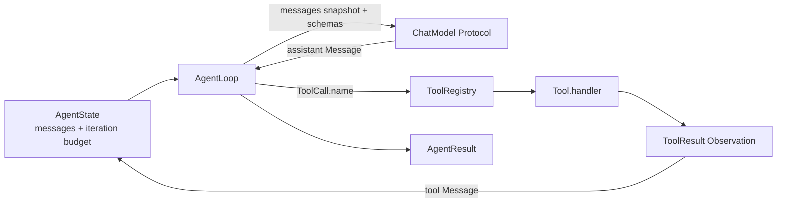

# Phase 1.3 学习笔记：Minimal Agent Loop

## 1. Step Overview

- **Current Phase**：Phase 1 — Python Coding Agent MVP。
- **Current Step**：Phase 1.3 — Minimal Agent Loop。
- **Step Status**：Implemented and locally verified / Awaiting Acceptance。
- **本 Step 目标**：在 Steps 1.1–1.2 的数据模型与 Tool Registry 之上，建立一个透明、同步、Provider 无关的最小 Agent Loop，并使用 fake ChatModel + fake Tool 验证真实的循环控制流。
- **最终新增能力**：模型轮次调用、单个或多个 Tool Call 顺序执行、结构化 Observation 回填、自然结束、显式失败、`max_iterations` 耗尽，以及工具路由/handler 协议错误的结构化反馈。

Step 1.1 先定义 `Message`、`ToolCall`、`ToolResult`、`AgentState` 和 `AgentResult`；Step 1.2 再定义 Tool 与 Registry。本 Step 第一次把这些对象连接成真正会运行的控制流，但仍只在单元测试中使用确定性替身。下一步 Planned 的 Step 1.4 会增加安全只读工具，本 Step 没有提前访问文件系统。

## 2. Problem

只有数据结构和 Registry，RepoPilot 仍无法完成下面这个最小闭环：

```text
User Message
→ 模型请求工具
→ Runtime 执行工具
→ 工具结果作为 Observation 返回模型
→ 模型继续推理或给出最终回答
```

如果缺少统一 Loop，调用方很容易自行拼装流程，产生以下工程问题：

1. 有的调用方可能忘记把 `ToolResult` 放回消息历史，模型看不到执行结果。
2. 工具失败可能被直接当成整个 Agent 失败，模型失去根据失败信息继续修复的机会。
3. 未知工具、handler 抛异常、handler 返回错误关联结果可能混成普通文本，破坏 `tool_call_id` 的可追溯性。
4. 没有明确迭代预算时，模型可以持续请求工具而无限循环。
5. 如果核心 Loop 直接依赖某个 LLM SDK，后续 Provider 适配会反向污染 Runtime 数据模型。
6. 如果“耗尽”被包装成普通 assistant 回复，上层会误以为任务自然完成。

本 Step 解决的是 Agent Runtime 的最小控制流，不是代码修复能力本身。fake ChatModel 与 fake Tool 只用于确定性验证控制流，没有冒充真实 Provider 或真实文件工具。

## 3. Design

### 3.1 核心对象及职责

| 对象 | 所在文件 | 本 Step 中的职责 |
| --- | --- | --- |
| `ChatModel` | `app/agent/loop.py` | Provider 无关的最小 Protocol；接收消息快照和 Tool Schema，返回一个内部 `Message` |
| `AgentLoop` | `app/agent/loop.py` | 管理迭代、调用模型、分派工具、回填 Observation，并产出明确终态 |
| `AgentState` | `app/agent/models.py` | 保存消息历史、当前 iteration、max_iterations，并校验 Tool Call / Result 关联 |
| `Message` | `app/agent/models.py` | 表达 user、assistant 和 tool 消息；tool 消息只能携带一个结构化 `ToolResult` |
| `ToolCall` | `app/agent/models.py` | 表达模型请求的调用 ID、名称和 JSON-compatible arguments |
| `ToolResult` | `app/agent/models.py` | 表达与某次调用关联的成功/失败 Observation |
| `ToolRegistry` / `Tool` | `app/tools/registry.py` | 按名称找到唯一 handler，并向模型暴露稳定 Tool Schema |
| `AgentResult` | `app/agent/models.py` | 明确区分 `succeeded`、`failed` 和 `exhausted` |

### 3.2 依赖关系



`AgentLoop` 依赖抽象的 `ChatModel`，而不是 Anthropic、OpenAI 或其他 SDK。Tool 仍然通过 Step 1.2 的 Registry 注入，不使用全局注册表。这样测试可以精确控制每一轮返回内容，后续真实 Provider 只需实现同一最小边界。

### 3.3 迭代语义

本实现把一次 `ChatModel.complete(...)` 计为一个 iteration：

- 调用模型前执行 `state.advance_iteration()`。
- 一轮模型可以返回一个或多个 Tool Call。
- 同一 assistant 消息中的多个 Tool Call 按出现顺序全部执行，不额外增加 iteration。
- 工具执行结束后，只有下一次模型调用才会增加 iteration。
- 如果最后一个允许轮次返回 Tool Call，Loop 仍执行并回填这些调用，然后因为不能再调用模型而返回 `EXHAUSTED`。

这个定义让预算直接约束最昂贵且可能持续产生新动作的“模型决策轮次”，同时不会把同一轮内的多个 Tool Call 误算成多个推理轮次。

### 3.4 终态与失败分类

```text
assistant 无 Tool Call + 有最终文本
→ AgentResult.SUCCEEDED

模型异常 / 非 Message / 非 assistant Message / 非法消息关联
→ AgentResult.FAILED

ToolResult.success == False
未知 Tool
handler 异常
handler 返回非 ToolResult 或错误调用关联
→ 结构化失败 ToolResult
→ 回填给模型继续决策

达到 max_iterations 且仍未自然结束
→ AgentResult.EXHAUSTED
```

关键区别是：**工具失败是 Observation，不自动等于 Agent Loop 失败。** 代码修复 Agent 必须有机会看到测试失败、文件不存在或工具路由错误后调整下一步。只有模型边界本身无法继续工作，或消息协议破坏 Runtime 不变量时，Loop 才直接返回 `FAILED`。

## 4. Execution Flow

### 4.1 正常 Tool Call 到自然结束

```mermaid
sequenceDiagram
    participant Caller
    participant State as AgentState
    participant Loop as AgentLoop
    participant Model as ChatModel
    participant Registry as ToolRegistry
    participant Handler as Tool.handler

    Caller->>Loop: run(state)
    Loop->>State: 检查 pending_tool_calls
    Loop->>State: advance_iteration()
    Loop->>Registry: schemas()
    Loop->>Model: complete(messages snapshot, schemas)
    Model-->>Loop: assistant Message + ToolCall
    Loop->>State: append assistant Message
    Loop->>Registry: get(call.name)
    Registry-->>Loop: Tool
    Loop->>Handler: handler(call)
    Handler-->>Loop: ToolResult
    Loop->>State: append tool Message
    Loop->>State: advance_iteration()
    Loop->>Model: complete(transcript with Observation, schemas)
    Model-->>Loop: final assistant text Message
    Loop->>State: append final Message
    Loop-->>Caller: AgentResult.succeeded(...)
```

实际执行步骤如下：

1. `run()` 检查输入必须是 `AgentState`，并拒绝在本 Step 中无法恢复的 unresolved Tool Call。
2. `while not state.is_exhausted` 控制预算。
3. `advance_iteration()` 在模型调用前增加计数。
4. `_complete()` 把 `tuple(state.messages)` 和 `registry.schemas()` 交给模型。
5. 返回值必须是 assistant `Message`，随后追加到状态。
6. 若没有 `tool_calls`，该消息就是最终回答，Loop 返回 `SUCCEEDED`。
7. 若存在调用，Loop 按顺序执行 `_execute_tool()`。
8. 每个结果都包装成 `Message(role=TOOL, tool_result=result)`，由 `AgentState` 再次校验关联。
9. 下一轮模型看到完整 Observation 后继续决策。

### 4.2 工具失败后的继续执行

```text
assistant ToolCall(call-1, run_check)
→ handler 返回 success=False
→ Tool Message(ToolResult(call-1, run_check, success=False, error=...))
→ 下一轮 ChatModel 读取失败输出
→ 决定继续调用工具，或输出最终文本
```

未知工具、handler 异常和协议错误也会通过 `_failed_tool_result()` 归一成同样的关联结构。这样下一轮不需要解析异常类型，只读取统一的 `ToolResult`。

### 4.3 迭代耗尽

```text
iteration 1 → model Tool Call → execute → Observation
iteration 2 → model Tool Call → execute → Observation
state.is_exhausted == True
→ 不进行第 3 次模型调用
→ AgentResult.exhausted(iterations=2)
```

耗尽结果没有 `final_message`，也不会生成一条伪装成正常回答的“已达到限制” assistant 文本。

## 5. File Changes

本节明确列出 Step 1.3 实际新增和修改的全部文件。路径均相对于 RepoPilot 根目录。

### 5.1 新增文件

| 文件 | 具体增加/实现的代码 | 为什么需要及如何协作 |
| --- | --- | --- |
| `services/agent_runtime/app/agent/loop.py` | 新增 `ChatModel` Protocol；新增 `AgentLoop.__init__`、`run`、`_complete`、`_execute_tool`、`_failed_tool_result` | 连接 Step 1.1 状态模型和 Step 1.2 Registry，形成真正执行的最小控制流；不依赖 Provider SDK 或文件系统 |
| `services/agent_runtime/tests/test_agent_loop.py` | 新增 `ScriptedChatModel`、fake Tool 构造器及 8 个测试 | 确定性验证单/多 Tool Call、Observation、自然结束、工具失败、协议失败和耗尽；测试替身只替代尚未进入范围的外部 Provider/真实工具，不替代 Loop 核心逻辑 |
| `docs/learning/phase-01/step-1.3-minimal-agent-loop.md` | 新增本学习笔记 | 记录 Step 1.3 的真实设计、流程、文件职责、核心代码、错误、测试、权衡和面试知识点 |

### 5.2 修改的代码文件

| 文件 | 具体修改内容 | 原因 |
| --- | --- | --- |
| `services/agent_runtime/app/agent/__init__.py` | 新增导入并公开导出 `AgentLoop`、`ChatModel` | 为测试和后续调用方提供稳定的 `app.agent` 公共入口，避免依赖内部模块路径 |
| `services/agent_runtime/app/tools/registry.py` | 将仅用于 `ToolHandler` 类型别名的 `ToolCall` / `ToolResult` 改为 `TYPE_CHECKING` 导入，并使用 forward reference | `app.agent` 公开 Loop 后会依赖 `app.tools`；移除 Registry 的反向运行时导入，避免在全新进程中先导入 `app.tools` 时形成循环，同时不改变 Registry 行为或 handler 类型含义 |

### 5.3 修改的文档文件

| 文件 | 具体修改内容 |
| --- | --- |
| `docs/roadmap.md` | 根据用户明确开始 1.3 的授权，将 1.2 标为 Completed；把 Current Step 锁定为 1.3 / Awaiting Acceptance；记录 1.3 能力、31 个测试与未实现边界 |
| `README.md` | 将项目状态更新为 Steps 1.1–1.3 已实现；补充 Loop 能力、31 个测试、真实限制及下一推荐 Step 1.4；更新当前仓库结构 |
| `services/agent_runtime/README.md` | 说明 `ChatModel` / `AgentLoop` 的真实行为、测试位置、失败语义与当前限制 |
| `docs/architecture.md` | 将当前实现扩展到 Phase 1.3；记录模型轮次、工具调用、Observation 和三种终态的 Runtime 边界 |
| `docs/migration.md` | 将 H-01 从 Candidate 更新为 Pattern adopted；新增 M-003，记录参考文件 hash、仅采用通用思想、独立重设计、许可判断、测试证据和限制；修正旧记录中的当前状态 |

### 5.4 明确未修改

- `services/agent_runtime/app/agent/models.py`：Step 1.1 的关联校验、迭代预算和终态已经满足 Loop 需要，没有为便利而重构稳定模型。
- `services/agent_runtime/tests/test_models.py`、`tests/test_tool_registry.py`：原 23 个测试未弱化或删除，只作为回归继续执行。
- `docs/decisions.md`：本 Step 符合 ADR 002、003、007，没有新基础设施、依赖、跨语言职责或重大架构选择，因此不新增 ADR。
- `references/RepoPilot_full_design.md`：当前 roadmap、architecture、ADR 与代码已足够明确最小实现，没有为了长期设计扩大范围。
- `../12-hermes-agent-small/`：仅重新只读核对 `waku/loop/agent.py` 及 SHA-256，没有修改或复制参考代码。

## 6. Core Code Walkthrough

### 6.1 最小 ChatModel Protocol

真实代码：

```python
class ChatModel(Protocol):
    def complete(
        self,
        messages: tuple[Message, ...],
        tools: list[dict[str, Any]],
    ) -> Message:
        """Return the next assistant message for the current transcript."""
```

输入中的 `messages` 使用 tuple 快照，防止模型适配器直接对 `AgentState.messages` 列表做 append/pop。每个 `Message` 本身是冻结 dataclass。`tools` 来自 `ToolRegistry.schemas()` 的防御性副本，因此 Provider Adapter 也不能修改 Registry 内部定义。

输出统一为内部 `Message`。未来 Step 1.8 的真实 Provider Adapter 负责把 SDK 响应转换成这个类型，核心 Loop 无需知道 Provider 的 content block、stop reason 或客户端参数。

### 6.2 主循环

真实核心代码：

```python
while not state.is_exhausted:
    state.advance_iteration()
    response = self._complete(state)
    if isinstance(response, AgentResult):
        return response

    state.append_message(response)

    if not response.tool_calls:
        return AgentResult.succeeded(
            final_message=response,
            iterations=state.iteration,
        )

    for call in response.tool_calls:
        result = self._execute_tool(call)
        state.append_message(
            Message(role=MessageRole.TOOL, tool_result=result)
        )

return AgentResult.exhausted(iterations=state.iteration)
```

这段代码故意保持线性和透明：模型调用、自然结束判断、Tool 分派、Observation 回填和预算出口都能直接看到。当前不使用复杂 Agent Framework，因为 Step 1.3 的核心价值正是验证这些控制语义。

`state.append_message()` 不是普通 list append。它会验证 Tool Call ID 在整个 transcript 中唯一，ToolResult 只完成早先尚未完成的调用，并且工具名匹配。因此 Loop 复用了已有领域不变量，而不是复制一套较弱校验。

### 6.3 模型边界错误

真实代码：

```python
try:
    response = self._model.complete(
        tuple(state.messages),
        self._tools.schemas(),
    )
except Exception as exc:
    return AgentResult.failed(
        error=f"chat model failed: {type(exc).__name__}: {exc}",
        iterations=state.iteration,
    )

if not isinstance(response, Message):
    return AgentResult.failed(
        error="chat model must return a Message",
        iterations=state.iteration,
    )
if response.role is not MessageRole.ASSISTANT:
    return AgentResult.failed(
        error="chat model must return an assistant Message",
        iterations=state.iteration,
    )
```

模型调用异常和返回协议错误都会使本次循环无法安全继续，所以返回 `FAILED`。代码只捕获 `Exception`，不会吞掉 `KeyboardInterrupt`、`SystemExit` 等进程控制异常。iteration 在调用前已增加，因此失败结果如实记录本次模型尝试。

### 6.4 工具执行与结果关联

真实核心代码：

```python
try:
    tool = self._tools.get(call.name)
except UnknownToolError as exc:
    return self._failed_tool_result(call, str(exc))

try:
    result = tool.handler(call)
except Exception as exc:
    return self._failed_tool_result(
        call,
        f"tool handler failed: {type(exc).__name__}: {exc}",
    )

if not isinstance(result, ToolResult):
    return self._failed_tool_result(
        call,
        "tool handler must return a ToolResult",
    )
if result.tool_call_id != call.id or result.tool_name != call.name:
    return self._failed_tool_result(
        call,
        "tool handler returned a result for a different tool call",
    )
return result
```

这段逻辑区分两类结果：

- handler 合法返回的 `ToolResult`：无论 `success=True` 还是 `False`，都原样成为 Observation。
- 路由/handler 协议故障：Loop 自己构造与原 `ToolCall` 正确关联的失败 `ToolResult`。

不能把错误关联的 handler 结果直接 append 到状态，否则要么破坏 transcript，要么错误完成另一调用。规范化结果始终使用原 call 的 ID 和 name。

### 6.5 测试替身如何证明 Observation 真正回填

`ScriptedChatModel` 会记录每次收到的消息快照。核心断言之一是：

```python
observation = state.messages[2].tool_result
self.assertEqual(observation.output, "result:source")
self.assertEqual(model.requests[1][0][-1], state.messages[2])
```

这不是只检查 handler “被调用过”，而是确认工具输出先进入 `AgentState`，并且第二轮模型实际收到了同一个结构化 tool Message。这正是 Observe → next Reason 的闭环证据。

## 7. Key Concepts

### Agent Loop

Agent Loop 是“让模型根据环境反馈重复决策”的最小控制结构。本 Step 的循环只有 Reason（模型返回 Message）、Act（执行 Tool Call）、Observe（追加 ToolResult）和两个主要 guardrail（自然结束、迭代耗尽）。透明循环有利于调试、测试和未来埋点。

### Protocol 与结构化类型边界

`Protocol` 使用结构化子类型：对象只要提供签名兼容的 `complete()`，就能被视为 ChatModel，无需继承基类。它让 fake 和未来 Provider Adapter 保持低耦合。类型提示不等于运行时保证，因此 `AgentLoop` 仍检查 `complete` 可调用、返回 `Message` 且角色为 assistant。

### Dependency Injection

`AgentLoop(model=..., tools=...)` 显式接收依赖。没有隐藏全局 Provider 或 Registry，测试可以精确替换边界，生产装配也能明确知道 Loop 使用哪些工具。

### Working State 与 Transcript Invariant

`AgentState.messages` 是当前 Run 的 working memory。它不仅保存内容，还通过 `append_message()` 维护 Tool Call / Result 的唯一、顺序和名称关联。Loop 是状态的编排者，`AgentState` 是状态不变量的守门者。

### Observation

Observation 是工具执行后提供给下一轮模型的结构化事实。失败 Observation 仍然是有价值的数据：例如测试失败输出会驱动下一次修改。Observation 必须携带原始 `tool_call_id`，否则模型协议和 Trace 无法关联请求与结果。

### Iteration Budget

`max_iterations` 是防止无限循环的硬边界，不是成功判断。耗尽说明 Agent 没有在预算内自然结束，因此必须与 `FAILED` 和 `SUCCEEDED` 区分。当前预算按模型轮次计算，后续还需要独立的 Tool Timeout、Task Timeout 和取消机制。

### Failure Domain

工具调用失败和 Runtime 失败属于不同 failure domain：工具失败可以被模型观察和修复；模型/消息协议失败使当前循环无法继续。合理分类能避免过早终止，也避免把基础协议损坏伪装成可恢复工具错误。

### Test Double 的边界

fake ChatModel 和 fake Tool 是当前 Step roadmap 明确要求的单元测试替身。它们用于控制外部边界，让真实 `AgentLoop`、`AgentState` 和 `ToolRegistry` 代码运行。它们不能作为真实 LLM、真实文件操作或 Coding Bug-Fix E2E 已完成的证据。

## 8. Design Decisions

### 8.1 为什么使用同步 Loop

当前验收只需要验证控制流，没有真实网络 Provider、并发工具或 I/O 工具。同步实现更小、更容易断言状态顺序，也不需要提前决定事件循环和取消传播方式。

代价是未来接入网络 Provider 和并发 I/O 时可能需要 async 边界。调整应在真实 Provider/工具需求出现时完成，并补充超时、取消及并发顺序测试，而不是现在预建两套接口。

### 8.2 为什么 ChatModel 接收消息和 Schema，而不是整个 AgentState

模型只需要会话内容与可用工具定义，不应直接修改 iteration、预算或 pending call。传入完整状态会扩大权限和耦合。当前窄接口让 Loop 保持预算与状态所有权。

### 8.3 为什么一轮中的多个 Tool Call 顺序执行

顺序执行具有确定性，符合当前同步 handler 契约，测试和 Observation 顺序容易解释。并行执行会引入结果顺序、共享仓库修改冲突、取消和部分失败语义，这些在没有真实需求与 Sandbox 前不应提前设计。

### 8.4 为什么工具错误变成 Observation

Agent 的价值之一是根据失败继续修复。未知工具或 handler 错误如果直接终止 Loop，模型没有机会换用正确工具或解释限制。结构化失败 Observation 保留调用关联，并统一进入下一轮。

但模型调用异常不能用同样方式伪造为工具结果，因为它没有对应 Tool Call，且当前没有可继续推理的模型响应，因此返回 `AgentResult.failed`。

### 8.5 为什么最后一轮仍执行 Tool Call

模型在允许的最后一次决策中已经产生合法 Tool Call；不执行会让 transcript 留下 pending call，且结果不能反映已接受的行动。当前选择完成该轮内的全部调用和 Observation，再返回 `EXHAUSTED`，但绝不额外调用模型。

### 8.6 为什么拒绝带 pending call 的初始状态

Step 1.3 只实现从稳定 transcript 开始的新同步运行，没有定义崩溃恢复或断点续跑。若初始状态存在 unresolved call，Loop 无法判断它是否从未执行、正在执行还是已产生副作用。盲目重放可能重复执行非幂等动作，因此当前 fail-fast。恢复与幂等语义必须在未来有明确上下文时设计。

### 8.7 为什么不加入 streaming、observer 和重试

这些能力不属于 Step 1.3 最小验收：

- streaming 需要 Provider-specific 增量转换和消息组装语义；
- observer/event 需要后续结构化事件契约；
- 自动重试需要区分临时模型错误和非幂等工具副作用；
- 超时/取消需要真实 I/O 与执行生命周期。

当前加入会扩大边界，并可能形成未经验证的行为。

### 8.8 与 Hermes 参考实现的关系

本 Step 重新只读核对了 `waku/loop/agent.py`，源文件 SHA-256 为 `C744964BFBBB2D0471EC22F9A3632C8AD943EAF4654DC1D08AA0E9B0E64F9FBA`。只采用 Reason → Act → Observe、自然结束和 max_iterations 的通用思想，没有复制源码。

RepoPilot 独立重设计了 Provider 无关消息、显式三终态、结构化 ToolResult、未知/handler 错误 Observation、Registry 依赖注入和 pending 状态保护；没有引入 Anthropic SDK、streaming fallback、observer 或普通字符串耗尽回复。具体证据记录在 `docs/migration.md` 的 M-003。

## 9. Error and Edge Cases

| 情况 | 当前行为 | 测试证据 |
| --- | --- | --- |
| 单个 Tool Call 成功 | 执行 handler、追加 Tool Message、下一轮自然结束 | `test_executes_one_tool_and_returns_the_natural_final_answer` |
| 一条消息含多个 Tool Call | 按出现顺序全部执行和追加，再调用模型 | `test_executes_multiple_calls_in_order_before_the_next_model_turn` |
| handler 返回 `success=False` | 原样回填，不把 Loop 立即标为失败 | `test_failed_tool_result_is_an_observation_not_a_loop_failure` |
| 未知 Tool 名称 | 生成关联原 call 的失败 Observation | `test_unknown_tool_becomes_a_correlated_failure_observation` |
| handler 抛 `Exception` | 捕获并生成失败 Observation | `test_handler_exception_and_invalid_result_become_observations` |
| handler 返回非 `ToolResult` | 生成协议错误 Observation | 同上 |
| handler 返回错误 call ID/name | 丢弃错误结果，生成与原 call 正确关联的失败 Observation | 同上 |
| 模型调用抛异常 | 返回 `AgentResult.failed`，记录已尝试的 iteration | `test_model_failure_and_protocol_errors_fail_explicitly` |
| 模型返回非 `Message` | 返回 `FAILED` | 同上 |
| 模型返回非 assistant Message | 返回 `FAILED` | 同上 |
| 初始状态有 unresolved Tool Call | 不调用模型/工具，返回 `FAILED`，避免未知副作用重放 | `test_rejects_a_state_with_unresolved_calls_without_running` |
| 达到 `max_iterations` | 完成最后一轮 Tool Observation 后返回 `EXHAUSTED`，不多调用模型 | `test_exhausts_after_the_last_allowed_model_turn` |
| assistant 产生重复 call ID | `AgentState.append_message()` 拒绝，Loop 返回协议 `FAILED` | 由 Step 1.1 关联测试覆盖底层不变量；Loop 的 append 错误分支已实现 |

当前未处理：async handler、并行执行、LLM/tool timeout、取消、自动重试、流式增量、事件发布、持久化恢复、Schema 参数语义校验、安全路径和命令策略。这些限制不能由 31 个单元测试推导为已支持。

## 10. Testing

### 10.1 测试文件与场景

- `tests/test_agent_loop.py`：Step 1.3 新增 8 个测试，覆盖 Loop 正常流、失败流和预算边界。
- `tests/test_models.py`：Step 1.1 的 17 个回归测试，保证消息关联、状态与终态没有退化。
- `tests/test_tool_registry.py`：Step 1.2 的 6 个回归测试，保证 Tool 定义与 Registry 行为没有退化。

### 10.2 测试命令

在 `services/agent_runtime/` 目录执行：

```powershell
python -B -m unittest tests.test_agent_loop -v
python -B -m unittest discover -s tests -v
```

### 10.3 真实结果

```text
Ran 8 tests in 0.001s
OK

Ran 31 tests in 0.006s
OK
```

两条命令退出码均为 0；没有跳过、零测试收集或弱化旧断言。运行环境为 Python 3.10.9，只使用标准库。

### 10.4 实现检查与 Diff Review

- 基线检查：修改前原 23 个测试全部通过。
- 实现检查：新增 Loop 没有 `TODO`、`pass`、`NotImplemented`、固定成功分支或假文件操作。
- 导入边界检查：分别在全新 Python 进程中执行 `from app.tools import ToolRegistry` 和 `from app.agent import AgentLoop`，均成功；`test_agent_loop.py` 也先导入 `app.tools`，使相关测试持续覆盖该导入顺序。
- 安全范围：业务代码没有 `subprocess`、`os.system`、`shell=True`、文件系统或网络访问。
- 依赖检查：没有增加 `pyproject.toml`、requirements 或第三方包。
- Diff 范围：只涉及 Phase 1.3 的 Loop、公共导出、测试和状态/架构/迁移/学习文档。
- `git diff --check`：通过，无 whitespace error；Git 仅提示 Windows 工作区现有 CRLF 转换策略和用户级 ignore 文件读取权限，不影响检查退出码。
- 秘密与假完成检查：没有凭据、Token、真实仓库路径数据或把 fake 测试宣传为真实 Provider/E2E。

## 11. What I Should Be Able to Explain

### 11.1 面试问题

1. Agent Loop 最小的 Reason → Act → Observe 流程是什么？
2. 为什么 `ChatModel` 返回内部 `Message`，而不是直接暴露 Provider SDK Response？
3. 为什么模型只接收消息快照和 Schema，而不能拿到整个 `AgentState`？
4. 为什么一次模型调用算一个 iteration，而一次 Tool Call 不单独算 iteration？
5. 同一轮多个 Tool Call 为什么当前顺序执行？未来并行需要解决什么问题？
6. 为什么 `ToolResult(success=False)` 不等于 `AgentResult.failed`？
7. 未知 Tool 和 handler 异常为什么应该成为 Observation？
8. 哪些错误必须立即终止 Loop，哪些错误可以反馈给模型继续处理？
9. 为什么 handler 返回的 `tool_call_id` 和 `tool_name` 必须再次校验？
10. 为什么 max_iterations 耗尽不能伪装成普通 assistant 回复？
11. 最后一个允许轮次返回 Tool Call 时，为什么仍执行工具但不再调用模型？
12. 为什么初始 pending Tool Call 不能在没有恢复语义时自动重放？
13. `Protocol`、依赖注入和 Provider-neutral contract 分别降低了什么耦合？
14. fake ChatModel / fake Tool 的测试能证明什么，不能证明什么？
15. 本 Step 为什么不实现 async、streaming、timeout、retry 或事件 observer？
16. `AgentState.append_message()` 对 Loop 提供了哪些领域不变量？
17. Step 1.3 如何为 Step 1.4 Safe Read Tools 和 Step 1.8 Provider 打基础？

### 11.2 推荐回答主线

能够清晰解释下面这段主线，就真正掌握了本 Step：

> RepoPilot 的 Python Runtime 用一个 Provider 无关的 ChatModel Protocol 隔离 SDK。AgentLoop 按模型轮次消耗预算，先把 assistant Message 放入 AgentState；如果有 Tool Call，就通过显式注入的 Registry 顺序找到 handler，验证并把 ToolResult 作为关联原 call 的 tool Message 回填。工具失败仍是 Observation，让模型有机会调整；模型或消息协议失败才终止为 FAILED。没有 Tool Call 的最终 assistant 文本是 SUCCEEDED，预算耗尽则是独立 EXHAUSTED。当前 fake 只证明控制流，不证明真实 Provider、文件工具或代码修复闭环。

## 12. Step Summary

Step 1.3 把前两步的静态契约连接成了第一个真实运行的 Agent 控制循环。现在 Runtime 能进行模型决策、执行一个或多个工具、把成功/失败 Observation 反馈给下一轮，并用明确结果区分自然完成、不可继续的失败和迭代耗尽。

本 Step 最需要掌握的是：Agent Loop 的控制流、Provider 抽象、显式状态不变量、工具失败与 Runtime 失败的分层、调用关联、迭代预算和确定性单元测试边界。

当前仍没有真实 LLM Provider、真实仓库工具、文件访问安全、Schema 语义校验、async/streaming、timeout/cancel、Sandbox 或 Coding Bug-Fix E2E。用户验收 Step 1.3 后，下一推荐 Step 是 Phase 1.4 Safe Read Tools；本次到此停止，不提前实现。
