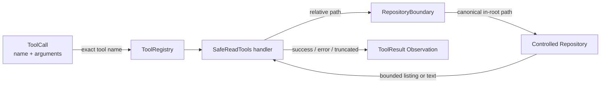

# Phase 1.4 学习笔记：Safe Read Tools

## 1. Step Overview

- **Current Phase**：Phase 1 — Python Coding Agent MVP。
- **Current Step**：Phase 1.4 — Safe Read Tools。
- **Step Status**：Implemented and locally verified / Awaiting Acceptance。
- **本 Step 目标**：让 Agent 第一次能够真实读取一个受控本地 Repository，同时把路径、链接、凭据和输出量约束落实在工具执行边界，而不是依赖模型“自觉”遵守。
- **最终新增能力**：固定仓库根目录的 `RepositoryBoundary`、递归 `list_files`、UTF-8 `read_file`、结构化成功/失败 `ToolResult`、路径穿越/绝对路径/symlink/Junction 逃逸防护、受保护文件过滤，以及有界扫描和输出。

Step 1.1 定义了 `ToolCall` / `ToolResult` 等数据模型，Step 1.2 定义了 `Tool` / `ToolRegistry`，Step 1.3 把模型调用和 Tool Observation 连接为最小 Agent Loop。本 Step 第一次为 Registry 提供真实文件系统 handler，但仍只允许读取开发者明确指定、内容已检查的本地测试 Repository。

下一步 Planned 的 Step 1.5 会在同一安全仓库边界上实现精确文本 `search_code`。本 Step 没有提前实现搜索、修改文件、运行测试或 Provider。

## 2. Problem

Coding Agent 必须查看仓库结构和源码，但“把模型给出的字符串直接交给 `open()`”会产生明显风险：

1. `../` 可以从仓库目录回退到父目录。
2. 绝对路径、Windows 盘符路径或 UNC 路径可以绕过仓库根目录。
3. 仓库内的 symlink 或 Windows Junction 外观看似安全，解析后却可能指向仓库外。
4. `.git/config`、`.env`、私钥等文件可能包含远程地址、用户名或 Token，不应进入模型上下文。
5. 超大目录和超大文件可能占用过多内存或挤满模型上下文。
6. 二进制内容或非法 UTF-8 如果当作普通文本返回，会造成解码异常或不可控 Observation。
7. 如果 handler 直接抛异常，Agent Loop 只能得到笼统的 handler failure；工具本身无法提供稳定、可测试的失败语义。

因此，本 Step 解决的不是“如何列目录”这样一个简单 API 问题，而是建立 RepoPilot Phase 1–4 的最小本地读取安全边界。它是 ADR 007 中“Python 仅在受控测试 Repository 执行有限工具”的真实落地，但不等同于 Phase 5 的生产 Sandbox。

## 3. Design

### 3.1 核心对象

| 对象 | 职责 |
| --- | --- |
| `RepositoryBoundary` | 固定并规范化仓库根目录；校验调用路径语法；解析真实路径；阻止仓库外和受保护路径访问 |
| `RepositoryAccessError` | 表达可预期的路径、权限和仓库边界错误，供 handler 转为失败 `ToolResult` |
| `SafeReadTools` | 持有边界与输出限制；创建两个 `Tool` 定义；实现真实 `list_files` / `read_file` handler |
| `build_safe_read_tools()` | 面向调用方的最小工厂，一次创建顺序固定的两个 Tool |
| `ToolRegistry` | 注册工厂返回的 Tool，并按模型请求的精确名称分派 handler |
| `ToolCall` / `ToolResult` | 分别承载模型参数和关联原调用的结构化 Observation |

### 3.2 默认资源边界

| 常量 | 默认值 | 作用 |
| --- | ---: | --- |
| `DEFAULT_MAX_FILE_CHARS` | 100,000 | 单次 `read_file` 最多返回的字符数 |
| `DEFAULT_MAX_LIST_ENTRIES` | 1,000 | 单次 `list_files` 最多返回的文件路径数 |
| `DEFAULT_MAX_SCANNED_ENTRIES` | 20,000 | 单次目录遍历最多检查的子项数 |

这些上限可以在构造 `SafeReadTools` 或调用工厂时缩小，主要用于测试和受控运行配置。它们不是 CLI 参数，也不能由模型在一次 Tool Call 中任意放大。

### 3.3 模块关系



`RepositoryBoundary` 不知道 Agent Loop，也不依赖模型 Provider；它只负责路径。`SafeReadTools` 不注册全局状态，而是将绑定同一 boundary 实例的 bound method 放入 `Tool.handler`。这样不同任务可以各自创建不同 Repository 根目录，不会共享可变全局路径。

### 3.4 两层路径校验

安全校验分为两层：

1. **词法层**：拒绝空路径、NUL、绝对路径、Windows drive/root 和任何 `..` 片段，并在访问前阻止明显的 `.git` / 凭据路径。
2. **真实路径层**：使用 `Path.resolve(strict=True)` 跟随 symlink / Junction，然后用 `resolved.relative_to(repository_root)` 验证真实目标仍在仓库内，再次检查解析后的受保护路径。

只做第一层会被链接绕过；只做第二层虽然通常也能挡住最终越界，但错误语义不够明确，而且不应允许模型依赖复杂规范化路径。两层结合能使边界更容易解释和测试。

## 4. Execution Flow

### 4.1 `read_file`

```text
ToolCall(name="read_file", arguments={"path": "src/app.py"})
→ 校验只出现 path 参数且 path 是非空字符串
→ RepositoryBoundary.resolve("src/app.py")
→ 拒绝绝对路径 / drive / root / .. / NUL / protected name
→ resolve(strict=True) 得到真实路径
→ 验证真实路径仍在 Repository root 内且不是 protected path
→ 验证目标是普通文件
→ 按 UTF-8 读取 max_file_chars + 1 个字符
→ 拒绝非法 UTF-8 或 NUL 字节
→ 根据第 max+1 个字符判断 truncated
→ 返回关联原 tool_call_id 的 ToolResult
```

读取使用 `newline=""`，因此不会把 CRLF 自动改写成 LF。模型看到的文本换行与文件实际文本换行一致。

### 4.2 `list_files`

```text
ToolCall(name="list_files", arguments={} 或 {"path": "src"})
→ 缺省 path 为 "."
→ 解析并验证目标目录
→ 按目录项名称排序后遍历
→ 每个子项 resolve(strict=True)
→ 越界、broken link、受保护路径直接跳过
→ 真实目录放入 pending，普通文件记录 canonical relative path
→ visited_directories 阻止链接环重复遍历
→ 达到扫描数或结果数上限时 truncated = true
→ 对文件名排序并以换行连接
→ 返回 ToolResult
```

输出统一为相对仓库根目录的 POSIX 风格路径，例如 `src/app.py`。如果仓库内链接指向仓库内已有文件，输出使用解析后的 canonical 路径并通过 `set` 去重；指向仓库外的链接不会出现在列表中。

### 4.3 失败路径

可预期错误不会作为成功输出，也不会返回固定假数据：

```text
RepositoryAccessError / OSError / UnicodeError
→ SafeReadTools handler 捕获
→ ToolResult(
     tool_call_id=原调用 ID,
     tool_name=原调用名称,
     success=False,
     error=稳定错误信息,
     duration_ms=真实耗时
   )
→ Agent Loop 将它作为 tool Message Observation 回填
```

这使后续真实 Agent 能看到“绝对路径不允许”“文件不存在”或“不是 UTF-8 文本”等具体原因，并修正下一次调用，而不是丢失关联信息。

## 5. File Changes

本 Step 实际新增或修改了以下文件：

| 文件 | 变更类型 | 具体作用 |
| --- | --- | --- |
| `services/agent_runtime/app/tools/safe_read.py` | 新增 | 实现 `RepositoryBoundary`、`RepositoryAccessError`、`SafeReadTools`、两个真实 Tool handler、输出限制和工厂函数 |
| `services/agent_runtime/app/tools/__init__.py` | 修改 | 导出 Safe Read 公共类型和 `build_safe_read_tools()`，让调用方通过 `app.tools` 使用 |
| `services/agent_runtime/tests/test_safe_read_tools.py` | 新增 | 使用真实临时文件系统验证 Tool 契约、真实读取、子目录列表、安全边界、链接逃逸、凭据保护、截断和错误语义 |
| `docs/roadmap.md` | 修改 | 将 1.3 标为 Completed，将 1.4 设为 Current / Awaiting Acceptance，并记录 40 个测试与未实现边界 |
| `docs/architecture.md` | 修改 | 将当前实现范围更新到 1.4，说明路径双重校验、链接处理、文件保护和有界读取 |
| `README.md` | 修改 | 更新仓库结构、Implemented / Planned、Current Step、验证证据和下一推荐 Step |
| `services/agent_runtime/README.md` | 修改 | 说明 Python Runtime 已有的真实 Safe Read 能力、测试范围和当前限制 |
| `docs/learning/phase-01/step-1.4-safe-read-tools.md` | 新增 | 本学习笔记，记录真实实现、流程、代码、测试和权衡 |

`docs/decisions.md` 没有修改，因为 ADR 007 已经明确批准 Phase 1–4 的受控 Python 本地工具过渡方案，本 Step 没有引入新的架构选择。`docs/migration.md` 也没有修改，因为本实现未复制 Hermes 或 Go Scaffold 代码，只遵循了 RepoPilot 当前架构与安全约束。

## 6. Core Code Walkthrough

### 6.1 先拒绝危险路径语法

以下片段来自 `RepositoryBoundary.resolve()`：

```python
platform_path = Path(relative_path)
windows_path = PureWindowsPath(relative_path)
posix_path = PurePosixPath(relative_path)
if (
    platform_path.is_absolute()
    or posix_path.is_absolute()
    or windows_path.is_absolute()
    or windows_path.root
    or windows_path.drive
):
    raise RepositoryAccessError("absolute paths are not allowed")
if ".." in posix_path.parts or ".." in windows_path.parts:
    raise RepositoryAccessError("parent path traversal is not allowed")
```

这里同时构造 `PurePosixPath` 和 `PureWindowsPath`，原因是同一段工具代码可能在不同主机运行。假设只使用当前平台 `Path`，Linux 上的 `C:\outside.txt` 可能被当作普通文件名，Windows 上的反斜杠穿越语义也无法在跨平台测试中稳定表达。

检查 `windows_path.root` 很重要：Windows 的 `\outside.txt` 是“当前盘符根目录下的路径”，它不一定满足 `is_absolute()` 对“盘符 + 根”的完整定义，但仍然不应被当作仓库相对路径。`windows_path.drive` 同时拒绝 `C:\outside.txt` 和 `C:outside.txt`。

### 6.2 跟随链接后重新验证边界

以下片段同样来自 `RepositoryBoundary`：

```python
resolved = (self._root / platform_path).resolve(strict=True)

# 必须在跟随符号链接或 Windows Junction 后再次校验真实路径，
# 否则表面位于仓库内的链接仍可能读取仓库外文件。
self._relative_resolved_path(resolved)
return resolved
```

```python
def _relative_resolved_path(self, resolved_path: Path) -> Path:
    try:
        relative = resolved_path.relative_to(self._root)
    except ValueError as exc:
        raise RepositoryAccessError("path escapes repository root") from exc
    if _is_protected(tuple(relative.parts)):
        raise RepositoryAccessError(
            "access to protected repository paths is not allowed"
        )
    return relative
```

`resolve(strict=True)` 同时要求目标真实存在，因此缺失路径、broken link 和链接环不会继续进入读取逻辑。`relative_to(root)` 不是简单字符串前缀比较：例如 `C:\repo-other` 不会因为字符串以 `C:\repo` 开头就被误判为子目录，WindowsPath 的比较也遵循对应路径 flavor 的大小写规则。

校验执行两次：调用参数中的 `.git` 会在解析前被挡住；一个普通名称的仓库内链接如果最终指向真实 `.git`，会在解析后再次被挡住。

### 6.3 有界读取并保留原始换行

以下片段来自 `SafeReadTools.read_file()`：

```python
# 仅读取上限再多一个字符：既能判断是否截断，也避免把超大文件
# 一次性装入内存。UTF-8 解码失败会作为真实 Tool 失败返回。
with file_path.open(
    "r", encoding="utf-8", errors="strict", newline=""
) as stream:
    content = stream.read(self._max_file_chars + 1)
if "\x00" in content:
    raise RepositoryAccessError(
        "file contains null bytes and is not treated as text"
    )
truncated = len(content) > self._max_file_chars
if truncated:
    content = content[: self._max_file_chars]
```

读取 `limit + 1` 而不是读取整个文件后切片，可将单次读取保留在固定数量级；多出的一个字符只用于判断是否真的发生截断。`errors="strict"` 保证非法 UTF-8 不会被悄悄替换成 `�`，NUL 检查则过滤“字节上可解码但不适合作为源码文本”的常见二进制内容。

当前限制单位是 Python Unicode 字符，不是原始字节或模型 Token。这足以约束 Phase 1 的 Tool Observation，但未来 Provider Context Budget 仍需单独按 Token 管理。

### 6.4 阻止目录链接环

以下片段来自 `_collect_file_names()`：

```python
while pending:
    current = pending.pop()
    if current in visited_directories:
        continue
    visited_directories.add(current)

    children = sorted(current.iterdir(), key=lambda path: path.name.casefold())
    for child in children:
        resolved = child.resolve(strict=True)
        canonical_name = self._boundary.relative_name(resolved)

        if resolved.is_dir():
            pending.append(resolved)
        elif resolved.is_file():
            names.add(canonical_name)
```

`pending` 保存的是 canonical directory，`visited_directories` 也以真实路径去重。因此 `src/loop -> src` 之类的内部链接不会导致无限递归。文件使用 canonical 相对名称和 `set`，同一真实文件被多个链接引用时不会重复输出。

真实代码还在每次访问前处理解析异常，并同时检查 `max_scanned_entries` 与 `max_list_entries`；达到任一边界都会令成功结果的 `truncated=True`。

### 6.5 Tool 工厂与参数契约

`SafeReadTools.definitions()` 产生的 Schema 是：

```python
{
    "name": "read_file",
    "description": "Read one UTF-8 text file by repository-relative path.",
    "input_schema": {
        "type": "object",
        "properties": {"path": {"type": "string"}},
        "required": ["path"],
        "additionalProperties": False,
    },
}
```

`list_files.path` 可省略并默认为 `.`；`read_file.path` 必填。因为 Step 1.2 的 Registry 目前只保证 Schema 是 JSON-compatible 顶层 object，并不执行完整 JSON Schema 验证，所以 handler 自己还会拒绝缺失、空字符串、非字符串和额外参数。这不是重复无用校验，而是当前执行边界必须真实落实的约束。

## 7. Key Concepts

### 7.1 Lexical Path 与 Canonical Path

- **Lexical path** 是调用方给出的文本结构，如 `src/../secret`。
- **Canonical path** 是解析 `.`、链接等后实际指向的路径。

RepoPilot 先限制 lexical path 的表达能力，再验证 canonical path 的所有权。只做字符串拼接或 `startswith()` 不足以建立安全边界。

### 7.2 Directory Traversal

Directory traversal 是利用 `..`、绝对路径、盘符、UNC、链接等方式访问授权根目录以外资源。这里选择完全拒绝 `..`，即使 `src/../README.md` 最终仍在仓库内也不允许，因为模型可以直接请求 `README.md`，无需开放容易混淆的路径形式。

### 7.3 Symlink 与 Windows Junction

symlink 是文件系统链接；Junction 是 Windows 常见的目录重解析点。两者都能让仓库内路径指向仓库外。本实现依赖 `Path.resolve(strict=True)` 获得真实目标，再检查其是否仍位于固定 root 内。测试优先创建真实 symlink，Windows 环境没有创建权限时使用 Junction 作为等价逃逸夹具。

### 7.4 Defense in Depth

本 Step 有多层防护：输入参数类型、路径语法、解析后边界、受保护文件、文件类型、文本编码、NUL、扫描上限、输出上限。任何一层都不能替代 Phase 5 Sandbox，但组合能显著缩小 Phase 1 受控测试环境的风险。

### 7.5 Structured Observation

工具错误仍是一个有效的 `ToolResult`，只不过 `success=False`。它与 `tool_call_id` 和 `tool_name` 关联，Agent Loop 可以把它放回消息历史。这与“Python 异常直接终止整个 Agent”不同：可恢复的工具调用错误应该成为模型可观察、可修正的输入。

### 7.6 Bounded Output

工具输出最终会进入 LLM 上下文，因此“只读”不等于“无副作用成本”。有界读取同时保护内存、日志与 Context Window。`truncated` 明确告诉上层结果不完整，避免模型把被截断内容误认为完整文件或完整目录。

## 8. Design Decisions

### 8.1 为什么使用 Python 标准库

本 Step 只需要路径解析、目录遍历、文本读取和计时，`pathlib` / `time` / `unittest` 已能满足。引入第三方文件工具或 JSON Schema 库会扩大依赖面，但不能替代真实路径边界，因此没有新增依赖。

### 8.2 为什么输出换行文本而不是新增数据模型

现有 `ToolResult.output` 是字符串，也是 Agent Loop 已支持的 Observation 格式。`list_files` 使用一行一个 POSIX 相对路径，模型易读、顺序稳定、无需修改 Step 1.1 数据模型。等未来需要机器化分页或 artifacts 时，再基于真实需求扩展契约；本 Step 不提前修改核心模型。

### 8.3 为什么默认递归列表

Coding Agent 需要快速理解小型受控仓库结构；只返回当前目录会增加多轮调用。递归列表配合扫描数和返回项上限，能在 Phase 1 小型测试仓库中形成更实用的最小能力。大型仓库的索引和 RAG 属于 Phase 6，不由本工具承担。

### 8.4 为什么允许仓库内链接但拒绝仓库外链接

完全禁止所有链接更简单，但会错误拒绝合法的仓库内组织方式。本实现检查真实目标并用 visited set 防环：只要 canonical target 在 root 内且不受保护，就可读取；外部目标一律拒绝。代价是输出使用 canonical 路径，而不是保留每个链接别名。

### 8.5 为什么常见凭据采用明确启发式

当前保护 `.git`、`.ssh`、`.env`/非模板 `.env.*`、常见凭据名称和私钥后缀；同时允许 `.env.example` / `.sample` / `.template` 作为安全配置模板。完全基于文件内容做 Secret Scanner 超出 Step 1.4，也可能产生大量误报。当前名单是最小防线，后续应根据真实仓库和安全策略复议。

### 8.6 为什么没有新增 ADR

ADR 007 已明确规定 Phase 1–4 的 Python 本地受控工具需要固定仓库根目录、路径/链接逃逸检查和凭据保护。本实现是该决定在 Current Step 内的实现，不改变语言职责、基础设施或核心通信方式。

## 9. Error and Edge Cases

| 场景 | 当前行为 | 测试覆盖 |
| --- | --- | --- |
| `../outside.txt` 或 `src/../README.md` | 失败，`parent path traversal is not allowed` | 有 |
| POSIX/Windows 绝对路径、盘符或 rooted path | 失败，`absolute paths are not allowed` | 有 |
| 仓库内链接指向仓库外 | 显式读取失败；根列表跳过该链接 | 真实 symlink/Junction 用例 |
| `.git/config`、`.env`、`private.pem` | 显式读取失败；列表不暴露 | 有 |
| `.env.example` | 允许列出和读取 | 列表用例有 |
| 文件不存在或 broken link | 失败或在递归列表中跳过 | 缺失文件有；broken link 由同一路径解析分支处理 |
| `read_file` 指向目录 | 失败，要求普通文件 | 有 |
| `list_files` 指向文件 | 失败，要求目录 | 有 |
| 缺失、错误类型或额外参数 | 失败并保留 tool_call 关联 | 有 |
| 非 UTF-8 字节 | 失败，不返回部分内容 | 有 |
| 含 NUL 的可解码内容 | 失败，按非文本处理 | 有 |
| 文件超过字符上限 | 成功返回前缀，`truncated=True` | 有 |
| 列表超过文件数上限 | 成功返回有限条目，`truncated=True` | 有 |
| 仓库内目录链接环 | canonical visited set 阻止无限递归 | 代码路径已实现；本 Step 未单列测试 |
| 文件在校验与打开之间被并发替换 | 当前无法完全消除 TOCTOU | 未覆盖；Phase 1 只面向受控本地测试仓库 |

错误信息不包含规范化后的仓库根目录；缺失路径只回显调用方原始相对参数。系统异常由 handler 转成失败 `ToolResult`，而构造时的非法 repository root / limit 属于开发配置错误，会直接抛 `ValueError`。

## 10. Testing

### 10.1 测试文件

`services/agent_runtime/tests/test_safe_read_tools.py` 新增 9 个测试方法：

1. `test_builds_expected_tool_contracts_and_reads_real_content`：验证两个 Tool 的顺序、真实递归列表、真实文件内容和结果关联。
2. `test_lists_only_the_requested_repository_subdirectory`：验证子目录范围和仓库相对输出。
3. `test_rejects_parent_traversal_and_absolute_paths`：验证 POSIX / Windows 穿越、绝对、drive 和 rooted path。
4. `test_rejects_a_real_link_that_escapes_the_repository`：创建真实外部目录链接，验证读取拒绝、显式列表拒绝和根列表不泄露。
5. `test_blocks_git_metadata_and_common_credential_files`：验证 `.git`、`.env`、私钥保护，并确认 `.env.example` 可见。
6. `test_reports_invalid_arguments_missing_paths_and_wrong_path_kinds`：验证参数边界、文件/目录类型和缺失路径。
7. `test_bounds_file_and_listing_output`：把上限缩小后验证真实截断和 `truncated=True`。
8. `test_rejects_binary_content_without_returning_partial_data`：验证非法 UTF-8 和 NUL 内容失败且 output 为空。
9. `test_rejects_invalid_roots_and_limits`：验证构造配置边界。

### 10.2 真实测试夹具

每个测试都用 `tempfile.TemporaryDirectory()` 创建独立仓库和真实文件，不 mock `Path.resolve()`、`open()` 或目录遍历。链接逃逸测试优先使用 `os.symlink()`；Windows 没有 symlink 权限时，测试通过 `mklink /J` 创建真实 Junction，并在临时目录清理前只删除链接本身。

初次定向测试曾出现 1 个失败：Windows 文本夹具写入自动产生 CRLF，而工具按设计保留原始换行，测试却硬编码期望 LF。修正方式是让夹具用字节明确写入 LF，而不是弱化断言或修改工具去掩盖换行事实。修正后定向和全量测试均通过。

### 10.3 执行命令与结果

实现前基线：

```text
cd services/agent_runtime
python -B -m unittest discover -s tests -v
Ran 31 tests in 0.008s
OK
```

Step 1.4 定向测试：

```text
python -B -m unittest tests.test_safe_read_tools -v
Ran 9 tests in 0.086s
OK
```

全量回归：

```text
python -B -m unittest discover -s tests -v
Ran 40 tests in 0.095s
OK
```

实现检查还执行了导入/契约 smoke check，确认工厂输出顺序是 `("list_files", "read_file")`，且 `read_file` Schema 的 required 字段为 `path`。`git diff --check` 没有发现 whitespace error；Git 仅提示当前 Windows 配置未来可能把 LF 转为 CRLF，不是 diff 内容错误。

## 11. What I Should Be Able to Explain

完成本 Step 后，我应该能够清楚回答以下问题：

1. 为什么把用户路径拼到 repository root 后直接 `open()` 仍然不安全？
2. lexical path validation 和 canonical path validation 分别解决什么问题？
3. 为什么 `src/../README.md` 即使最终仍在仓库内也被拒绝？
4. 为什么 Linux 上仍要使用 `PureWindowsPath` 检查 Windows 风格输入？
5. `PureWindowsPath.is_absolute()`、`root` 和 `drive` 为什么需要组合检查？
6. symlink 和 Junction 如何让“仓库内路径”指向仓库外？
7. `Path.resolve(strict=True)` 和 `Path.relative_to(root)` 在边界校验中各自负责什么？
8. 为什么不能用字符串 `startswith(repository_root)` 判断路径归属？
9. `visited_directories` 为什么以 canonical path 为键，而不是原始链接路径？
10. 为什么 `read_file` 读取 `limit + 1` 个字符，而不是先读取整个文件？
11. `truncated=True` 对 Agent 推理和后续 Context 管理有什么意义？
12. 为什么非法 UTF-8 和 NUL 内容要失败，而不是容错替换后返回？
13. 为什么工具调用错误应返回 `success=False` 的 `ToolResult`，而不是宣称 Loop 整体失败？
14. 为什么 Schema 声明 `additionalProperties=False` 后，handler 仍需自己验证参数？
15. 当前凭据过滤是怎样的启发式？为什么它不是完整 Secret Scanner？
16. Phase 1 的本地路径边界与 Phase 5 的 Go Tool Gateway + Docker Sandbox 有什么本质区别？
17. 这份实现还存在哪些 TOCTOU、权限和上下文预算限制？
18. 面试中如何用“最小权限、纵深防御、结构化 Observation、有界资源”概括本 Step 的工程价值？

## 12. Step Summary

Phase 1.4 让 RepoPilot 从“只有 Tool 契约和 fake handler”前进到“能在一个固定、受控仓库中真实列文件和读源码”。核心不是两个文件 API，而是统一的 `RepositoryBoundary`：先限制路径语法，再验证链接解析后的真实目标，同时保护 Git 元数据和常见凭据，并控制扫描与输出量。

我需要真正掌握的是：路径安全不能依赖模型提示；目录穿越既有 lexical 形式也有链接形式；工具错误必须保留调用关联；只读工具同样需要资源边界；本地受控执行不是生产 Sandbox。

当前 Step 已完成实现、测试、Diff Review、必要文档同步和本学习笔记，状态为 Awaiting Acceptance。下一推荐 Step 是 **Phase 1.5 — Search Code Tool**，它应复用当前安全仓库边界实现最小精确文本检索；本次没有提前实现。
