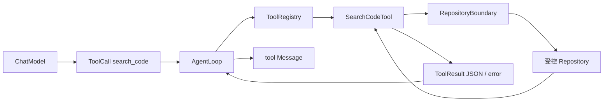

# Phase 1.5 学习笔记：Search Code Tool

## 1. Step Overview

- **Current Phase**：Phase 1 — Python Coding Agent MVP
- **Current Step**：Phase 1.5 — Search Code Tool
- **本 Step 目标**：让 Agent 能在一个固定、受控的本地 Repository 中执行真实的精确文本检索，并获得可定位、可解析、可限制的搜索结果。
- **最终新增能力**：`search_code` 接收单行字面量 `query` 和可选相对 `path`，对 UTF-8 文本执行大小写敏感检索，返回包含路径、行号、列号和原始行文本的 JSON 数组。
- **前置 Step**：Phase 1.4 已提供 `RepositoryBoundary`、`list_files` 和 `read_file`，本 Step 直接复用其仓库边界与凭据保护规则。
- **后续 Step（Planned）**：Phase 1.6 才实现 `apply_patch`。本 Step 没有提前加入任何写入能力。

本 Step 完成后，Agent Runtime 已具备最小的“先找位置、再读取文件”能力，但还不能修改代码或运行测试，因此完整 Coding Agent MVP 仍是 **NOT IMPLEMENTED**。

## 2. Problem

只有 `list_files` 和 `read_file` 时，模型必须先猜文件名，再逐个读取文件。仓库稍大后会出现三个问题：

1. 模型不知道某个函数、类名或错误字符串出现在哪个文件中。
2. 为了寻找代码而大量读取完整文件，会浪费上下文和 Agent iteration。
3. 如果搜索没有仓库边界和输出限制，它可能读取仓库外文件、凭据或过量内容。

`search_code` 解决的是 Phase 1 中最基础的**词法定位**问题：给定一个明确文本，例如 `FeedService`，返回它所在的仓库相对路径和行位置，然后 Agent 再调用 `read_file` 获取上下文。

它不是 Phase 6 的 Code RAG。当前 Step 不理解语义、Symbol、AST 或自然语言近义词，只回答“这个精确字符串出现在哪些文本行”。保持这个边界，可以用标准库和小型真实文件系统测试验证行为，而不提前引入索引或外部依赖。

## 3. Design

### 3.1 核心对象

| 对象 | 职责 |
| --- | --- |
| `SearchCodeTool` | 固定 Repository 根目录和所有资源上限，构造 Tool 定义并执行搜索 |
| `RepositoryBoundary` | 复用 Step 1.4 的路径规范化、仓库内校验、链接逃逸校验和受保护文件规则 |
| `Tool` | 向模型描述 `search_code` 的名称、说明、输入 Schema 和 handler |
| `ToolCall` | 携带本次调用 ID、工具名和 `query` / `path` 参数 |
| `ToolResult` | 返回成功/失败、JSON 输出、错误、耗时和 `truncated`，并关联原 `tool_call_id` |
| `build_search_code_tool()` | 为一个固定 Repository 创建可注册的 `Tool` |

### 3.2 输入契约

模型可见的参数只有两个：

| 参数 | 必填 | 语义 |
| --- | --- | --- |
| `query` | 是 | 非空、单行、大小写敏感的字面量文本 |
| `path` | 否 | 仓库相对文件或目录；默认 `.` |

不允许额外参数。handler 会再次做真实运行时校验，因为当前 `ToolRegistry` 只保证 Schema 可传输，不执行完整 JSON Schema 语义校验。

### 3.3 输出契约

`ToolResult.output` 仍遵守 Step 1.1 的字符串字段，因此本 Step 把命中编码为紧凑、完整的 JSON 数组：

```json
[
  {
    "path": "src/service.py",
    "line": 12,
    "column": 5,
    "text": "    return target"
  }
]
```

- `path`：规范化后的 POSIX 风格仓库相对路径。
- `line`：从 1 开始的行号。
- `column`：该行第一次出现 `query` 的位置，从 1 开始，按 Python Unicode 字符位置计算。
- `text`：去掉换行符后的完整命中行。
- 无命中时返回 `[]`，仍然是 `success=True`。
- 资源上限导致搜索不完整时，返回仍可解析的 JSON，并设置 `truncated=True`。

### 3.4 默认资源边界

| 限制 | 默认值 | 防止的问题 |
| --- | ---: | --- |
| `max_matches` | 100 | 命中过多导致 Observation 膨胀 |
| `max_output_chars` | 100,000 | 长行或大量结果占满上下文 |
| `max_scanned_files` | 5,000 | 遍历并打开过多文件 |
| `max_scanned_entries` | 20,000 | 大目录或目录树造成无界枚举 |
| `max_file_chars` | 100,000 | 单文件读取占用过多内存和时间 |

这些值属于工具构造配置，不开放给模型随意提高。每个值必须是正整数；`max_output_chars` 至少为 2，确保空 JSON 数组 `[]` 总能完整返回。

### 3.5 模块与调用关系



当前真实代码中，`AgentLoop` 已能执行任意已注册 handler 并回填 `ToolResult`；本 Step 只新增具体的 Search Tool，没有修改 Loop。

## 4. Execution Flow

### 4.1 正常目录搜索

实际执行顺序如下：

1. `AgentLoop` 根据工具名从 `ToolRegistry` 取得 `search_code`。
2. `search_code()` 校验 `query`、`path` 和额外参数。
3. `RepositoryBoundary.resolve()` 解析 `path`，拒绝绝对路径、`..`、受保护路径和解析后的仓库逃逸。
4. `_collect_candidate_files()` 递归遍历目录，对每个子项解析 canonical path。
5. 越界链接、受保护文件和失效路径不进入候选集合；已访问目录集合阻止链接环。
6. 候选文件按规范化仓库相对路径排序，确保相同 Repository 得到确定顺序。
7. `_read_text()` 以严格 UTF-8 和固定字符上限读取每个候选文件。
8. `content.splitlines()` 逐行处理，`line.find(query)` 做大小写敏感的字面量匹配。
9. 命中转换为 `path`、`line`、`column`、`text` 字典。
10. 加入命中前先重新编码完整 JSON，超过命中数或输出字符上限时停止并设置 `truncated=True`。
11. 返回与原调用 ID 关联的成功 `ToolResult`，由 Loop 包装成 tool Observation。

### 4.2 显式文件搜索

当 `path` 指向文件时，不遍历目录，直接搜索该文件。此时非法 UTF-8、NUL 字节、文件消失或不可读是明确失败，因为用户要求搜索的唯一目标无法处理。

### 4.3 目录中的非文本文件

搜索目录时，非法 UTF-8、包含 NUL、搜索过程中失效或不可读的单个文件会被跳过，其他文本文件仍继续检索。原因是目录中包含图片、编译产物等非文本文件是正常情况，不能让一个文件抹掉已经找到的其他真实结果。

### 4.4 无命中与截断

- **完整搜索且无命中**：`success=True`、`output="[]"`、`truncated=False`。
- **搜索范围受限且当前无命中**：`success=True`、`output="[]"`、`truncated=True`。
- **非法参数或显式目标不可读**：`success=False`、`output=""`、`error` 包含真实原因。

这个区别很重要：空数组并不总能证明整个 Repository 没有结果，调用方还必须检查 `truncated`。

## 5. File Changes

本 Step 实际新增或修改了以下文件。这里同时记录变更类型、具体代码和协作关系，便于后续通过 Diff 复盘。

### 5.1 业务代码与测试文件

| 文件 | 变更类型 | 具体增加或修改的代码 |
| --- | --- | --- |
| `services/agent_runtime/app/tools/search_code.py` | **新增** | 新增 `SearchCodeTool`、五项默认资源限制、`definition()`、真实 `search_code()` handler、候选文件遍历、UTF-8 有界读取、参数校验、JSON 编码、成功/失败结果构造和 `build_search_code_tool()` 工厂 |
| `services/agent_runtime/app/tools/__init__.py` | **修改** | 新增导出 `SearchCodeTool` 与 `build_search_code_tool`，调用方可以统一从 `app.tools` 导入 |
| `services/agent_runtime/tests/test_search_code_tool.py` | **新增** | 新增 `SearchCodeToolTests` 的 10 个测试方法，使用真实临时目录、真实文本/二进制文件和真实 symlink；Windows 无 symlink 权限时使用 Junction 等价夹具 |

### 5.2 状态与说明文档

| 文件 | 变更类型 | 具体同步内容 |
| --- | --- | --- |
| `docs/roadmap.md` | **修改** | 将 1.4 标记为 Completed，将 1.5 设为 Current / Awaiting Acceptance，记录真实实现、50 个测试和未实现边界 |
| `docs/architecture.md` | **修改** | 将当前实现范围更新到 Phase 1.1–1.5，说明 Search Tool 输入、路径安全、JSON 输出和资源限制 |
| `README.md` | **修改** | 更新项目结构、Current Step、Implemented / Planned、50 个测试证据和下一推荐 Step |
| `services/agent_runtime/README.md` | **修改** | 说明 Runtime 中 `search_code` 的真实行为、测试范围和当前限制 |
| `docs/learning/phase-01/step-1.5-search-code-tool.md` | **新增** | 当前学习笔记，记录问题、设计、执行流程、代码、测试、权衡、限制和面试知识点 |

`docs/decisions.md` 没有修改，因为 ADR 007 已经批准 Phase 1–4 在受控测试 Repository 中实现有限 Python 本地工具，本 Step 未产生新的架构决策。

`docs/migration.md` 没有修改，因为本 Step 没有复制 Hermes、Go Agent Scaffold 或其他第三方代码；长期设计只用于确认 `search_code → read_file` 的产品流程定位。

## 6. Core Code Walkthrough

### 6.1 Tool 定义绑定固定 Repository

核心定义来自 `search_code.py`：

```python
return Tool(
    name="search_code",
    description=(
        "Search UTF-8 repository text for a case-sensitive literal query "
        "and return JSON matches with path, line, column, and text."
    ),
    input_schema={
        "type": "object",
        "properties": {
            "query": {"type": "string", "minLength": 1},
            "path": {"type": "string", "default": "."},
        },
        "required": ["query"],
        "additionalProperties": False,
    },
    handler=self.search_code,
)
```

`SearchCodeTool` 在构造时固定根目录和限制，模型只决定要找的文本及仓库内范围，不能把根目录替换成宿主机其他位置，也不能提高扫描上限。

### 6.2 参数校验和边界解析

```python
query, relative_path = self._arguments(call)
target = self._boundary.resolve(relative_path)
single_file_search = target.is_file()
candidates, truncated = self._collect_candidate_files(target)
```

这里先校验参数，再交给 Step 1.4 的 `RepositoryBoundary`。`single_file_search` 在文件系统读取前保存，确保后面即使文件在搜索期间消失，显式文件搜索仍按失败处理，不会错误降级为目录跳过语义。

### 6.3 canonical path 再校验

```python
# 与 Safe Read 一样，必须先解析真实路径再纳入搜索范围；这样既
# 跳过越界链接，也能通过 visited 集合阻止目录链接环。
children = sorted(current.iterdir(), key=lambda path: path.name.casefold())
for child in children:
    resolved = child.resolve(strict=True)
    relative_name = self._boundary.relative_name(resolved)
```

只检查字符串形式的 `child` 不够，因为仓库内的 `escape` 可以是指向仓库外的 symlink 或 Windows Junction。`resolve(strict=True)` 跟随链接，`relative_name()` 再检查真实目标是否仍属于根目录和允许路径。

`visited_directories` 保存 canonical directory path，同一个真实目录即使通过多个链接进入，也只扫描一次，避免无限循环和重复工作。

### 6.4 有界 UTF-8 读取

```python
# 每个文件只读取上限再多一个字符，用固定内存开销判断搜索范围
# 是否完整；超出范围通过 ToolResult.truncated 显式反馈。
with file_path.open("r", encoding="utf-8", errors="strict", newline="") as stream:
    content = stream.read(self._max_file_chars + 1)

truncated = len(content) > self._max_file_chars
return content[: self._max_file_chars], truncated
```

“上限 + 1”是常见的有界读取技巧：

- 只读上限无法区分“文件刚好等于上限”和“文件还有内容”。
- 多读一个字符就能准确设置 `truncated`。
- 不需要把整个大文件加载到内存。

`errors="strict"` 确保解码错误不会被静默替换；NUL 字节即使 UTF-8 合法，也被视为非普通文本。

### 6.5 行定位

```python
for line_number, line in enumerate(content.splitlines(), start=1):
    column = line.find(query)
    if column < 0:
        continue
    hit = {
        "path": relative_name,
        "line": line_number,
        "column": column + 1,
        "text": line,
    }
```

`find()` 接收普通字符串，所以 `needle.*` 中的 `.*` 没有正则含义。`enumerate(..., start=1)` 和 `column + 1` 让结果符合编辑器常用的 1-based 位置。

当前一个命中行只记录该行第一次出现的位置，不为同一行内的重复文本生成多条记录。这是当前最小契约，未来只有出现真实需求并更新 Step 时才扩展。

### 6.6 保证截断后 JSON 仍完整

```python
# 始终对完整结果重新编码后再判断上限，避免直接截断字符串
# 产生无法解析的半段 JSON。
if len(matches) >= self._max_matches:
    truncated = True
    break
encoded_with_hit = self._encode_matches([*matches, hit])
if len(encoded_with_hit) > self._max_output_chars:
    truncated = True
    break
matches.append(hit)
```

不能先生成很大的 JSON 再做 `output[:limit]`，因为这样可能得到半个字符串、半个对象或缺失的 `]`。当前实现只有当“加入该命中后的完整 JSON”仍在上限内时才真正加入，因此调用方始终可以执行 `json.loads(result.output)`。

## 7. Key Concepts

### 7.1 Lexical Search

Lexical Search 按字面字符匹配。它适合函数名、类名、错误字符串、配置键等精确标识符，行为稳定、可复现、无需索引。它无法理解“缓存击穿”和 `singleflight` 之间的语义关系，这属于后续 Code RAG。

### 7.2 Canonical Path

用户输入和目录项是 lexical path；`Path.resolve()` 得到跟随链接后的 canonical path。安全判断必须作用于 canonical path，否则仓库内链接可以绕过根目录限制。

### 7.3 Deterministic Output

候选文件按规范化路径排序，行按文件内自然顺序返回。确定性让单元测试、Agent Observation 和后续失败复盘更可靠，也避免相同仓库因文件系统枚举顺序不同而产生随机上下文。

### 7.4 Structured Observation

虽然 `ToolResult.output` 是字符串，JSON 仍提供结构边界。模型或后续 Provider Adapter 可以区分路径、行、列和文本，而不必解析脆弱的 `path:line:text` 拼接格式。

### 7.5 Bounded Work 与 Bounded Output

只限制最终输出不等于限制工作量。当前实现分别约束目录项、候选文件、单文件字符、命中数和输出字符，控制文件系统枚举、I/O、内存以及模型上下文四个不同维度。

### 7.6 ToolResult.truncated

`success=True` 表示工具按当前限制正常完成并给出合法结果，不保证扫描覆盖整个物理 Repository。`truncated=True` 是不可忽略的事实，Agent 应缩小 `path`、换更具体的 `query` 或读取已找到的路径，而不是把空数组直接解释为全仓库无结果。

## 8. Design Decisions

### 8.1 为什么使用 Python 标准库而不是调用 ripgrep

当前 Step 需要验证工具语义和安全边界，不需要安装或探测外部可执行文件。标准库实现跨测试环境可复现、没有新依赖、错误和截断语义完全由 RepoPilot 控制。后续若真实仓库性能证明不足，可以在保持 Tool 契约的前提下评估替换底层实现。

### 8.2 为什么只支持大小写敏感字面量

这是最小、最明确的检索语义。加入正则、glob、大小写模式和排除规则会同时扩大 Schema、错误类型和安全测试面。当前已经能满足精确标识符定位，其他模式留给有真实需求的后续小 Step。

### 8.3 为什么输出 JSON 而不修改 ToolResult 数据模型

`ToolResult.output` 已经是 Agent Loop 与模型 Observation 的稳定字符串边界。为了一个 Tool 新增通用 `artifacts` 或任意结构字段会越过 Step 1.5，也会影响 Steps 1.1–1.3。JSON 字符串提供了当前需要的结构化能力，并保持已有契约兼容。

### 8.4 为什么复用 RepositoryBoundary

路径策略必须只有一个当前事实来源。复制一套略有差异的路径检查，很容易让 `read_file` 拒绝的路径被 `search_code` 接受。复用 Step 1.4 能保持绝对路径、`..`、`.git`、凭据和链接逃逸规则一致。

### 8.5 为什么目录搜索跳过非文本文件，而单文件搜索失败

目录里存在图片或编译产物很正常，跳过它们可以保留其他文本命中；显式指定单文件时，跳过会制造“成功但没有搜索目标”的假象，因此必须失败。两种语义由测试固定。

### 8.6 为什么没有新增 ADR 或依赖

ADR 007 已覆盖 Phase 1–4 的受控 Python 本地工具过渡。本 Step 没有改变语言职责、通信方式、基础设施或长期安全方案，也没有增加第三方包，所以无需新增 ADR 或依赖记录。

## 9. Error and Edge Cases

| 场景 | 当前行为 | 测试证据 |
| --- | --- | --- |
| 缺少、空或非字符串 `query` | 失败，返回参数错误 | `test_rejects_invalid_arguments_and_paths` |
| 多行 `query` | 失败；当前结果按行定位 | `test_rejects_invalid_arguments_and_paths` |
| 额外参数 | 失败，避免悄悄忽略模型拼错的字段 | `test_rejects_invalid_arguments_and_paths` |
| 绝对路径或 `..` | 失败，不访问仓库外目标 | `test_rejects_invalid_arguments_and_paths` |
| `.env` 等受保护文件 | 显式访问失败，目录扫描不返回 | `test_blocks_protected_files_and_repository_escape_links` |
| 指向仓库外的 symlink / Junction | 显式目标失败，根扫描跳过 | `test_blocks_protected_files_and_repository_escape_links` |
| 非法 UTF-8 或 NUL 的显式文件 | 失败且不返回部分数据 | `test_rejects_explicit_non_text_files` |
| 目录中的非文本文件 | 跳过，其他文本搜索继续成功 | `test_rejects_explicit_non_text_files` |
| 无命中 | 成功返回 `[]` | `test_returns_successful_empty_json_for_no_match` |
| 区分大小写和正则字符 | `TARGET` 不匹配 `target`；`.*` 按普通字符 | `test_uses_case_sensitive_literal_line_matching` |
| 命中数/JSON 输出达到上限 | 返回完整 JSON，设置 `truncated=True` | `test_bounds_match_count_and_keeps_output_valid_json` |
| 单文件或候选文件达到上限 | 返回已完成范围，设置 `truncated=True` | `test_bounds_file_content_and_candidate_file_scanning` |
| 非法 Repository 根或限制 | 构造时抛出 `ValueError` | `test_rejects_invalid_roots_and_limits` |

## 10. Testing

### 10.1 测试文件和夹具

专项测试文件：

`services/agent_runtime/tests/test_search_code_tool.py`

每个测试使用 `tempfile.TemporaryDirectory()` 创建真实 Repository，写入多个目录、UTF-8 文件、非法字节文件、NUL 文件、受保护文件和仓库外目录。链接逃逸使用真实 symlink；Windows 没有创建 symlink 权限时，使用 `mklink /J` 创建具有等价边界风险的 Junction。

### 10.2 十个测试方法验证什么

1. `test_builds_contract_and_returns_deterministic_structured_matches`：Tool Schema、调用关联、稳定路径顺序、1-based 行列和 JSON 字段。
2. `test_returns_successful_empty_json_for_no_match`：无命中不是错误。
3. `test_scopes_search_to_a_file_or_subdirectory`：文件和子目录范围真实生效。
4. `test_uses_case_sensitive_literal_line_matching`：大小写敏感，正则字符没有特殊含义。
5. `test_rejects_invalid_arguments_and_paths`：缺失/错误参数、额外参数、穿越和绝对路径。
6. `test_blocks_protected_files_and_repository_escape_links`：凭据保护、真实链接逃逸和根扫描过滤。
7. `test_rejects_explicit_non_text_files`：显式非文本失败，目录搜索继续。
8. `test_bounds_match_count_and_keeps_output_valid_json`：命中数和 JSON 字符上限，截断输出仍能解析。
9. `test_bounds_file_content_and_candidate_file_scanning`：单文件字符和候选文件数上限。
10. `test_rejects_invalid_roots_and_limits`：构造阶段配置边界。

### 10.3 实际执行命令与结果

专项测试：

```text
cd services/agent_runtime
python -B -m unittest tests.test_search_code_tool -v
```

真实结果：

```text
Ran 10 tests in 0.128s
OK
```

完整 Runtime 回归：

```text
cd services/agent_runtime
python -B -m unittest discover -s tests -v
```

真实结果：

```text
Ran 50 tests in 0.199s
OK
```

这 50 个测试包括：

- 8 个 Agent Loop 测试；
- 17 个核心数据模型测试；
- 6 个 Tool / Registry 测试；
- 9 个 Safe Read 测试；
- 10 个 Search Code 测试。

### 10.4 Diff Review

代码测试通过后执行了：

```text
git status --short
git diff --check
git diff --stat
```

并逐项读取新增实现和测试，检查了：

- 修改范围只属于 Step 1.5；
- 没有 `TODO`、空实现、固定业务结果或弱化断言；
- 没有新依赖、网络、写操作或 Future Step；
- 中文注释位于链接边界、有界读取、目录非文本处理和 JSON 截断等关键逻辑；
- 测试里的 `secret` 仅是凭据保护夹具，不是真实敏感信息；
- 新文件无尾随空白并以换行结束。

## 11. What I Should Be Able to Explain

完成本 Step 后，应能够回答并讲清楚以下问题：

1. RepoPilot 为什么需要 `search_code`，它与 `read_file` 如何分工？
2. Step 1.5 的精确文本检索为什么不等于 Phase 6 Code RAG？
3. 为什么模型只能提供 `query` 和相对 `path`，不能提供 Repository 根目录或资源上限？
4. lexical path 和 canonical path 有什么区别？为什么 symlink / Junction 后必须再次检查？
5. 为什么受保护文件规则必须与 Safe Read 共用，而不是在 Search Tool 复制一份？
6. 为什么无命中是成功，路径非法却是失败？
7. `success=True, truncated=True, output="[]"` 应该如何解释？
8. 为什么只截断 JSON 字符串会破坏工具契约？当前代码怎样保证输出始终可解析？
9. “上限 + 1 字符”的读取方式解决了什么边界判断？
10. 为什么目录搜索跳过非文本文件，而显式文件搜索返回失败？
11. `line` 和 `column` 为什么从 1 开始？当前 column 的计数单位是什么？
12. 为什么当前一个命中行只记录第一次出现的位置？未来扩展时要考虑什么兼容性？
13. 为什么不仅限制输出，还需要限制目录项、文件数和单文件字符数？
14. 为什么当前选择标准库实现，而不是直接依赖 ripgrep？何时值得复议？
15. `ToolResult.tool_call_id` 对 Agent Loop 的 Observation 关联有什么作用？
16. Phase 5 为什么仍要把执行职责迁移给 Go Tool Gateway，而不是把这个 Python 本地工具直接当生产安全边界？

## 12. Step Summary

### 12.1 Current Limitations

当前实现的真实限制如下：

- 只支持大小写敏感、单行字面量查询；没有正则、glob、模糊、Symbol 或语义检索。
- 每个命中行只返回第一次出现的列，不枚举同一行的重复 occurrence。
- 只扫描严格 UTF-8 且不含 NUL 的文本；目录模式会跳过非文本或不可读文件，不返回单独的 skipped-files 清单。
- 大文件只搜索前 `max_file_chars` 个字符；必须结合 `truncated` 判断结果是否完整。
- 目录遍历是同步本地文件系统 I/O，没有取消、超时、ignore 文件规则或增量索引。
- 输出上限按 Python 字符计数，不是 UTF-8 字节数。
- 当前测试对象是专门创建、内容已知的临时 Repository；不能据此宣称适合不可信外部仓库。
- Phase 5 仍需由 Go Tool Gateway / Sandbox 接管生产执行与授权边界。

### 12.2 本 Step 总结

Phase 1.5 新增了真实、受控、可测试的 `search_code`：它复用仓库安全边界，按确定顺序搜索 UTF-8 文本，以结构化 JSON 返回路径和行列位置，并对扫描工作与 Observation 大小实施多层限制。

本 Step 最应掌握的是：**字面量搜索与语义检索的边界、canonical path 安全校验、确定性结构化输出、不同层次的资源限制，以及 success / empty / truncated / failure 四种结果含义。**

下一推荐 Step 是 Phase 1.6 — Apply Patch Tool。它应建立在同一个 Repository 边界上实现受控真实修改和 Diff，但在用户验收并明确继续前仍为 **Planned / NOT IMPLEMENTED**。
