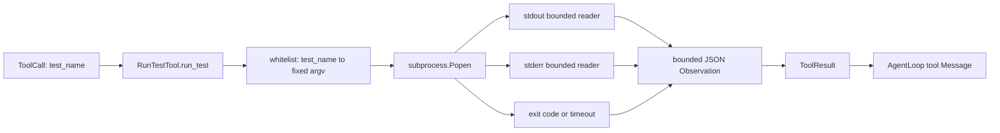

# Phase 1.7 — Run Test Tool 学习笔记

## 1. Step Overview

- **Current Phase**：Phase 1 — Python Coding Agent MVP
- **Current Step**：Phase 1.7 — Run Test Tool
- **Step Status**：Implemented and locally verified / Awaiting Acceptance
- **一句话概括**：本 Step 让 Agent 能在受控 Repository 中选择一个预配置测试项，真实执行固定测试命令，并把 PASS、FAIL、timeout、stdout、stderr 和 exit code 作为结构化 Observation 返回。

本 Step 的目标不是提供一个通用终端，而是补上研发闭环中的 **Test** 节点。Step 1.6 已经能真实修改一个文件；如果没有可信测试，Agent 只能说“看起来修好了”，不能证明修改满足项目断言。Step 1.7 把预配置测试命令变成 Registry-ready 的 `run_test` Tool，让已有 `AgentLoop` 在注册该 Tool 后能够执行测试并读取结果。

前后关系如下：

- **此前已实现**：Phase 1.1–1.6 的数据模型、Tool Registry、使用 fake ChatModel 验证的 Agent Loop，以及真实 `list_files`、`read_file`、`search_code`、`apply_patch`。
- **本 Step 实现**：白名单 `run_test`、真实子进程、固定 cwd、最小环境、timeout、有界双流捕获、exit code 判定和失败 Observation。
- **Planned / NOT IMPLEMENTED**：Step 1.8 真实 LLM Provider；Step 1.9 受控 Bug-Fix E2E；Phase 5 Go Tool Gateway、Git Worktree 和 Docker Sandbox。

## 2. Agent Execution Position and Capability Gap

### 2.1 完整 Agent 流程中的位置

```text
User Request
→ AgentState / AgentLoop                         [此前已实现]
→ Model 选择 list_files / search_code / read_file [Loop 可执行；真实文件 Tool 已实现]
→ Model 选择 apply_patch                         [此前已实现：真实单文件修改]
→ Model 选择 run_test(test_name)                 [本 Step 实现]
→ 白名单解析 → 固定 argv → 真实子进程             [本 Step 实现]
→ stdout / stderr / exit code / timeout          [本 Step 实现]
→ ToolResult Observation 回到 AgentLoop          [已有 Loop 能力 + 本 Step 结果契约]
→ 根据失败 Observation 再修改并重试               [Loop 机制已具备；真实 LLM 驱动仍 Planned]
→ 真实测试通过                                   [Tool 已具备；完整 E2E 在 Step 1.9]
→ Review / Eval / Approval / Final Result        [Planned / NOT IMPLEMENTED]
```

这里必须区分“组件已经兼容”与“端到端已经运行”：`RunTestTool.definition()` 返回现有 `Tool` 类型，`AgentLoop` 已能调用任何注册 Tool 并回填 `ToolResult`；但当前没有默认 Runtime 装配、真实 Provider 或 Step 1.9 Bug-Fix E2E。因此本 Step 证明的是测试执行组件真实可用，不宣称完整 Agent 已自主修复 Bug。

### 2.2 Before：流程此前卡在哪里

Step 1.6 完成后，真实流程最多走到：

```text
读取文件 → 生成 Patch → 修改文件 → 返回真实 Diff
```

缺口是：

1. 没有代码真正启动测试进程。
2. 没有 exit code，无法用项目断言判定修改是否成功。
3. 没有 stdout / stderr，失败后 Agent 看不到断言、堆栈或编译错误。
4. 没有 timeout，卡死测试可能无限占住 Agent Loop。
5. 如果直接接受模型命令字符串，`run_test` 会变成任意宿主 shell 入口，违反 Phase 1 安全边界。

### 2.3 Current Step：输入 → 处理 → 输出

输入不是任意命令，而是：

```json
{
  "test_name": "unit"
}
```

服务端构造工具时已经配置：

```python
{
    "unit": [sys.executable, "-B", "-m", "unittest", "discover", "-s", "tests", "-v"]
}
```

核心处理顺序：

1. 校验调用只含 `test_name`。
2. 确认名称位于构造时的白名单。
3. 取出完全固定的 argv；模型不能追加参数。
4. 以 Repository 根目录作为 cwd、`shell=False`、最小环境启动真实子进程。
5. 分别持续排空 stdout / stderr，但只保存有界前缀。
6. 等待进程；超时则终止，非零退出则保留失败证据。
7. 输出始终是长度受限、可解析的 JSON。
8. 用原始 `tool_call_id` 和 `tool_name` 构造 `ToolResult`。

成功 Observation 的核心形态：

```json
{
  "command": ["python", "-m", "unittest"],
  "exit_code": 0,
  "stderr": "",
  "stderr_truncated": false,
  "stdout": "Ran 10 tests ... OK",
  "stdout_truncated": false,
  "test_name": "unit",
  "timed_out": false
}
```

失败时 `ToolResult.success=False`，`error` 明确说明非零退出或 timeout，`output` 仍保存上述执行证据。测试失败是 Agent 应读取的 Observation，不是需要由 Loop 隐藏的异常。

### 2.4 After：补上后能继续什么

现在单个 Tool 已能真实回答：

- 哪个预配置测试被执行；
- 固定命令是什么；
- 测试进程是否正常退出；
- exit code 是多少；
- stdout / stderr 中报告了什么；
- 是否 timeout；
- 输出是否因安全上限而截断。

因此后续真实 Provider 可以依据失败输出决定重新读取、修改和再次测试。没有本 Step，Step 1.9 的“Test Fail → Observation → Retry → Test Pass”没有可信执行基础。

## 3. Design

### 3.1 核心对象



| 对象 | 通俗作用 | 工程职责 | 流程位置 |
| --- | --- | --- | --- |
| `RunTestTool` | 受控测试启动器 | 冻结白名单、验证调用、启动/等待/终止子进程、构造结果 | ToolCall 到 ToolResult |
| `_BoundedCapture` | 只保留前 N 个字符的排水桶 | 线程安全保存 stdout / stderr 前缀，超限后继续排空 pipe 并记录截断 | 子进程输出采集 |
| `Tool` | 给 Registry 和模型看的工具说明 | 保存 name、description、Schema 与 handler | 工具发现与调用入口 |
| `ToolCall` | Agent 的测试请求 | 携带调用 ID、`run_test` 名称和 `test_name` 参数 | Agent → Tool |
| `ToolResult` | 测试执行回执 | 关联调用并表达 success、output、error、duration、truncated | Tool → Observation |

### 3.2 白名单数据结构

构造输入是 `Mapping[str, Sequence[str]]`：

```text
test_name → 完整 argv
```

实现保存两份防御性 tuple：

- `_display_commands`：保留配置的原始 argv，进入执行证据。
- `_execution_commands`：把 argv[0] 解析并冻结成绝对可执行文件路径，用于真实启动。

两者分离的原因是：Observation 应展示项目配置的命令，而执行不应在切换到 Repository cwd 后再次依赖相对命令查找。

### 3.3 结构化输出

通用 `ToolResult.output` 仍是字符串；本 Step 不为单个 Tool 扩大核心模型，而是在字符串中保存确定性 JSON。这样：

- 不改变 Steps 1.1–1.6 的 Provider-neutral 契约；
- stdout 和 stderr 能分开；
- exit code、timeout、双流截断有明确字段；
- 输出截断后仍然可以 `json.loads()`，不会留下半段 JSON。

## 4. End-to-End Agent Execution Flow

### 4.1 当前 Repository 中真实可运行的最小成功路径

示例：验证 `passing.py`。

1. 测试创建真实临时 Repository 和 `passing.py`。
2. `RunTestTool(repository, {"unit": [sys.executable, "passing.py"]})` 固定根目录和白名单。
3. `definition()` 生成名为 `run_test` 的 Tool，Schema enum 只有 `unit`。
4. Tool 被放入真实 `ToolRegistry`。
5. `ToolCall(id="call-run-test", name="run_test", arguments={"test_name": "unit"})` 到达 handler。
6. `_test_name_argument()` 验证参数和白名单。
7. `_execute()` 在临时 Repository 根目录启动真实 Python 子进程。
8. 脚本分别向 stdout / stderr 输出；两个 reader 真实读取 pipe。
9. 进程返回 exit code 0。
10. `_render_output()` 生成可解析 JSON。
11. `ToolResult.success=True`，调用 ID、耗时和输出完整保留。

这个路径没有 Mock `subprocess.Popen`、exit code、文件系统或 Registry。

### 4.2 非零退出路径

真实失败脚本打印：

```text
stdout: assertion context
stderr: expected 4 but got 5
exit code: 3
```

处理结果：

```text
ToolResult.success = False
ToolResult.error = "test command exited with code 3"
ToolResult.output.exit_code = 3
ToolResult.output.stdout = "assertion context\n"
ToolResult.output.stderr = "expected 4 but got 5\n"
```

当该 Tool 注册到 `AgentLoop` 时，已有 Loop 会把结果包装为 tool Message。下一轮模型看到的不是 Python 异常，而是可用于修复的失败 Observation。

### 4.3 timeout 路径

真实慢脚本先 flush 一行，再 sleep 5 秒。工具等待 0.1 秒后：

1. 标记 `timed_out=True`；
2. POSIX 向独立进程组发送 SIGKILL；
3. Windows best-effort 调用固定系统 `taskkill /T /F`，失败时至少终止直接进程；
4. reader 只再等待有限 pipe drain grace，防止遗留 pipe 让 Tool 永久等待；
5. 返回 `success=False`、`exit_code=null` 和 timeout 前已捕获的 stdout。

## 5. File Changes

本 Step 真实新增/修改了以下文件。

### 5.1 核心代码与测试

| 文件 | 类型 | 文件职责 | 为什么需要 | 如何协作 |
| --- | --- | --- | --- | --- |
| `services/agent_runtime/app/tools/run_test.py` | **新增** | 白名单配置、固定命令解析、真实子进程执行、timeout、双流捕获、JSON Observation、Tool builder | 补上 Agent 的真实 Test 节点 | 复用 `RepositoryBoundary`、`ToolCall`、`ToolResult`、`Tool`；产物可注册到 `ToolRegistry` 并由 `AgentLoop` 调用 |
| `services/agent_runtime/tests/test_run_test_tool.py` | **新增** | 10 个真实临时 Repository / 子进程测试 | 证明 PASS、FAIL、timeout、安全和输出边界是真实行为 | 直接调用 handler，并通过 Registry / builder 验证现有契约兼容性 |
| `services/agent_runtime/app/tools/__init__.py` | **修改** | 导出 `RunTestTool`、`TestExecutionError`、`build_run_test_tool` | 让 Runtime 其他模块从统一 tools package 使用新 Tool | 保持 Registry 基础契约先导入，避免既有循环导入问题 |

### 5.2 状态与说明文档

| 文件 | 类型 | 具体修改 |
| --- | --- | --- |
| `docs/roadmap.md` | **修改** | Step 1.6 标记 Completed；Current Step 更新为 1.7 / Awaiting Acceptance；记录真实实现、70 项测试和 Step 1.8 仍未实现 |
| `docs/architecture.md` | **修改** | 当前实现更新到 Phase 1.1–1.7；记录白名单、固定 argv、最小环境、双流、timeout 和 Phase 5 边界 |
| `README.md` | **修改** | 更新结构树、Implemented / Planned、Current Step、70 项测试证据和下一推荐 Step |
| `services/agent_runtime/README.md` | **修改** | 说明 Runtime 级 `run_test` 设计、测试范围、过渡安全条件和当前限制 |
| `docs/learning/phase-01/step-1.7-run-test-tool.md` | **新增** | 当前学习笔记，基于真实代码讲解流程、文件、函数、测试、权衡、限制和面试知识点 |

`docs/decisions.md` 未修改：ADR 007 已明确接受 Phase 1–4 的 Python 受控本地工具过渡，并规定 Phase 5 迁移到 Go Tool Gateway + Docker Sandbox；本 Step 没有改变该决定。

`docs/migration.md` 未修改：没有复制 Hermes、Go Agent Scaffold 或其他第三方代码。仅查阅长期设计中 `run_test → exit code → Observation` 的目标位置，并按当前安全文档独立实现。

没有新增第三方依赖；实现只使用 Python 标准库。

## 6. Core Code Walkthrough

### 6.1 模型只能选择测试 ID

真实代码：

```python
input_schema={
    "type": "object",
    "properties": {
        "test_name": {
            "type": "string",
            "enum": list(self._execution_commands),
        }
    },
    "required": ["test_name"],
    "additionalProperties": False,
}
```

Schema 只暴露预配置名称。handler 仍做运行时校验，不能只相信模型遵守 Schema。这里对应 Agent 流程中的 ToolCall 输入边界。

### 6.2 构造期冻结可执行文件

真实核心逻辑：

```python
found = shutil.which(display[0])
if found is None:
    raise ValueError(
        f"executable for {test_name!r} was not found on PATH"
    )
resolved = Path(found).resolve(strict=True)

return display, (str(resolved), *display[1:])
```

如果配置使用 `python` 或 `go`，构造时按受信服务环境解析一次；执行时 argv[0] 已是绝对路径。这样切换 cwd 到目标 Repository 后，仓库内同名文件不能劫持命令查找。中文注释在源码中明确说明了这一安全意图。

### 6.3 固定执行上下文且不经过 shell

真实代码：

```python
process = subprocess.Popen(
    execution_command,
    cwd=self._boundary.root,
    stdin=subprocess.DEVNULL,
    stdout=subprocess.PIPE,
    stderr=subprocess.PIPE,
    shell=False,
    env=self._environment,
    text=True,
    encoding="utf-8",
    errors="replace",
    **popen_options,
)
```

- `execution_command` 来自构造期白名单，不来自模型。
- `cwd` 固定到规范化 Repository 根。
- `stdin=DEVNULL` 防止测试等待交互输入。
- stdout / stderr 独立捕获。
- `shell=False` 让 `;`、`&&`、`>` 等只是普通参数字符。
- 环境只保留 PATH、系统目录、临时目录、locale 等必要项，并固定 Python 输出编码；代理、Token、Profile 等不默认继承。

### 6.4 有界保存但持续排空

真实核心逻辑：

```python
while True:
    chunk = stream.read(_READ_CHUNK_CHARS)
    if not chunk:
        return
    capture.append(chunk)
```

`_BoundedCapture.append()` 只保存剩余配额，但 reader 不会因达到配额而停止读取。原因是 OS pipe 有容量上限：如果父进程不再读取，子进程可能卡在写输出，最后被误判为 timeout。

stdout 和 stderr 必须并发读取。如果只先读完 stdout 再读 stderr，子进程可能在 stderr pipe 写满时阻塞，而父进程又在等待 stdout EOF，形成死锁。

### 6.5 exit code 与 timeout 形成不同失败语义

真实核心逻辑：

```python
try:
    exit_code = process.wait(timeout=self._timeout_seconds)
except subprocess.TimeoutExpired:
    timed_out = True
    self._terminate_timed_out_process(process)
    process.wait()
    exit_code = None
```

- exit code 0：测试成功。
- exit code 非 0：测试已经结束，但断言、编译或测试进程失败。
- timeout：没有获得自然退出结果，因此 JSON 中 `exit_code=null`，而不是伪造一个测试退出码。

### 6.6 截断后仍返回完整 JSON

真实设计：

```python
candidate = self._serialize_payload(
    test_name=test_name,
    command=command,
    exit_code=exit_code,
    timed_out=timed_out,
    stdout=stdout_text[:stdout_length],
    stderr=stderr_text[:stderr_length],
    stdout_truncated=stdout_truncated,
    stderr_truncated=stderr_truncated,
)
```

实现用二分搜索寻找能放入总字符上限的最大 stdout / stderr 前缀。不能简单对最终 JSON 做 `output[:limit]`，因为那会留下无法解析的半个字符串，也会丢失 exit code 和截断标记。

构造器还预先确认：即使 stdout / stderr 为空，命令、名称、timeout 和最长平台 exit code 的元数据也能放进限制。否则在异常退出时才发现上限不足会破坏 Tool 契约。

## 7. Key Concepts

### 7.1 Allowlist / 白名单

**通俗解释**：像餐厅固定菜单，只能点已有菜名，不能走进厨房自行写一份命令。

**工程定义**：运行时输入只能引用服务端预先验证的标识符；标识符映射到不可由调用者修改的完整 argv。

**本 Step 入口与输出**：`test_name` 进入 `_test_name_argument()`，成功后得到冻结 argv；未知名称得到失败 `ToolResult`，不会启动进程。

**缺失后果**：模型可能把 `run_test` 变成任意命令执行器，访问宿主文件、启动网络安装或组合危险动作。

### 7.2 argv 与 Shell

**通俗解释**：argv 是把每个参数放进单独格子；shell 字符串是让命令解释器重新阅读整句话。

**工程定义**：`Popen(sequence, shell=False)` 把参数序列直接交给进程创建 API；`shell=True` 会引入管道、重定向、变量替换和命令连接等额外语法。

**本 Step 中**：配置保存 tuple argv，测试证明 `; echo ... > ...` 只作为一个普通参数到达脚本，没有创建注入文件。

**缺失后果**：即使“看起来是测试命令”，拼接输入也可能执行第二条宿主命令。

### 7.3 Exit Code

**通俗解释**：程序结束时交回的数字成绩单；通常 0 表示完成，非 0 表示失败类别。

**工程定义**：操作系统保存的进程终止状态。测试框架用非零状态表达断言失败、收集失败、编译失败或内部错误。

**本 Step 中**：只有自然返回 0 才令 `ToolResult.success=True`；非零值同时进入 JSON 和错误摘要。

**缺失后果**：只搜索 stdout 中的 “OK” 容易被日志格式、语言或伪输出欺骗，无法形成可信 Gate。

### 7.4 Timeout

**通俗解释**：给测试一只闹钟，到点还没结束就停止等待并明确报告超时。

**工程定义**：父进程对等待时长设置上限，到期后终止测试执行并生成不同于自然失败的结果。

**本 Step 中**：`process.wait(timeout=...)` 到期产生 `TimeoutExpired`；Observation 记录 `timed_out=true` 与 `exit_code=null`。

**缺失后果**：死循环、阻塞 I/O 或等待交互的测试会无限占用 Agent 迭代。

### 7.5 Pipe Backpressure

**通俗解释**：输出管道像有限容量水管；不持续排水，写日志的一方也会被堵住。

**工程定义**：stdout / stderr pipe 的内核缓冲区有限，写入者在缓冲区满时阻塞，直到读取者消费数据。

**本 Step 中**：两个 reader thread 分别持续读取双流；`_BoundedCapture` 只限制保留量，不停止排空。

**缺失后果**：高输出但本应快速完成的测试可能永远不退出，形成假 timeout 或死锁。

### 7.6 Observation

**通俗解释**：工具把“实际发生了什么”交回 Agent 的回执。

**工程定义**：与原 `tool_call_id` 关联的 `ToolResult`，包含成功状态、输出、错误、耗时和截断标记。

**本 Step 中**：Observation 的 output 是测试执行 JSON；失败仍保留 stdout / stderr / exit code，供下一轮推理使用。

**缺失后果**：Agent 只能知道“测试失败”，却不知道为何失败，也无法有依据地修复。

## 8. Design Decisions

### 8.1 为什么暴露 `test_name`，不暴露命令字符串

候选方案包括：任意 shell 字符串、模型提供 argv 后与白名单比对、只提供预配置 ID。

当前选择预配置 ID，因为它具有最小攻击面和最清楚的参数契约。模型只需表达“运行 unit”，无需知道宿主解释器路径。代价是新增测试组合必须由 Runtime 配置，而不能由模型临时拼接。

如果未来需要受控参数化，必须定义逐参数规则和共享执行策略，不能简单把 `args` 开放给模型。

### 8.2 为什么使用 `Popen` 与 reader，而不是 `subprocess.run(capture_output=True)`

`subprocess.run()` 写法更短，但 `capture_output=True` 会在内存中累计完整输出；无限打印直到 timeout 的测试可能占用大量内存。`Popen` 允许边读边丢弃超限部分，同时继续排空 pipe。

代价是实现更长，需要处理线程、timeout、进程终止和输出快照。

### 8.3 为什么 stdout / stderr 不合并

stderr 通常包含堆栈、编译错误和诊断，stdout 常包含测试进度和普通日志。分开保存使 Agent 和后续 UI 能判断信息来源。代价是需要两个并发 reader 和公平的总输出预算。

### 8.4 为什么非法 UTF-8 用替换字符

测试进程已经真实完成时，某个无效字节不应让 exit code 和其余日志全部消失。`errors="replace"` 用 `�` 标记无法解码的字节，同时保留结果。

这不同于 `read_file`：源文件必须是可靠 UTF-8 文本，所以非法编码会被拒绝；进程日志是观测流，保留尽可能多的证据更有价值。

### 8.5 为什么不扩展 `ToolResult` 数据模型

可以新增 test-specific 字段，但会把通用工具协议和一个具体 Tool 绑定。当前使用 JSON `output` 保存 test-specific 明细，已有 `success/error/duration/truncated` 继续表达通用语义。

未来 Go Tool Gateway 稳定共享协议时，可根据真实跨语言需求重新评估专用 execution details；本 Step 不提前设计完整结果层级。

### 8.6 为什么没有新增依赖或 ADR

标准库 `subprocess`、`threading`、`json`、`pathlib` 和 `unittest` 已足够。ADR 007 已覆盖当前 Python 本地过渡和 Phase 5 迁移方向，没有新基础设施、通信方式或语言职责变化。

## 9. Error and Edge Cases

| 场景 | 当前行为 | 测试证据 |
| --- | --- | --- |
| `test_name` 缺失、空或非字符串 | 失败 ToolResult；不启动进程 | `test_rejects_unknown_or_invalid_arguments_without_execution` |
| 未知 `test_name` | `test command is not allowed`；零执行 | 同上 |
| 多余参数 | 明确列出 unexpected arguments；零执行 | 同上 |
| shell 控制字符位于固定参数 | 仅作为普通 argv 元素传递 | `test_command_is_fixed_and_shell_syntax_is_only_a_literal_argument` |
| exit code 0 | success=True；完整执行 JSON | `test_builds_contract_and_runs_passing_test_in_repository_root` |
| exit code 非 0 | success=False；保存双流和真实 code | `test_nonzero_exit_returns_stdout_stderr_and_exit_code` |
| timeout | 终止、exit_code=null、保留已有输出 | `test_timeout_terminates_process_and_preserves_partial_output` |
| stdout 和 stderr 都很大 | 持续排空、返回有界可解析 JSON、双流截断为 true | `test_large_streams_are_drained_but_return_bounded_valid_json` |
| 输出含非法 UTF-8 | 用替换字符保留其余结果 | `test_replaces_invalid_utf8_output_instead_of_losing_result` |
| 多个白名单项 | 只执行请求的精确 ID | `test_selects_only_the_requested_preconfigured_command` |
| 根目录不存在 | 构造失败 | `test_rejects_invalid_roots_commands_and_limits` |
| 白名单为空、命令是字符串/空 argv/非法元素 | 构造失败 | 同上 |
| 可执行文件找不到 | 构造失败，不延迟到模型调用 | 同上 |
| timeout 非正数/非有限值 | 构造失败 | 代码边界；测试覆盖 0 |
| 输出上限装不下必要元数据 | 构造失败 | 同上 |
| 运行前可执行文件被删除或不可启动 | 失败 ToolResult，error 包含启动错误，output 保留命令元数据 | 实现分支；当前专项未单独模拟该竞态 |

## 10. Testing

### 10.1 测试为什么是真实的

`services/agent_runtime/tests/test_run_test_tool.py` 使用 `TemporaryDirectory` 创建真实 Repository 和真实 Python 脚本，并由当前 Python 解释器启动真实子进程。测试没有 Mock `Popen`、`wait`、stdout、stderr、exit code 或 timeout。

唯一使用的 `unittest.mock.patch.dict` 只是在父测试进程中放入一个标记环境变量，以证明它没有泄漏到子进程；这不是替代核心执行。

### 10.2 十个测试方法验证什么

1. `test_builds_contract_and_runs_passing_test_in_repository_root`：Schema enum、Registry、固定 cwd、最小环境、stdout / stderr、exit 0、调用关联。
2. `test_nonzero_exit_returns_stdout_stderr_and_exit_code`：真实 exit 3 与失败 Observation。
3. `test_timeout_terminates_process_and_preserves_partial_output`：真实 sleep、0.1 秒 timeout、部分日志和 null exit code。
4. `test_rejects_unknown_or_invalid_arguments_without_execution`：未知/缺失/空/错误类型/额外参数，且 marker 文件证明没有执行。
5. `test_command_is_fixed_and_shell_syntax_is_only_a_literal_argument`：shell 注入字符只作为 literal argv。
6. `test_large_streams_are_drained_but_return_bounded_valid_json`：stdout / stderr 各 50,000 字符，总输出最多 500 字符且 JSON 可解析。
7. `test_replaces_invalid_utf8_output_instead_of_losing_result`：原始无效字节替换和 exit code 保留。
8. `test_selects_only_the_requested_preconfigured_command`：多个允许项的精确选择。
9. `test_builder_returns_a_registry_ready_tool`：公共 builder 返回现有 `Tool` 契约。
10. `test_rejects_invalid_roots_commands_and_limits`：Repository、白名单、argv、可执行文件、timeout 和输出上限构造边界。

### 10.3 实际命令与结果

实现前基线：

```powershell
cd services/agent_runtime
python -B -m unittest discover -s tests -v
```

结果：

```text
Ran 60 tests in 0.329s
OK
```

最终专项测试：

```powershell
python -B -m unittest tests.test_run_test_tool -v
```

结果：

```text
Ran 10 tests in 0.658s
OK
```

最终全量回归：

```powershell
python -B -m unittest discover -s tests -v
```

结果：

```text
Ran 70 tests in 0.967s
OK
```

语法与导入检查：

```powershell
python -B -c "import ast; ...; import app.agent, app.tools"
```

结果：3 个本 Step Python 文件语法解析成功，`app.agent` 与 `app.tools` 同时导入成功。

### 10.4 实现检查与 Diff Review

检查内容包括：

```powershell
git diff --check
git status --short
rg -n "TODO|FIXME|NotImplemented|\bpass\b|shell\s*=\s*True|os\.system" ...
```

结论：

- 没有任意 shell、模型自定义 argv、动态安装或网络实现。
- `subprocess.run` 只用于 Windows timeout 时调用固定绝对路径 `taskkill.exe`，参数仅含工具创建的 PID，仍是 `shell=False`；不是模型可调用的通用命令入口。
- 没有 TODO、空实现、固定成功结果或弱化断言。
- 没有新第三方依赖、秘密或参考项目复制代码。
- 代码范围只覆盖 Step 1.7；没有实现 Provider 或 Bug-Fix E2E。
- 文档中 Implemented / Planned 与真实代码一致。
- Windows Git 仅提示部分已跟踪文件未来 checkout 时可能 LF → CRLF；`git diff --check` 没有空白错误。

## 11. What I Should Be Able to Explain

完成学习后，应能清楚回答：

1. `run_test` 在 RepoPilot 的 Read → Modify → Test → Observe → Retry 流程中位于哪里？
2. 为什么 Step 1.7 完成后仍不能宣称完整 Coding Agent 已完成？
3. 为什么模型只传 `test_name`，而不是 `go test ./...` 这样的字符串？
4. 白名单 ID 到固定 argv 的映射如何防止参数注入？
5. 为什么构造时要把可执行文件解析并冻结为绝对路径？
6. `shell=False` 具体避免了哪些额外解释语义？
7. 为什么测试命令仍需固定 Repository cwd？
8. 最小环境变量为什么是安全边界的一部分？
9. stdout 和 stderr 为什么要分开读取？
10. 什么是 pipe backpressure？为什么达到输出上限后 reader 仍必须继续排空？
11. 为什么 `subprocess.run(capture_output=True)` 不适合无限输出的测试？
12. exit code 0、非零和 timeout 在 ToolResult 中分别如何表达？
13. 为什么 timeout 时 `exit_code` 是 null，而不是进程被 kill 后的内部状态码？
14. 为什么输出截断后仍必须是完整 JSON？
15. 二分搜索如何处理 JSON 转义导致的长度膨胀？
16. `ToolResult.truncated` 与 JSON 中两个 stream truncated 字段有什么区别？
17. 为什么进程日志非法 UTF-8 选择替换，而源文件读取选择拒绝？
18. Windows `taskkill /T` 为什么仍只是 best-effort，而不能等同 Docker Sandbox？
19. 当前 timeout、CPU、Memory、Network、文件系统隔离分别做到什么程度？
20. 测试失败为什么是 Observation，而不是 AgentLoop 的终止错误？
21. `tool_call_id` 如何保证测试结果回到正确的模型调用？
22. 为什么本 Step 不扩展通用 `ToolResult` 数据模型？
23. 为什么没有为 `run_test` 引入 pytest、psutil 或命令框架？
24. Step 1.8 和 1.9 将如何使用本 Step，但哪些能力现在仍是 Planned？

## 12. Step Summary

### 12.1 Before → After

- **Before**：Agent 能真实查找、读取和修改代码，但无法执行项目断言验证修改。
- **After**：Agent Runtime 拥有一个 Registry-ready 的白名单测试 Tool，能在固定 Repository 中执行真实命令，并获得 PASS、FAIL、timeout、stdout、stderr、exit code、duration 和 truncation 证据。

本 Step 补上的是完整研发闭环中的 **Test → Observation**。关键价值不只是“能启动进程”，而是让测试执行同时满足可控、可关联、可限时、可限量、可解释和失败可反馈。

### 12.2 当前限制

- 仅适用于开发者专门准备、内容已检查的本地测试 Repository，不是生产 Sandbox。
- 测试代码本身仍在宿主机运行；没有 Docker 文件系统隔离、CPU / Memory / Process 限额或网络阻断。
- POSIX 使用进程组，Windows 使用 `taskkill /T` best-effort；可靠取消、竞态处理和强制清理仍由 Phase 5 解决。
- stdout / stderr 用 UTF-8 解码并替换非法字节，不保留原始字节流或平台本地编码。
- output 是 ToolResult 内的 JSON 字符串，没有独立 artifact 文件或持久 Trace。
- 没有 Runtime 默认装配和配置文件；调用方必须显式创建并注册 Tool。
- 没有真实 LLM Provider，当前 AgentLoop 仍由 fake ChatModel 测试。
- 没有 Step 1.9 真实 Bug Repository 闭环，尚未证明真实模型能根据失败 Observation 自主重试并最终测试通过。

### 12.3 最应掌握的内容

本 Step 最应掌握：**白名单 ID 与固定 argv、shell/参数边界、可执行文件冻结、固定 cwd、最小环境、真实 exit code、timeout、进程清理、stdout/stderr pipe backpressure、有界并发捕获、可解析 JSON Observation，以及测试失败回到 Agent Loop 的语义。**

下一推荐 Step 是 **Phase 1.8 — One Real LLM Provider**。它会把一个真实 Provider 适配到现有 Message / Tool Schema / AgentLoop；该能力当前仍是 **Planned / NOT IMPLEMENTED**，本次没有提前实现。
