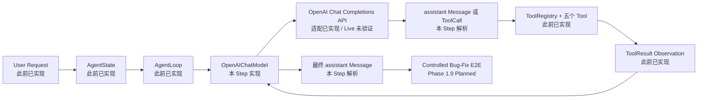

# Phase 1.8 — One Real LLM Provider 学习笔记

## 1. Step Overview

- **Current Phase**：Phase 1 — Python Coding Agent MVP
- **Current Step**：Phase 1.8 — One Real LLM Provider
- **Step Status**：Implemented / Awaiting Live Validation
- **一句话能力说明**：本 Step 让此前只能和测试替身对话的 Agent Loop，具备了把内部消息与工具协议转换为 OpenAI API 请求、再把模型响应转换回 RepoPilot 对象的真实 Provider 适配能力。

本 Step 的目标不是完成整个 Coding Agent，也不是完成一次真实 Bug 修复，而是只补齐下面这段边界：

```text
RepoPilot 内部 Message / Tool Schema
→ OpenAI Chat Completions 请求
→ OpenAI assistant 文本或 function tool calls
→ RepoPilot 内部 Message / ToolCall
```

当前真实状态必须分开看：

- **此前已实现**：数据模型、Tool Registry、同步 Agent Loop、五个本地受控工具。
- **本 Step 已实现**：`OpenAIChatModel`、双向协议转换、HTTP 调用、响应限制、错误与密钥脱敏、Provider 契约测试、最小实调入口。
- **本 Step 尚未完成的验收证据**：当前环境没有 `OPENAI_API_KEY`，因此没有成功执行付费的 OpenAI live call。
- **Planned / NOT IMPLEMENTED**：Phase 1.9 受控 Bug-Fix E2E、Provider retry、async/streaming、Responses API、多 Provider、生产 Sandbox。

因此，本 Step 不能标成 Completed，也不能推进 Current Step 到 1.9；当前状态是 **Implemented / Awaiting Live Validation**。

## 2. Agent Execution Position and Capability Gap

### 2.1 本 Step 在完整 Agent 流程中的位置



这里最重要的是不要把“Provider 适配器已实现”误写成“完整 Coding Agent 已经能修 Bug”。真实模型能否在受控仓库中连续完成 Search、Read、Modify、Test Fail、Retry、Test Pass，必须等 Phase 1.9 单独验收。

### 2.2 Before：此前已经能做什么，流程卡在哪里

Phase 1.3 已经定义了 `ChatModel` Protocol：

```python
class ChatModel(Protocol):
    def complete(
        self,
        messages: tuple[Message, ...],
        tools: list[dict[str, Any]],
    ) -> Message:
        ...
```

`AgentLoop` 已经知道如何：

1. 把当前消息和 Tool Schema 交给 `ChatModel.complete`。
2. 接收 assistant `Message`。
3. 执行其中的 `ToolCall`。
4. 把 `ToolResult` 包装成 tool Message。
5. 进入下一轮模型调用。

但此前测试使用的是 `ScriptedChatModel`。它按测试脚本直接返回预先写好的 `Message`，没有真实 HTTP 请求，也不理解任何 Provider 的字段格式。

因此此前流程会在这里中断：

```text
AgentLoop
→ ChatModel Protocol
→ 没有真实实现
→ 无法请求外部 LLM
```

### 2.3 Current Step：输入、处理与输出

本 Step 的入口是：

```python
OpenAIChatModel.complete(
    messages: tuple[Message, ...],
    tools: list[dict[str, Any]],
) -> Message
```

处理过程是：

```text
内部 messages / tools
→ 校验输入类型与非空 transcript
→ 转换为 OpenAI messages / function tools
→ JSON 编码
→ 携带 Bearer API Key 发起固定 HTTPS POST
→ 有界读取响应
→ 解析 JSON 和 choices[0].message
→ 解析 function.arguments JSON 字符串
→ 构造内部 Message / ToolCall
```

输入包括：

- system / user 文本消息；
- assistant 文本消息；
- assistant 发出的一个或多个 `ToolCall`；
- tool Message 中的完整 `ToolResult`；
- Tool Registry 导出的 name、description、input_schema。

输出只有一个内部 assistant `Message`：

- 有文本且没有 Tool Call时，Agent Loop 可自然结束；
- 有 Tool Call 时，Agent Loop 会执行对应工具并回填 Observation；
- Provider 或协议失败时，抛出 `OpenAIProviderError`，再由既有 Agent Loop 转换为失败 `AgentResult`。

### 2.4 After：补上以后能继续什么

完成本 Step 后，Agent Loop 不再绑定测试替身，也不需要理解 OpenAI 的 `choices`、`tool_calls`、`function.arguments` 等字段。

它只依赖稳定的内部契约：

```text
输入：tuple[Message, ...] + Tool Schema
输出：Message(role=assistant)
```

这使 Phase 1.9 可以在不改写 Loop 的前提下，使用真实模型决定何时调用 `search_code`、`read_file`、`apply_patch` 和 `run_test`。

但是，在 live call 完成前，只能确认协议映射和 Loop 集成逻辑正确，不能确认当前账户、模型 ID、网络权限和 OpenAI 服务访问真实可用。

## 3. Design

### 3.1 核心对象

| 对象 | 通俗理解 | 工程职责 | 输入 | 输出 |
| --- | --- | --- | --- | --- |
| `OpenAIChatModel` | “翻译员 + HTTP 客户端” | 实现 `ChatModel.complete`，隔离 Provider 格式 | 内部 Message、Tool Schema | 内部 assistant Message |
| `OpenAIProviderError` | Provider 边界的统一错误 | 表达 HTTP、网络、JSON、响应协议失败 | 原始边界错误 | 可读且脱敏的异常 |
| `_to_openai_message` | 请求消息翻译器 | 转换四种内部 role | `Message` | OpenAI message object |
| `_to_openai_tool` | 工具说明翻译器 | 将 Registry Schema 转成 function tool | provider-neutral schema | OpenAI function tool |
| `_parse_openai_tool_call` | 工具调用翻译器 | 解析并校验 function arguments | OpenAI tool call | 内部 `ToolCall` |
| `live_openai_provider.py` | 手工验收探针 | 发起一次明确、可计费的真实 API 调用 | API Key、model ID | assistant 文本或非零退出码 |

### 3.2 Provider Boundary 是什么

通俗地说，Provider Boundary 像一个插头转换器：Agent Loop 只认识 RepoPilot 自己的插头，OpenAI API 只认识 OpenAI 的插头，适配器负责转换，但不能改变电器本身的工作逻辑。

工程定义上，它是内部领域模型与外部 LLM API 协议之间的适配层。入口是 `complete(messages, tools)`，处理内容是字段转换、HTTP I/O 和协议校验，输出是 Provider 无关的 assistant `Message`。

没有这层边界会出现三个具体问题：

1. `AgentLoop` 被 `choices[0].message` 等外部字段污染。
2. 更换 Provider 时必须重写循环和状态逻辑。
3. Provider 返回非法 JSON 或错误 role 时，错误会在工具执行阶段才暴露，难以定位。

### 3.3 为什么选择 Chat Completions

当前内部 `AgentState.messages` 已经保存完整 transcript：assistant tool calls 和随后关联的 tool result 都在消息列表里。

OpenAI 官方 Function Calling 文档中的 Chat Completions 流程与此结构直接对应：

```text
assistant.tool_calls
→ application executes function
→ role=tool + tool_call_id + content
→ next chat.completions request
```

官方参考：<https://developers.openai.com/api/docs/guides/function-calling>

Responses API 需要按其 item 模型保存和继续传递 response output、function_call_output，部分模型还涉及 reasoning item 状态。当前内部模型没有这些字段。如果现在强行接入，会扩大 Step 1.8 的数据模型与状态范围。

因此当前选择是：

- 使用仍受官方支持的 Chat Completions function calling；
- 保持内部 transcript 不变；
- 不提前实现 Responses API 会话状态；
- 将未来迁移条件记录为：有明确模型需求或 Responses-only 能力时，再单独设计状态兼容方案。

### 3.4 为什么不用 OpenAI SDK

当前 Runtime 没有 `pyproject.toml`，也没有任何外部 Python 依赖。完成一次 JSON POST、Bearer Header 和响应解析，标准库已经足够。

本 Step 使用：

- `urllib.request.Request`；
- `urllib.request.urlopen`；
- `urllib.error.HTTPError / URLError`；
- `json`；
- `socket.timeout`。

收益：

- 不新增安装和许可证管理负担；
- API 请求内容完全可见，适合学习 Provider 协议；
- 契约测试可以精确断言 JSON 和 Header；
- 保持 Step 粒度小。

代价：

- 需要自己维护 HTTP/JSON 错误处理；
- 没有 SDK 的自动类型模型、内建 retry 和 API 版本便利能力；
- API 演进时需要手工同步。

当 Provider 能力扩大到 streaming、Responses API 或复杂错误/重试策略时，再评估官方 SDK；不能仅因为未来可能使用就现在引入。

## 4. End-to-End Agent Execution Flow

### 4.1 工具调用成功路径

测试 `test_integrates_with_agent_loop_and_returns_observation_next_turn` 真实执行了以下本地流程：

```text
User Message("Inspect source.")
→ AgentState
→ AgentLoop.run
→ OpenAIChatModel.complete（第 1 轮）
→ HTTP 边界返回 assistant function call: inspect
→ 解析成 ToolCall(id="call-inspect", arguments={"value": "source"})
→ ToolRegistry.get("inspect")
→ inspect handler 返回 ToolResult(output="found:source")
→ Message(role=tool, tool_result=...)
→ OpenAIChatModel.complete（第 2 轮）
→ ToolResult 整体编码为 JSON Observation
→ HTTP 边界返回 "Inspection complete."
→ 内部 assistant Message
→ AgentResult.succeeded(iterations=2)
```

这条测试没有伪造 Agent Loop 或 Tool 执行。只有不可在单元测试中依赖的外部 HTTP 服务响应被替换为可控响应，因此它证明的是：真实 adapter 与既有 Loop、Registry、ToolResult 可以协作。

它不证明 OpenAI 账户可访问，也不等于 Phase 1.9 的真实 Bug-Fix E2E。

### 4.2 最终文本成功路径

当 Provider 返回：

```json
{
  "choices": [
    {
      "message": {
        "role": "assistant",
        "content": "Inspection complete."
      }
    }
  ]
}
```

`_parse_response` 将其构造为：

```python
Message(
    role=MessageRole.ASSISTANT,
    content="Inspection complete.",
)
```

Agent Loop 看到没有 `tool_calls`，返回 `AgentResult.succeeded`。

### 4.3 Provider 失败路径

假设 OpenAI 返回 HTTP 401：

```text
urlopen
→ HTTPError(code=401)
→ 有界读取 error body
→ 只提取 error.message
→ 将 API Key 替换为 [REDACTED]
→ OpenAIProviderError
→ AgentLoop._complete 捕获
→ AgentResult.failed("chat model failed: OpenAIProviderError: ...")
```

失败不会被伪装成 assistant 文本，也不会继续执行工具。

### 4.4 Tool Observation 为什么发送完整 JSON

工具输出不是只有 `output` 字符串，还包括：

```json
{
  "tool_call_id": "call-1",
  "tool_name": "run_test",
  "success": false,
  "output": "assertion failed",
  "error": "test exited with code 1",
  "duration_ms": 127,
  "truncated": false
}
```

如果只把 `output` 发给模型，模型会丢失 success、error、耗时和截断语义，可能把失败当成功。完整 JSON Observation 让下一轮模型能区分：

- 测试是真通过还是失败；
- 输出是否被截断；
- 失败是工具业务结果还是 Provider 自身故障；
- 结果关联哪个 tool call。

## 5. File Changes

本 Step 具体新增或修改了以下文件。

### 5.1 新增代码文件

#### `services/agent_runtime/app/providers/__init__.py`

- 导出 `OpenAIChatModel` 和 `OpenAIProviderError`。
- 为 Provider 模块提供稳定导入入口。
- 避免调用方依赖具体实现文件路径。

#### `services/agent_runtime/app/providers/openai_chat.py`

- 本 Step 的核心实现。
- 负责配置校验、内部消息转换、Tool Schema 转换、HTTPS 请求、有界读取、错误脱敏、响应解析和 `ToolCall` 构造。
- 固定 OpenAI 官方 Chat Completions URL，避免把 API Key 发往调用方任意指定的 URL。
- 重要方法和关键安全步骤加入了中文注释。

#### `services/agent_runtime/live_openai_provider.py`

- 最小真实 API 调用入口。
- 从 `OPENAI_API_KEY` 读取密钥，从 `--model` 或 `REPOPILOT_OPENAI_MODEL` 读取模型 ID。
- 只打印 model、role、content 和 tool call 数量，不打印 API Key。
- 缺配置或 Provider 失败时返回非零退出码。

#### `services/agent_runtime/tests/test_openai_provider.py`

- 新增 10 个 Provider 测试。
- 验证配置、密钥、完整请求转换、工具调用解析、Agent Loop 两轮集成、非法输入、响应上限、协议错误、HTTP 错误和网络错误。

### 5.2 修改文档文件

#### `docs/roadmap.md`

- 将 1.7 更新为 Completed。
- 将 Current Step 更新为 1.8。
- 将状态写为 Implemented / Awaiting Live Validation。
- 记录 80 个单元测试和缺少 live call 的真实限制。
- 保持 1.9 为 Planned。

#### `docs/architecture.md`

- 当前实现范围从 Phase 1.1–1.7 更新到 1.1–1.8。
- 新增 Provider 边界、Chat Completions 选择、消息/工具转换、错误和密钥处理说明。
- 明确 Responses API、多 Provider 和 live validation 尚未完成。

#### `services/agent_runtime/README.md`

- 增加 OpenAI Provider 的运行时说明。
- 增加最小实调命令。
- 更新测试数量和限制。

#### `README.md`

- 更新仓库总览、Current Step、Implemented / Planned、验证证据和下一步。
- 不再把真实 Provider 适配器列为完全未实现。
- 明确真实外网调用仍未通过。

### 5.3 本学习文件

#### `docs/learning/phase-01/step-1.8-one-real-llm-provider.md`

- 记录本 Step 的 Agent 流程位置、实现、代码、测试、权衡和限制。
- 明确列出所有新增/修改文件。
- 不把尚未成功执行的 live call 写成已完成。

### 5.4 未修改的文件与原因

- `app/agent/loop.py`：已有 `ChatModel` Protocol 足以接入，不需要为 OpenAI 改 Loop。
- `app/agent/models.py`：Chat Completions 可以无损映射现有 transcript，不需要增加 Provider 字段。
- `docs/decisions.md`：本 Step 没有改变 Go/Python 边界或引入新基础设施，OpenAI 适配器也不是不可替换的长期平台锁定，因此没有新增 ADR。
- `docs/migration.md`：没有复制 Hermes 或 Go Scaffold 代码；实现依据当前 RepoPilot 契约和 OpenAI 官方协议独立完成。

## 6. Core Code Walkthrough

### 6.1 Provider 入口保持内部协议稳定

核心代码：

```python
def complete(
    self,
    messages: tuple[Message, ...],
    tools: list[dict[str, Any]],
) -> Message:
    request_payload = self._build_request(messages, tools)
    response_payload = self._post_json(request_payload)
    return self._parse_response(response_payload)
```

这三个阶段分别是：

1. `_build_request`：内部对象转外部请求。
2. `_post_json`：只负责一次 HTTP 交互。
3. `_parse_response`：外部响应转内部对象。

拆开后，协议转换、I/O 和响应校验可以分别理解和测试，不会形成一个巨大函数。

### 6.2 API Key 从环境读取但不进入 repr

核心代码：

```python
@classmethod
def from_env(cls, *, model: str, ...) -> "OpenAIChatModel":
    api_key = os.environ.get("OPENAI_API_KEY", "")
    if not api_key.strip():
        raise OpenAIProviderError("OPENAI_API_KEY is not configured")
    return cls(api_key=api_key, model=model, ...)

def __repr__(self) -> str:
    # API Key 只保存在私有字段中；调试输出绝不能把密钥带入日志。
    return (
        f"{type(self).__name__}(model={self._model!r}, "
        f"timeout_seconds={self._timeout_seconds!r})"
    )
```

`from_env` 不提供默认假 Key。没有配置就明确失败。

自定义 `repr` 的作用是避免调试日志意外打印整个实例字段。HTTP 和网络错误还会通过 `_redact` 再做一次密钥替换。

### 6.3 Tool Schema 转换

内部 Registry Schema：

```python
{
    "name": "read_file",
    "description": "Read one repository file.",
    "input_schema": {
        "type": "object",
        "properties": {"path": {"type": "string"}},
        "required": ["path"],
    },
}
```

转换后的 OpenAI function tool：

```python
{
    "type": "function",
    "function": {
        "name": name,
        "description": description,
        "parameters": deepcopy(dict(input_schema)),
    },
}
```

这里没有设置 `strict=True`。OpenAI strict mode 要求 object schema 对所有字段和 `additionalProperties` 有更严格约束，而当前 Tool Registry 明确只保证 JSON-compatible 顶层 object，并未实现完整 JSON Schema 语义校验。

如果现在写成 strict，就会对当前 Schema 能力做虚假承诺，部分工具也会被 API 拒绝。

### 6.4 ToolResult Observation 转换

核心代码：

```python
return {
    "role": "tool",
    "tool_call_id": result.tool_call_id,
    "content": json.dumps(
        result.to_dict(),
        ensure_ascii=False,
        separators=(",", ":"),
    ),
}
```

`tool_call_id` 让 OpenAI 把结果关联回原 function call。`content` 使用完整结构化结果，而不是只回显输出。

这一步对应 Agent 流程中的：

```text
Tool execution
→ ToolResult
→ Observation
→ next model turn
```

### 6.5 解析 function arguments

OpenAI 返回的 `function.arguments` 是 JSON 字符串，不是 Python dict。

核心代码：

```python
arguments_json = function.get("arguments")
if not isinstance(arguments_json, str):
    raise ValueError("tool call arguments must be a JSON string")
arguments = json.loads(arguments_json)
if not isinstance(arguments, dict):
    raise ValueError("tool call arguments must decode to an object")
return ToolCall(
    id=raw_call.get("id"),
    name=function.get("name"),
    arguments=arguments,
)
```

两层校验不可省略：

1. Provider 字段必须是 JSON 字符串。
2. JSON 解析结果必须是 object，不能是数组、字符串或数字。

最终再由内部 `ToolCall` 校验 ID、name 和 JSON-compatible arguments，从而复用已有不变量。

### 6.6 有界响应

核心代码：

```python
body = response.read(self._max_response_bytes + 1)
if len(body) > self._max_response_bytes:
    raise OpenAIProviderError(
        "OpenAI response exceeded max_response_bytes"
    )
```

“上限 + 1”是判断是否超限的常见技巧：

- 只读上限字节时，无法知道后面是否还有内容；
- 多读 1 字节，就能区分“恰好等于上限”和“实际超过上限”；
- 不需要把无限响应全部放进内存。

## 7. Key Concepts

### 7.1 Adapter

通俗解释：把一种插头转成另一种插头。

工程定义：在不修改核心领域模型的前提下，将内部接口和外部服务协议双向转换的组件。

在本 Step 中：

- 入口：`ChatModel.complete`；
- 处理：Message/Tool Schema 与 OpenAI JSON 互转；
- 输出：内部 assistant `Message`；
- 缺少它：Loop 会直接依赖 OpenAI 字段，无法保持 Provider 无关。

### 7.2 Tool Calling

通俗解释：模型不是自己读文件或跑测试，而是请求应用程序调用一个有名字、有参数的函数。

工程定义：LLM 根据公开的工具 Schema 返回结构化 function call，宿主应用校验并执行，再把结果作为 tool message 反馈给模型。

在 RepoPilot 中：

```text
OpenAI tool_call
→ 内部 ToolCall
→ ToolRegistry
→ Tool handler
→ ToolResult
→ OpenAI tool message
```

如果没有 tool_call_id 关联，多个并行或连续调用的结果可能匹配到错误请求。

### 7.3 Observation

通俗解释：Agent 做完一个动作后看到的真实反馈。

工程定义：工具执行产生并关联到原 `ToolCall` 的结构化 `ToolResult`，包含成功状态、输出、错误、耗时和截断状态。

Provider 适配器负责把它完整送回下一轮模型。如果缺失，模型无法根据真实失败继续修复。

### 7.4 Boundary Validation

通俗解释：外部数据进门时先验货，不让坏数据进入内部流程。

工程定义：在 Provider 边界验证 HTTP 状态、响应大小、UTF-8、JSON 形状、role、choices、tool call type 和 arguments 类型。

没有边界校验，错误会延迟到 `AgentState` 或 Tool handler 中出现，导致错误定位模糊，甚至执行错误工具。

### 7.5 Secret Redaction

通俗解释：错误消息里即使意外出现密钥，也要先涂黑再对外显示。

工程定义：API Key 只存于私有字段和 Authorization Header；对象 `repr` 不包含它，异常文本通过精确字符串替换变为 `[REDACTED]`。

这不是完整 Secret Management。生产中的秘密注入、轮换、审计和日志策略属于后续平台能力。

## 8. Design Decisions

### 8.1 单 Provider，不做统一多厂商平台

当前只实现 OpenAI。

原因：

- Roadmap 明确要求“One Real LLM Provider”；
- `ChatModel` 已经是最小抽象；
- 再增加 Provider Registry、路由、fallback 或能力矩阵会跨出当前 Step。

未来只有出现真实的第二 Provider 需求时，才根据差异扩展，而不是提前猜测共同接口。

### 8.2 固定官方 HTTPS URL

当前不开放任意 `base_url`。

原因：API Key 会放入 Authorization Header。如果调用方能随意指定 URL，配置错误或恶意输入可能把 OpenAI Key 发送到其他主机。

这也意味着当前不支持 OpenAI-compatible gateway、代理 Provider 或私有 endpoint；这是有意限制，不是遗漏。

### 8.3 同步调用

现有 `AgentLoop` 是同步接口，因此 Provider 也同步实现。

优点是调用链透明、测试简单；代价是请求期间占用当前 Worker。async、streaming 和可靠取消需要和 Worker/事件/Task 生命周期一起设计，不能只在 Provider 局部加一个 `async def` 就宣称完成。

### 8.4 不做自动重试

当前任何 HTTP / 网络失败都显式返回失败。

原因：

- retry 会改变请求次数、成本和延迟；
- 需要区分 429、5xx、timeout 与不可重试的 4xx；
- 需要退避、抖动、次数上限和可观测性；
- 当前 Roadmap 没有授权这组行为。

## 9. Error and Edge Cases

| 错误或边界 | 当前处理 | 测试证据 |
| --- | --- | --- |
| API Key 为空 | `from_env` 抛 `OpenAIProviderError` | `test_from_env_requires_the_api_key_without_echoing_it` |
| model 为空 | 构造失败 | `test_validates_configuration_and_keeps_api_key_out_of_repr` |
| timeout 为 0、bool、NaN、Infinity | 构造失败 | 同上 |
| response byte limit 非正整数 | 构造失败 | 同上 |
| 空 transcript 或非法 Message | 网络前拒绝 | `test_rejects_invalid_inputs_before_network_io` |
| Tool Schema 不是 object | 网络前拒绝 | 同上 |
| 响应超过 2 MB 默认上限 | 抛 Provider Error | `test_rejects_oversized_and_invalid_json_responses` |
| 非 UTF-8 / 非 JSON 响应 | 抛 Provider Error | 同上及解析逻辑 |
| choices 缺失或为空 | 拒绝 | `test_rejects_malformed_provider_messages` |
| message role 不是 assistant | 拒绝 | 同上 |
| content 不是 string/null | 拒绝 | 同上 |
| tool_calls 不是 array/null | 拒绝 | 同上 |
| function arguments 不是 JSON object | 拒绝 | 同上 |
| 空 assistant，无文本也无调用 | 内部 Message 不变量拒绝 | 同上 |
| HTTP 401 等错误 | 提取有界 error.message 并脱敏 | `test_reports_http_error_without_leaking_api_key` |
| 网络错误 | 统一为 `OpenAIProviderError` 并脱敏 | `test_reports_network_error_without_leaking_api_key` |
| 多个 function calls | 保持顺序解析为多个 `ToolCall` | `test_parses_multiple_function_calls_with_json_object_arguments` |

## 10. Testing

### 10.1 Provider 专项测试

命令：

```powershell
cd services/agent_runtime
python -B -m unittest tests.test_openai_provider -v
```

结果：

```text
Ran 10 tests in 0.012s
OK
```

10 个测试覆盖：

1. 构造配置和 Key 不进入 `repr`。
2. `OPENAI_API_KEY` 环境读取与缺失错误。
3. 四种 Message、Tool Observation 和 Tool Schema 的完整请求转换。
4. 多个 function calls 及 arguments JSON object 解析。
5. 两轮真实 Agent Loop + Tool + Observation 集成。
6. 非法输入在网络前拒绝。
7. 响应大小与 JSON 边界。
8. Provider message 协议错误。
9. HTTP 错误和 API Key 脱敏。
10. 网络错误和 API Key 脱敏。

### 10.2 全量回归测试

命令：

```powershell
cd services/agent_runtime
python -B -m unittest discover -s tests -v
```

结果：

```text
Ran 80 tests in 0.984s
OK
```

这 80 个测试包括 Steps 1.1–1.8 的模型、Registry、Loop、Safe Read、Search Code、Apply Patch、Run Test 和 OpenAI Provider。

### 10.3 实调入口缺配置验证

命令：

```powershell
python -B live_openai_provider.py --model test-model
```

当前结果：

```text
OpenAI provider validation failed: OPENAI_API_KEY is not configured
exit code: 1
```

这证明缺少 Key 时会安全失败，但**不等于真实 Provider 调用通过**。

真正的验收命令是：

```powershell
$env:OPENAI_API_KEY = "<只在本机设置，不写入仓库>"
python -B live_openai_provider.py --model <账户可用模型 ID>
```

该命令会产生真实 API 请求和可能的费用。当前没有 Key，未执行成功，因此 Step 1.8 仍为 Awaiting Live Validation。

### 10.4 其他检查

- 实现扫描：新增文件中没有 `TODO`、`FIXME`、`pass` 或 `NotImplemented`。
- 尾随空格检查：通过。
- `git diff --check` 与 untracked 文件检查：通过，仅有 Git 的 LF→CRLF 工作区提示。
- Secret 扫描：未发现真实 `sk-...` Key；测试只使用明确的假测试字符串。
- `compileall` 尝试因仓库内现有 `__pycache__` 目录不可写而失败；这不是语法失败。新增模块已被 80 个 unittest 成功导入并执行。

## 11. Diff Review

本 Step 的 Diff Review 结论：

- 没有修改 `AgentLoop` 或核心模型以迁就 OpenAI。
- 没有实现 Phase 1.9 Bug Repository 或真实修复流程。
- 没有增加 SDK、Provider 框架、重试库或其他依赖。
- 没有增加任意 `base_url`，避免 Key 被发送到非 OpenAI 主机。
- 没有真实密钥、固定业务数据、空实现或弱化测试。
- HTTP 响应替身只替代外部服务边界，核心协议转换和 Loop/Tool 集成都运行真实代码。
- README、architecture 和 roadmap 对“已实现”“尚未 live 验证”“Planned”做了明确区分。
- `docs/decisions.md` 与 `docs/migration.md` 无需变更，原因已在文件变更章节说明。

## 12. Current Limitations

1. 当前环境无 `OPENAI_API_KEY`，live call 未成功执行。
2. 只支持固定 OpenAI Chat Completions endpoint。
3. 不支持 Responses API。
4. 不支持 streaming、async、重试、退避和 Provider fallback。
5. 没有 token usage、request ID、latency 等运行时 Trace。
6. Tool Schema 仍是非 strict；完整 JSON Schema 语义校验尚未实现。
7. 当前 Provider timeout 只限制一次 HTTP 请求，不等于 Task 级可靠取消。
8. 当前不是常驻 Worker 或服务入口。
9. 尚未在受控 Bug Repository 中验证真实模型会正确选择五个工具。
10. Python 本地执行工具仍是 Phase 1–4 的有限过渡，不是生产 Sandbox。

## 13. What I Should Be Able to Explain

完成学习后，应能够清楚回答：

1. 为什么 Agent Loop 不应直接依赖 OpenAI 的 `choices` 和 `tool_calls`？
2. `ChatModel` Protocol 如何让 Provider 与 Loop 解耦？
3. OpenAI function tool schema 和 RepoPilot `Tool.to_dict()` 有什么字段差异？
4. 为什么 `function.arguments` 要先 JSON 解析，再要求结果必须是 object？
5. 为什么 tool Observation 要发送完整 `ToolResult`，不能只发送 `output`？
6. `tool_call_id` 在多次工具调用中解决什么关联问题？
7. 为什么本 Step 选择 Chat Completions，而没有直接采用 Responses API？
8. 为什么当前不设置 `strict=True`？
9. 为什么固定 API URL 比开放任意 `base_url` 更安全？
10. “上限 + 1 字节”如何判断响应是否超限？
11. 为什么 HTTP mock 可以验证 Provider 契约，但不能代替 live call？
12. Provider 异常如何进入 `AgentResult.failed`？
13. API Key 可能通过哪些路径泄露，本实现分别如何处理？
14. 为什么自动重试不是一个可以顺手加入的小功能？
15. Step 1.8 完成后，为什么仍不能宣称 Coding Agent MVP 已完成？

## 14. Interview-Level Explanation

可以用下面这段话说明本 Step：

> RepoPilot 的 Agent Loop 只依赖 Provider-neutral 的 `ChatModel` Protocol。Phase 1.8 实现了一个同步 OpenAI Chat Completions Adapter，把内部 Message、Registry Tool Schema 和 ToolResult Observation 转成 OpenAI function-calling 请求，并把 assistant text 或 function calls 校验后转回内部 Message/ToolCall。适配器使用固定 HTTPS endpoint、环境 API Key、请求 timeout 和有界响应，显式处理 HTTP、网络、JSON 与协议错误，并避免在 repr 和错误中泄露 Key。单元测试覆盖了两轮 Loop→Tool→Observation→Provider 流程，但当前环境没有 API Key，所以 live call 尚未完成，不能把 Step 标为 Completed，也没有提前进入 Phase 1.9。

## 15. Step Summary

### Before → After

```text
Before:
AgentLoop 只有 ChatModel Protocol 和测试替身，不能构造真实 Provider 请求。

After:
AgentLoop 可通过 OpenAIChatModel 完成消息/工具双向协议转换和 HTTPS 调用；
协议错误与秘密处理有明确边界；
但真实 API 可用性仍等待 live validation。
```

本 Step 补上的关键能力是“真实 LLM Provider 边界”，它连接了透明 Agent Loop 与外部模型服务，同时没有让 OpenAI 格式污染内部状态和工具模型。

真正需要掌握的是：Adapter 模式、Provider Boundary、function calling、ToolCall/ToolResult 关联、Observation 回填、边界校验、Secret Redaction，以及 contract test 与 live integration test 的区别。

下一推荐 Step 是 **Phase 1.9 Controlled Bug-Fix E2E**，但它仍是 Planned。只有先补齐 Step 1.8 的最小真实 API 调用证据并获得验收，才能推进；本次不实现 1.9。
