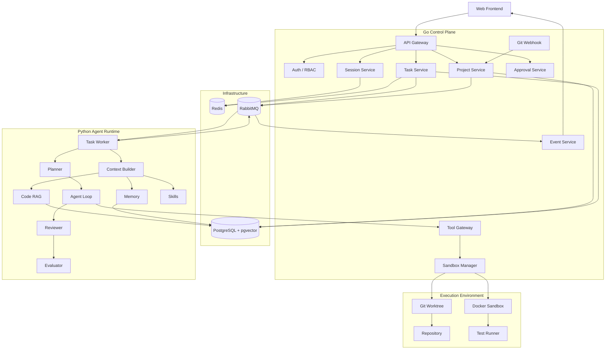
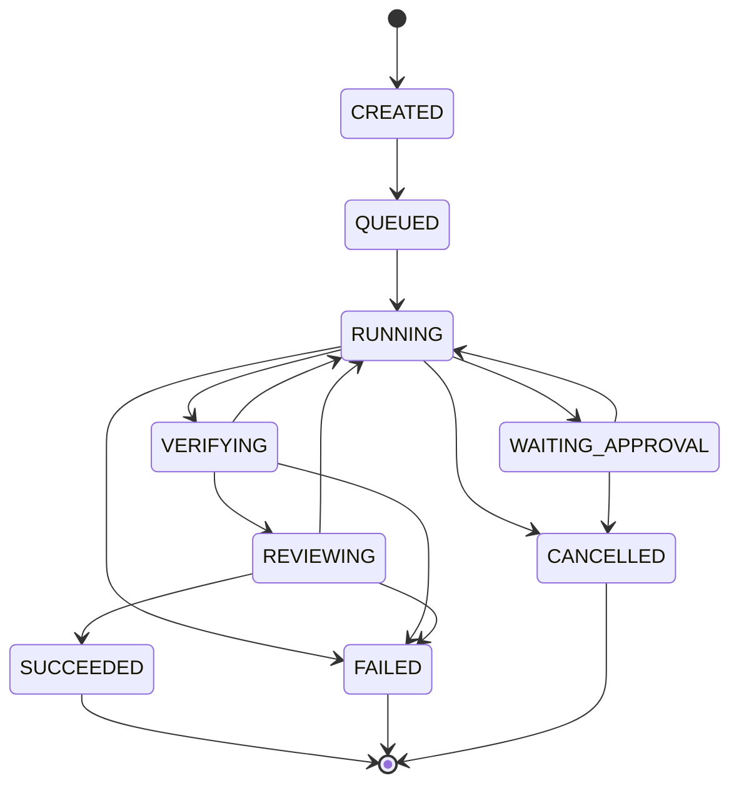
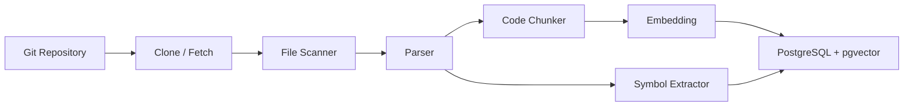
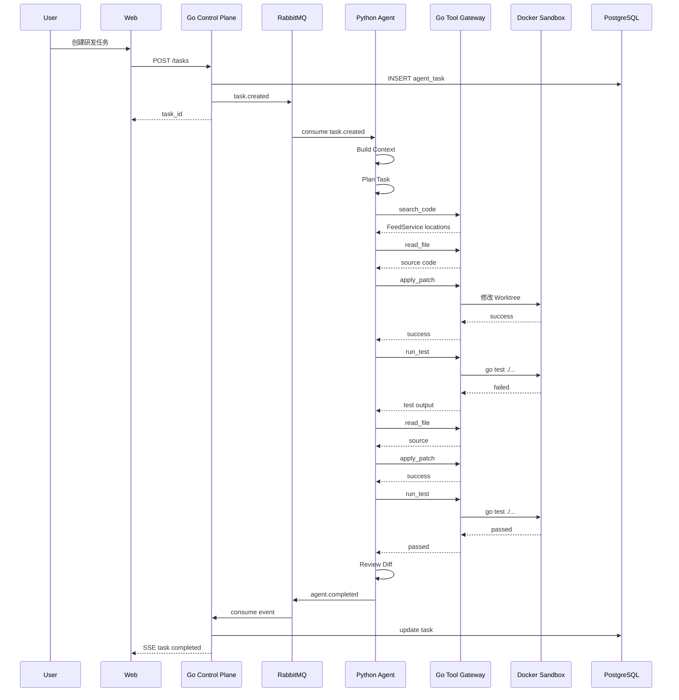

# Hermes 魔改详细设计方案

## 项目暂定名：RepoPilot

> 面向软件研发场景的 AI 任务协作 Agent 平台  
> 技术定位：Go Control Plane + Python Agent Runtime + PostgreSQL + pgvector + Redis + RabbitMQ + Docker Sandbox + SSE + OpenTelemetry

---

# 0. 这份方案解决什么问题

这份文档基于你当前的三个项目进行设计：

1. `12-hermes-agent-small`  
   当前已经具备 Agent Loop、Tool Calling、三类 Memory、Retrieval Gate、Consolidation、MCP、Trace、Deterministic Eval、LLM Judge、Release Gate、Coding Eval、Workspace 和 `delegate_task` 等能力。

2. 你自己做的 Go Agent Scaffold  
   当前已经具备 Gin HTTP、SSE、配置驱动 Agent、工厂与责任链式装配、LLM Agent、Sequential Workflow、MCP Tool Router、Skill Loader、Runner、Session 等基础。

3. 你的 Feed 项目  
   已经能够体现 Go、Gin、MySQL、Redis、RabbitMQ、Feed 推拉结合、多级缓存、singleflight、Outbox、幂等消费、异步一致性等后端能力。

因此，新项目最重要的目标有三个：

1. 补齐 Python Agent 工程能力。
2. 保留并强化 Go 后端工程能力。
3. 与 Feed 项目形成明显差异，让两个项目分别覆盖高并发后端和 AI Agent Engineering。

最终希望简历呈现出的技术画像是：

```text
项目一：短视频 Feed 流系统
Go 后端 / 高并发 / Redis / MQ / 缓存 / 数据一致性

项目二：RepoPilot AI 研发任务协作平台
Go + Python / Agent / RAG / Tool Calling / Sandbox / Eval / LLMOps
```

---

# 1. 最终项目定位

## 1.1 推荐应用场景

我最推荐把 Hermes 改造成：

**AI 研发任务协作 Agent 平台**

用户绑定一个 Git 仓库以后，可以使用自然语言提交研发任务，例如：

```text
帮我分析这个项目中 FeedService 的缓存逻辑。

帮我修复 Issue #137。

给 user service 增加 Redis 缓存，并补充单元测试。

运行全部测试，分析失败原因并尝试修复。

检查这个 PR 的代码质量和潜在风险。

根据这个需求完成代码修改，测试通过以后让我确认，再创建提交。
```

Agent 可以完成：

```text
理解任务
  ↓
分析仓库
  ↓
检索代码
  ↓
制定执行计划
  ↓
调用工具
  ↓
修改代码
  ↓
运行测试
  ↓
失败后继续修复
  ↓
代码审查
  ↓
质量评测
  ↓
等待人工确认
  ↓
提交结果
```

这个场景与 Hermes 当前代码的契合度很高。

Hermes 已经存在：

```text
waku/loop/agent.py
waku/tools/registry.py
waku/tools/experimental.py
waku/tools/workspace.py
waku/memory/
waku/ops/coding_eval.py
waku/ops/tracing.py
waku/ops/release_gate.py
evals/coding.jsonl
```

其中 `delegate_task` 已经能够把 Coding Task 交给本地 coding agent，`coding_eval.py` 已经能够基于真实命令验证代码，`release_gate.py` 已经具备 deterministic eval 和 judge 的发布门禁思想。

因此，研发 Agent 方向可以最大程度复用现有能力，同时拥有足够大的改造空间。

---

# 2. 为什么我推荐研发 Agent 场景

可以考虑的场景很多，例如：

| 场景 | 优点 | 主要问题 | 推荐度 |
| --- | --- | --- | --- |
| 通用个人助手 | Hermes 原始能力可以直接使用 | 产品同质化明显，工程亮点有限 | ★★ |
| 企业知识库助手 | RAG 很自然 | 容易变成普通 RAG Chat | ★★★ |
| Draw.io 绘图 Agent | 你已有相关 Go 项目 | 能力边界较窄，第二个项目与旧项目重叠 | ★★★ |
| AI 研发任务 Agent | Tool、RAG、Sandbox、Eval、Go 服务都能自然加入 | 实现量较大 | ★★★★★ |
| 运维故障 Agent | Go 和 Tool 很契合 | 需要构造较多真实运维环境 | ★★★★ |

研发 Agent 最适合你的原因主要有四个。

### 2.1 Hermes 已经有 Coding 方向基础

`experimental.py` 已经实现 `delegate_task`，同时给 `run_command`、`browse_web`、`schedule_task` 留出了扩展位置。

`workspace.py` 已经在考虑：

```text
任务独立工作目录
代码产物
运行日志
执行结果
MANIFEST
```

`coding_eval.py` 也已经采用：

```text
生成代码
  ↓
执行 verify 命令
  ↓
根据 exit code 判断任务是否成功
```

这一套天然适合继续升级成完整 Coding Agent。

### 2.2 Go 可以拥有非常清晰的职责

Go 可以承担平台层：

```text
API
鉴权
项目管理
任务管理
状态机
RabbitMQ
Redis
SSE
Webhook
Tool Gateway
Sandbox Manager
并发控制
幂等
限流
```

Python 可以承担 AI 层：

```text
Agent Loop
Planner
Context Builder
RAG
Memory
Tool Calling
Skills
Evaluator
Reviewer
```

两种语言的职责非常容易解释。

### 2.3 与 Feed 项目形成互补

Feed 项目已经充分覆盖 Redis、RabbitMQ、MySQL、高并发、缓存、最终一致性。

RepoPilot 中 Redis 和 RabbitMQ 仍然存在，但它们解决的是 Agent 长任务、状态同步、异步 Memory、异步索引、任务事件流等问题。

这样面试时可以展示：

```text
同一种基础设施
在两类系统中解决不同工程问题
```

这会比简单重复一个 CRUD 后端更加有价值。

### 2.4 研发 Agent 很适合展示 Agent Engineering

这个场景能够自然体现：

```text
Tool Calling
Agent Loop
Code RAG
Hybrid Retrieval
Memory
Sandbox
Human Approval
Trace
Eval
Release Gate
MCP
异步任务
多服务通信
```

这些内容可以形成完整的 AI 应用工程闭环。

---

# 3. 产品最终应该长什么样

建议最终产品包含五个核心页面。

## 3.1 Project 页面

用户可以：

```text
创建项目
绑定 Git 仓库
配置默认分支
触发代码索引
查看索引状态
查看最近任务
```

例如：

```text
Project: feed-system

Repository:
github.com/xxx/feed-system

Branch:
main

Indexed:
2026-09-10 20:31

Files:
438

Symbols:
3127

Chunks:
6541
```

## 3.2 Task 页面

用户输入：

```text
检查 FeedService 的缓存实现，并给 GetFeed 添加 singleflight 防缓存击穿。
修改完成后运行测试。
```

页面展示：

```text
Task #1024

状态：RUNNING

当前阶段：
RUN_TEST

执行进度：

✓ Analyze Task
✓ Search Repository
✓ Inspect FeedService
✓ Modify Code
→ Run Tests
○ Review Diff
○ Await Approval
```

## 3.3 Agent Timeline

前端实时展示：

```text
21:03:01 Task Created
21:03:02 Agent Started
21:03:05 search_code("FeedService")
21:03:06 read_file("internal/service/feed.go")
21:03:18 apply_patch(...)
21:03:21 run_test("go test ./...")
21:03:29 Test Failed
21:03:33 read_file(...)
21:03:50 apply_patch(...)
21:04:03 run_test("go test ./...")
21:04:14 Test Passed
21:04:20 Review Finished
```

这部分通过 Go SSE 推送。

## 3.4 Diff 页面

展示：

```text
Modified Files
3

internal/service/feed.go
internal/service/feed_test.go
internal/cache/cache.go
```

同时展示 Git Diff。

## 3.5 Approval 页面

高风险操作需要用户确认：

```text
Agent wants to execute:

git commit
git push
create pull request

Risk Level:
HIGH

[Approve]
[Reject]
```

这一块非常值得做，因为它能够把 Agent 从单纯自动执行升级成可控的工程系统。

---

# 4. 总体架构

最终推荐架构如下。



---

# 5. 最重要的架构原则

这个项目最核心的设计原则可以总结成一句话：

```text
Go 管平台和执行安全
Python 管 Agent 智能
```

## 5.1 Go Control Plane

Go 负责：

```text
用户请求
身份鉴权
项目配置
任务生命周期
任务状态机
任务排队
RabbitMQ
Redis
SSE
Webhook
工具权限
代码执行环境
资源控制
人工审批
幂等
限流
日志和 Metrics
```

## 5.2 Python Agent Runtime

Python 负责：

```text
Prompt
Agent Loop
Task Planning
Context Assembly
RAG
Memory
Skill
Tool Selection
Reflection
Review
Eval
LLM Provider
```

这样设计有一个很大的好处。

Python Agent Runtime 可以独立演进。

例如后续你想尝试：

```text
纯手写 Agent Loop
LangGraph
OpenAI Agents SDK
PydanticAI
自定义 Multi Agent
```

Go 平台层都不需要发生大规模变化。

---

# 6. 为什么不要让 Go 和 Python 各写一套 Agent Loop

你当前的 Go Agent Scaffold 已经有：

```text
LLM Agent
Tool Calling
Sequential Workflow
Parallel Workflow
Loop Workflow
Runner
```

Hermes 也存在完整 Agent Loop。

如果新项目里保留两套核心 Runtime，会产生职责重叠。

面试时很容易出现一个问题：

```text
同一个任务到底由哪套 Agent Runtime 执行？
```

因此，新项目建议逐步把 Go Agent Scaffold 的定位调整为 Control Plane。

Go 中依然可以保留：

```text
Config
Ports
Task Orchestrator
Tool Gateway
MCP Gateway
Service
Handler
SSE
```

Python 成为唯一主要 Agent Runtime。

原 Go Agent 的 Workflow 可以保留作为学习成果，也可以在 RepoPilot 主分支中逐步弱化。

---

# 7. Go 具体负责什么

## 7.1 API Gateway

推荐使用 Gin。

API 负责：

```text
参数校验
统一响应格式
JWT
请求 ID
Trace ID
限流
错误处理
SSE
```

建议 API：

```text
POST   /api/v1/auth/login

POST   /api/v1/projects
GET    /api/v1/projects
GET    /api/v1/projects/:id

POST   /api/v1/projects/:id/repositories
POST   /api/v1/projects/:id/index

POST   /api/v1/tasks
GET    /api/v1/tasks/:id
POST   /api/v1/tasks/:id/cancel

GET    /api/v1/tasks/:id/events
GET    /api/v1/tasks/:id/diff

POST   /api/v1/tasks/:id/approvals/:approval_id/approve
POST   /api/v1/tasks/:id/approvals/:approval_id/reject
```

---

# 8. Task Service

Task Service 是 Go 平台层最重要的模块。

它负责：

```text
创建任务
校验项目
创建 task_id
初始化状态
写 PostgreSQL
写 Redis
发送 RabbitMQ
处理取消
处理重试
处理完成
```

核心接口可以设计成：

```go
type TaskService interface {
    CreateTask(ctx context.Context, cmd CreateTaskCommand) (*Task, error)
    GetTask(ctx context.Context, taskID string) (*Task, error)
    CancelTask(ctx context.Context, taskID string) error
    RetryTask(ctx context.Context, taskID string) error
}
```

任务创建流程：

```text
Frontend
  ↓
POST /tasks
  ↓
TaskService
  ↓
生成 task_id
  ↓
PostgreSQL INSERT
  ↓
Redis 写入状态
  ↓
RabbitMQ Publish
  ↓
返回 task_id
```

这样 HTTP 请求不会一直等待 Agent 执行结束。

---

# 9. Agent Task 状态机

建议从一开始就设计状态机。

推荐状态：

```text
CREATED
QUEUED
RUNNING
WAITING_APPROVAL
VERIFYING
REVIEWING
SUCCEEDED
FAILED
CANCELLED
```

状态转换：



这里一定要限制非法状态跳转。

例如：

```text
SUCCEEDED → RUNNING
```

应该直接拒绝。

可以定义：

```go
func CanTransition(from, to TaskStatus) bool
```

这样任务状态会比简单字符串管理更加可靠。

---

# 10. RabbitMQ 怎么设计

RabbitMQ 主要承担长任务和后台任务。

建议定义 Exchange：

```text
agent.task
agent.event
agent.memory
repo.index
agent.eval
```

## 10.1 Task Exchange

Routing Key：

```text
task.created
task.retry
task.cancel
```

Python Worker 监听：

```text
agent_task_worker
```

例如：

```json
{
  "event_id": "evt_xxx",
  "task_id": "task_1024",
  "project_id": "project_20",
  "repository_id": "repo_12",
  "branch": "main",
  "instruction": "修复 FeedService 缓存击穿问题",
  "created_at": "2026-09-10T21:00:00+08:00"
}
```

## 10.2 Agent Event Exchange

Python Agent 每完成一个重要动作，发布事件：

```text
agent.started
agent.plan.created
agent.tool.started
agent.tool.completed
agent.test.started
agent.test.failed
agent.test.passed
agent.review.started
agent.review.completed
agent.approval.required
agent.completed
agent.failed
```

Go Event Consumer 接收以后：

```text
写入 task_events
  ↓
更新 Redis Task 状态
  ↓
通过 SSE 推送前端
```

## 10.3 Memory Exchange

```text
memory.consolidate
```

Agent 一次任务结束以后，仅发送消息：

```text
task_id
session_id
project_id
```

Memory Worker 后台完成 Consolidation。

这样 Memory Consolidation 不会增加用户请求延迟。

## 10.4 Repo Index Exchange

```text
repo.index.created
repo.index.updated
```

Repository 更新以后触发代码索引。

## 10.5 Eval Exchange

```text
eval.requested
```

可以把耗时较高的评测异步执行。

---

# 11. 为什么 RabbitMQ 与 gRPC 可以同时存在

这两个技术解决的问题不同。

## 11.1 RabbitMQ

适合：

```text
长任务
异步任务
事件通知
失败重试
削峰
服务解耦
```

例如：

```text
Go
  ↓
RabbitMQ
  ↓
Python Agent Worker

整个任务可能执行 30 秒甚至 10 分钟
```

## 11.2 gRPC

适合：

```text
Python 正在执行 Agent
  ↓
需要立即调用一个 Go Tool
  ↓
等待结果继续下一轮 LLM
```

例如：

```text
Python Agent
  ↓
RunCommand("go test ./...")
  ↓
Go Tool Gateway
  ↓
Docker Sandbox
  ↓
Result
  ↓
Python Agent
```

这是一个典型同步 RPC。

因此推荐：

```text
任务调度：RabbitMQ

工具执行：gRPC

前端推送：SSE
```

三者职责非常清楚。

MVP 阶段可以先用 HTTP 调用 Tool Gateway。

项目稳定以后，再把 Python 到 Go 的 Tool Gateway 改成 gRPC。

---

# 12. gRPC Tool Gateway 设计

可以定义：

```protobuf
service ToolGateway {
    rpc ExecuteTool(ToolRequest) returns (ToolResponse);
}
```

请求：

```protobuf
message ToolRequest {
    string task_id = 1;
    string tool_call_id = 2;
    string tool_name = 3;
    string arguments_json = 4;
}
```

响应：

```protobuf
message ToolResponse {
    string tool_call_id = 1;
    bool success = 2;
    string output = 3;
    string error = 4;
    int64 duration_ms = 5;
}
```

这样 Python Agent 完全不需要知道 Docker、Git Worktree、资源限制等细节。

它只知道：

```text
我要调用 run_test
我要调用 read_file
我要调用 apply_patch
```

具体工具如何安全执行由 Go 负责。

---

# 13. Tool Gateway

Hermes 当前 Tool Registry 非常简洁：

```text
name
description
input_schema
fn
```

对于教学代码非常清晰。

RepoPilot 需要升级 Tool Metadata。

建议 Tool 定义增加：

```text
Name
Description
Schema
RiskLevel
Timeout
RetryPolicy
Permission
SandboxRequired
Idempotent
```

例如：

| Tool | Risk | Sandbox | Approval |
| --- | --- | --- | --- |
| list_files | LOW | 可选 | 否 |
| read_file | LOW | 可选 | 否 |
| search_code | LOW | 否 | 否 |
| git_status | LOW | 是 | 否 |
| git_diff | LOW | 是 | 否 |
| run_test | MEDIUM | 是 | 否 |
| run_command | MEDIUM | 是 | 视命令而定 |
| apply_patch | MEDIUM | 是 | 否 |
| git_commit | HIGH | 是 | 是 |
| git_push | HIGH | 是 | 是 |
| create_pr | HIGH | 是 | 是 |

---

# 14. Tool Result 统一协议

所有工具返回统一结构。

建议：

```json
{
  "tool_call_id": "call_123",
  "tool": "run_test",
  "success": true,
  "output": "ok   feed/service  1.42s",
  "error": "",
  "duration_ms": 1512,
  "truncated": false,
  "artifacts": []
}
```

这样可以统一：

```text
Trace
Eval
错误处理
Agent Observation
前端 Timeline
Metrics
```

---

# 15. Tool 安全模型

建议将工具权限分成三级。

## LOW

只读操作。

```text
read_file
list_files
search_code
git_status
git_diff
```

自动执行。

## MEDIUM

会改变临时 Workspace，或者执行受控代码。

```text
apply_patch
run_test
run_command
```

只能在 Sandbox 中运行。

## HIGH

可能影响外部系统或远端仓库。

```text
git_push
create_pr
delete_branch
执行高风险命令
```

必须人工批准。

---

# 16. Human Approval

这是 RepoPilot 很值得实现的一项能力。

Python Agent 想调用：

```text
git_push
```

Tool Gateway 发现：

```text
risk = HIGH
```

Go 创建：

```text
approval_request
```

Task 状态改成：

```text
WAITING_APPROVAL
```

前端显示：

```text
Agent 请求执行：

git push origin agent/task_1024

原因：
代码已经通过测试，希望推送远端分支。

[Approve]
[Reject]
```

用户 Approve 后：

```text
ApprovalService
  ↓
重新投递 command
  ↓
Tool Gateway
  ↓
执行 git push
```

这个设计可以很好地体现 Agent 安全和 Human in the Loop。

---

# 17. Docker Sandbox

Sandbox 是整个项目的重要工程亮点。

Hermes 当前 `delegate_task` 会直接通过 `subprocess.run()` 调用本地进程。

研发 Agent 场景下建议升级。

最终流程：

```text
Task Created
  ↓
创建 Git Worktree
  ↓
创建 Docker Sandbox
  ↓
挂载 Worktree
  ↓
Agent 修改代码
  ↓
Sandbox 执行测试
  ↓
销毁 Container
  ↓
根据任务结果决定是否保留 Worktree
```

---

# 18. Sandbox 目录设计

例如：

```text
data/
  workspaces/
    task_1024/
      repo/
      logs/
      artifacts/
      metadata.json
```

其中：

```text
repo/
```

对应一个 Git Worktree。

这样多个 Agent Task 可以同时修改同一个项目而互不影响。

例如：

```text
main repository

worktree/task_1024
worktree/task_1025
worktree/task_1026
```

---

# 19. Sandbox 安全限制

建议至少实现：

```text
CPU Limit
Memory Limit
Process Limit
Timeout
Working Directory Limit
Environment Variable Whitelist
Command Validation
Network Control
Output Size Limit
```

Docker 示例目标：

```text
CPU: 1 Core
Memory: 1 GB
Timeout: 120 s
Network: disabled by default
Filesystem: only workspace writable
```

还需要限制命令。

例如：

```text
go test ./...
pytest
npm test
git status
git diff
```

可以自动放行。

涉及：

```text
rm
curl
wget
ssh
git push
```

进入额外检查。

---

# 20. Python Agent Runtime

Python 服务建议单独运行。

核心模块：

```text
Task Worker
Context Builder
Planner
Agent Loop
Tool Client
RAG
Memory
Skills
Reviewer
Evaluator
Provider
```

---

# 21. Agent Runtime 的核心流程

建议保留 Hermes 简单透明的 Agent Loop 思路。

核心过程：

```text
Build Context
  ↓
LLM
  ↓
Tool Call?
  ↓ YES
Execute Tool
  ↓
Observation
  ↓
LLM
  ↓
...
  ↓
Final Result
```

可以保留最大迭代次数：

```python
for iteration in range(max_iterations):
    response = llm(messages, tools)

    if not response.tool_calls:
        return response

    results = execute_tools(response.tool_calls)

    messages.append(response)
    messages.extend(results)
```

这一块非常值得自己维护。

因为面试的时候你可以完整解释 Agent Loop。

---

# 22. Planner 怎么设计

建议给复杂任务增加 Plan。

例如用户：

```text
给 FeedService 增加 singleflight，并补充测试。
```

Planner 输出结构化 Plan：

```json
{
  "goal": "给 FeedService 增加 singleflight 防缓存击穿",
  "steps": [
    {
      "id": "step_1",
      "action": "检索 FeedService 相关代码"
    },
    {
      "id": "step_2",
      "action": "分析缓存回源路径"
    },
    {
      "id": "step_3",
      "action": "修改代码"
    },
    {
      "id": "step_4",
      "action": "补充测试"
    },
    {
      "id": "step_5",
      "action": "运行测试"
    },
    {
      "id": "step_6",
      "action": "Review Diff"
    }
  ]
}
```

Plan 保存到 PostgreSQL。

前端可以展示任务进度。

---

# 23. 不要一开始做非常复杂的 Multi Agent

第一版建议：

```text
一个 Main Coding Agent
+
一个 Reviewer
```

足够。

Main Agent：

```text
理解需求
检索
修改
测试
修复
```

Reviewer：

```text
检查 Diff
检查需求完成度
检查潜在风险
给出 Review 结果
```

后面再考虑：

```text
Planner Agent
Coding Agent
Test Agent
Reviewer Agent
```

过早拆成很多 Agent 会带来：

```text
Token 消耗
上下文传递
状态同步
任务失败恢复
调试困难
```

所以第一阶段优先把单 Agent Loop 做扎实。

---

# 24. Code RAG

这是整个项目 AI 能力的第二个核心。

用户问：

```text
FeedService 的缓存回源逻辑在哪里？
```

或者 Agent 自己需要找：

```text
CreateFeed
```

都需要 Repository Retrieval。

---

# 25. Repo Index Pipeline

流程：



---

# 26. Chunk 不建议简单固定字符切割

代码最好按照语义结构切。

例如 Go：

```text
package
type
interface
struct
function
method
```

Python：

```text
module
class
function
method
```

Java：

```text
class
interface
method
```

一个 chunk 建议包含：

```text
repository_id
file_path
language
symbol_name
symbol_type
start_line
end_line
content
embedding
content_hash
```

---

# 27. 推荐 Hybrid Retrieval

最终检索建议组合三路。

```text
Vector Search
+
Keyword Search
+
Symbol Search
```

### Vector Search

解决：

```text
用户描述与代码命名不同
```

例如：

```text
用户：缓存击穿
代码：singleflight
```

### Keyword Search

解决精确词：

```text
FeedService
GetFeed
singleflight
Redis
```

PostgreSQL 可以使用：

```text
tsvector
GIN Index
```

### Symbol Search

精确定位：

```text
FeedService.GetFeed
UserRepository.Create
```

最终可以使用：

```text
RRF
```

融合排名。

---

# 28. Retrieval 流程

推荐：

```text
User / Agent Query
  ↓
Query Analyzer
  ↓
生成 semantic_query
  ↓
生成 keywords
  ↓
生成 symbol candidates
  ↓
Vector Search
  +
Keyword Search
  +
Symbol Search
  ↓
RRF Fusion
  ↓
Top K
  ↓
Context Builder
```

---

# 29. Hermes 当前 Memory Retrieval 有一个值得修的点

当前 SQLite Semantic Store 使用类似：

```python
re.findall(r"[a-zA-Z0-9]{2,}", text.lower())
```

这种实现非常适合简单英文 FTS 示例。

如果项目大量使用中文，例如：

```text
帮我找一下缓存击穿相关代码
```

中文关键词不会按照当前逻辑被完整提取。

因此新项目中建议把中文 Memory 和 Code Retrieval 一起升级。

可选方案：

```text
PostgreSQL pgvector
+
Embedding Retrieval
+
自定义 Keyword Search
```

这样中英文查询都更稳定。

---

# 30. Memory 怎么改

Hermes 原有三类 Memory 思想值得保留。

## 30.1 Working Memory

当前任务上下文：

```text
System Prompt
Task Goal
Task Plan
Recent Messages
Retrieved Code
Tool Results
Current Diff
```

只存在于当前执行过程。

## 30.2 Semantic Memory

长期事实：

```text
项目主要使用 Go
测试命令是 go test ./...
用户习惯使用 Conventional Commit
该项目 Repository 层禁止直接使用 Redis
```

## 30.3 Episodic Memory

记录历史任务：

```text
2026-09-10：
曾修复 FeedService 缓存击穿问题，
修改 internal/service/feed.go，
最终 go test ./... 通过。
```

## 30.4 Procedural Memory

保留 SKILL.md。

例如：

```text
skills/
  go_bugfix/
    SKILL.md

  review_go_service/
    SKILL.md

  write_unit_test/
    SKILL.md
```

---

# 31. Memory Scope

强烈建议给 Memory 增加 Scope。

至少三层：

```text
USER
PROJECT
TASK
```

例如：

```text
USER:
用户偏好中文回复

PROJECT:
该项目测试命令为 go test ./...

TASK:
当前正在修复 FeedService
```

避免不同项目的 Memory 串在一起。

---

# 32. Retrieval Gate 保留

Hermes 的 Retrieval Gate 思路非常值得保留。

流程：

```text
User Query
  ↓
Retrieval Gate
  ↓
需要 Memory?
  ↓
Yes
  ↓
Retrieve Memory
```

例如：

```text
1 + 1 等于多少
```

无需读取项目 Memory。

例如：

```text
我们之前给 FeedService 做过什么优化？
```

需要搜索长期 Memory。

可以将 Gate 输出升级为：

```json
{
  "retrieve_memory": true,
  "retrieve_code": true,
  "memory_query": "FeedService previous optimization",
  "code_query": "FeedService"
}
```

一个 Gate 同时决定：

```text
是否查 Memory
是否查 Code RAG
```

---

# 33. Consolidation 改成异步

Hermes 当前完整 respond 流程结束以后会调用 Memory Consolidation。

新项目建议：

```text
Task Finished
  ↓
Publish memory.consolidate
  ↓
立即返回主流程
```

后台：

```text
Memory Worker
  ↓
读取任务记录
  ↓
提炼 Semantic Memory
  ↓
提炼 Episodic Memory
  ↓
写 PostgreSQL
```

这样主请求延迟更稳定。

---

# 34. PostgreSQL 数据库设计

推荐 PostgreSQL 统一承担：

```text
业务数据
Agent 数据
Memory
Code Metadata
Vector
```

使用 pgvector 保存 embedding。

---

# 35. users

```text
id
username
password_hash
created_at
updated_at
```

---

# 36. projects

```text
id
user_id
name
description
created_at
updated_at
```

索引：

```text
user_id
```

---

# 37. repositories

```text
id
project_id
name
repo_url
default_branch
local_path
last_commit_sha
index_status
last_indexed_at
created_at
updated_at
```

---

# 38. agent_tasks

```text
id
project_id
repository_id
user_id
instruction
status
current_stage
branch
workspace_path
error_code
error_message
created_at
started_at
finished_at
updated_at
version
```

`version` 可以用于乐观锁。

索引：

```text
project_id
repository_id
user_id
status
created_at
```

---

# 39. task_runs

允许一个 Task 多次运行。

```text
id
task_id
run_number
model_provider
model_name
prompt_version
status
input_tokens
output_tokens
cost
latency_ms
started_at
finished_at
```

这样未来可以进行模型对比。

---

# 40. task_events

```text
id
event_id
task_id
run_id
event_type
payload_json
created_at
```

`event_id` 唯一索引。

可以实现消费者幂等。

---

# 41. tool_calls

```text
id
task_id
run_id
tool_call_id
tool_name
risk_level
arguments_json
status
output
error_message
duration_ms
created_at
finished_at
```

---

# 42. approvals

```text
id
task_id
tool_call_id
action
reason
status
requested_at
resolved_at
resolved_by
```

状态：

```text
PENDING
APPROVED
REJECTED
EXPIRED
```

---

# 43. conversation_sessions

```text
id
project_id
user_id
title
created_at
updated_at
```

---

# 44. messages

```text
id
session_id
task_id
role
content
tool_call_id
metadata_json
created_at
```

---

# 45. memory_facts

```text
id
scope_type
scope_id
subject
content
embedding
source_task_id
created_at
updated_at
```

---

# 46. memory_episodes

```text
id
scope_type
scope_id
summary
embedding
source_task_id
happened_at
created_at
```

---

# 47. code_chunks

```text
id
repository_id
commit_sha
file_path
language
symbol_name
symbol_type
start_line
end_line
content
content_hash
embedding
created_at
```

索引建议：

```text
repository_id
file_path
symbol_name
content_hash
embedding vector index
```

---

# 48. Redis 怎么用

Redis 不建议承担最终事实来源。

它适合承担：

```text
热状态
锁
Session
限流
事件缓冲
幂等 Key
```

推荐 Key。

## Task Status

```text
agent:task:{task_id}
```

内容：

```json
{
  "status": "RUNNING",
  "stage": "RUN_TEST",
  "progress": 70
}
```

TTL 可以设置为任务结束后 24 小时。

## Distributed Lock

```text
lock:task:{task_id}
```

避免同一个任务被两个 Worker 同时执行。

## Idempotency

```text
idempotency:task:create:{request_id}
```

防止前端重复提交。

## Rate Limit

```text
rate:user:{user_id}
```

## SSE Event Buffer

```text
stream:task:{task_id}
```

可以使用 Redis Stream。

这样用户刷新页面后还能重新读取最近事件。

---

# 49. Redis Stream 是否必须

第一版可以先不用。

MVP：

```text
RabbitMQ
  ↓
Go Consumer
  ↓
内存 SSE Hub
```

后续升级：

```text
RabbitMQ
  ↓
Go Consumer
  ↓
Redis Stream
  ↓
SSE
```

这样前端断线重连以后可以从 last_event_id 恢复。

---

# 50. SSE 设计

事件：

```text
task_status
plan
tool_start
tool_result
test_result
approval_required
review
final
error
```

例如：

```text
event: tool_result
data: {
  "tool": "run_test",
  "success": true,
  "duration_ms": 1320
}
```

不要把 LLM Token Stream 和 Task Event 完全混在一起。

建议：

```text
message_delta
```

专门传模型文本。

其他结构化事件使用独立事件类型。

---

# 51. Observability

Hermes 原来的：

```text
JSONL Trace
+
OpenTelemetry
```

建议继续保留。

但 Trace 需要增加 Task 维度。

推荐核心字段：

```text
trace_id
request_id
task_id
run_id
user_id
project_id
repository_id
iteration
model
provider
tool_name
tool_call_id
latency_ms
input_tokens
output_tokens
status
```

---

# 52. 一个 Agent Task 的 Trace

例如：

```text
agent.task
  ↓
agent.plan
  ↓
agent.iteration.1
    ↓
    llm.call
    ↓
    tool.search_code
  ↓
agent.iteration.2
    ↓
    llm.call
    ↓
    tool.read_file
  ↓
agent.iteration.3
    ↓
    llm.call
    ↓
    tool.apply_patch
  ↓
agent.iteration.4
    ↓
    tool.run_test
  ↓
agent.review
  ↓
agent.eval
```

在 Phoenix 或其他 OTel 后端中可以直接查看瀑布图。

---

# 53. Eval 怎么设计

Hermes 的 Eval 是这个项目值得保留的一部分。

建议分四层。

## 53.1 Unit Test

普通代码测试。

```text
Go Unit Test
Python Pytest
```

## 53.2 Deterministic Agent Eval

检查：

```text
正确工具有没有调用
参数是否正确
危险工具是否经过 Approval
测试工具是否执行
Agent 是否遵守最大迭代次数
```

例如：

```json
{
  "input": "运行项目测试",
  "expect_tool": "run_test"
}
```

## 53.3 Coding Eval

类似 Hermes 当前 `coding.jsonl`：

```text
准备一个有 Bug 的 Repository
  ↓
给 Agent 一个任务
  ↓
Agent 修改代码
  ↓
执行 verify
  ↓
exit code == 0
```

这类 Eval 很有价值，因为最终评判来自真实代码执行结果。

## 53.4 LLM Judge

适合评估：

```text
需求完成度
Code Review 质量
最终总结是否清晰
是否遗漏重要风险
```

---

# 54. Release Gate

保留 Hermes 的 Release Gate 思想。

例如：

```text
Deterministic Eval
必须 100%

Coding Eval
必须 >= 90%

Judge Score
必须 >= 80

关键安全 Eval
必须 100%
```

通过：

```text
GATE OPEN
```

失败：

```text
GATE CLOSED
```

当你修改：

```text
Prompt
Model
Retrieval Top K
Tool Description
Agent Loop
```

都运行一次 Gate。

---

# 55. Agent 核心指标

建议至少记录：

```text
Task Success Rate
Tool Call Success Rate
Test Pass Rate
Average Iterations
Average Latency
Input Tokens
Output Tokens
Cost Per Task
Approval Count
Retry Count
```

如果后期想做模型比较，还可以记录：

```text
GPT
Claude
Gemini
DeepSeek
```

在同一个 Coding Eval Dataset 上的成功率。

Hermes 当前已经存在 model shootout 的思想，可以继续利用。

---

# 56. 前端怎么处理

你原 Go Agent Scaffold 已经存在 Next.js 前端。

可以继续使用。

推荐页面结构：

```text
frontend/
  src/
    app/
      login/
      projects/
      tasks/
      settings/

    components/
      TaskTimeline/
      AgentChat/
      DiffViewer/
      ApprovalCard/
      TracePanel/
      RepoStatus/

    api/
      auth.ts
      project.ts
      task.ts
      agent.ts
```

前端重点不用做得特别花。

最重要的是能够直观展示：

```text
Agent 正在干什么
调用了什么工具
修改了什么代码
测试有没有通过
当前是否等待审批
```

---

# 57. 推荐 Monorepo 目录

建议后续整理成：

```text
repo_pilot/
│
├── apps/
│   └── web/
│
├── services/
│   │
│   ├── control_plane/
│   │   ├── cmd/
│   │   │   └── server/
│   │   │
│   │   ├── internal/
│   │   │   ├── api/
│   │   │   ├── auth/
│   │   │   ├── project/
│   │   │   ├── task/
│   │   │   ├── approval/
│   │   │   ├── event/
│   │   │   ├── tool/
│   │   │   ├── sandbox/
│   │   │   ├── repository/
│   │   │   └── observability/
│   │   │
│   │   ├── pkg/
│   │   └── go.mod
│   │
│   └── agent_runtime/
│       ├── app/
│       │   ├── worker/
│       │   ├── agent/
│       │   │   ├── loop.py
│       │   │   ├── planner.py
│       │   │   ├── context.py
│       │   │   └── reviewer.py
│       │   │
│       │   ├── tools/
│       │   ├── rag/
│       │   ├── memory/
│       │   ├── skills/
│       │   ├── eval/
│       │   ├── providers/
│       │   └── observability/
│       │
│       ├── tests/
│       └── pyproject.toml
│
├── proto/
│   └── tool_gateway.proto
│
├── configs/
│
├── deploy/
│   ├── docker-compose.yml
│   ├── postgres/
│   ├── redis/
│   ├── rabbitmq/
│   └── sandbox/
│
├── evals/
│   ├── deterministic/
│   ├── coding/
│   └── judge/
│
├── docs/
│   ├── architecture.md
│   ├── tool-security.md
│   ├── memory.md
│   └── eval.md
│
└── README.md
```

---

# 58. Go Control Plane 目录详细建议

```text
internal/
│
├── api/
│   ├── middleware/
│   ├── handler/
│   └── dto/
│
├── domain/
│   ├── project/
│   ├── task/
│   ├── approval/
│   └── tool/
│
├── application/
│   ├── project_service.go
│   ├── task_service.go
│   ├── approval_service.go
│   └── tool_service.go
│
├── infrastructure/
│   ├── persistence/
│   │   └── postgres/
│   ├── cache/
│   │   └── redis/
│   ├── mq/
│   │   └── rabbitmq/
│   ├── grpc/
│   ├── git/
│   ├── sandbox/
│   └── telemetry/
│
└── event/
    ├── hub.go
    └── consumer.go
```

---

# 59. Python Agent Runtime 目录详细建议

```text
app/
│
├── worker/
│   ├── consumer.py
│   └── task_worker.py
│
├── agent/
│   ├── runtime.py
│   ├── loop.py
│   ├── planner.py
│   ├── context_builder.py
│   ├── reviewer.py
│   └── state.py
│
├── tools/
│   ├── registry.py
│   ├── client.py
│   └── schemas.py
│
├── rag/
│   ├── indexer.py
│   ├── chunker.py
│   ├── retriever.py
│   ├── vector_search.py
│   ├── keyword_search.py
│   ├── symbol_search.py
│   └── fusion.py
│
├── memory/
│   ├── retrieval_gate.py
│   ├── semantic.py
│   ├── episodic.py
│   ├── procedural.py
│   └── consolidation.py
│
├── skills/
│
├── eval/
│   ├── deterministic.py
│   ├── coding.py
│   └── judge.py
│
├── providers/
│   ├── base.py
│   ├── openai.py
│   └── anthropic.py
│
└── observability/
    └── tracing.py
```

---

# 60. Hermes 源码具体怎么迁移

这部分很重要。

不要从零重写全部 Python。

优先进行有目的的重构。

---

# 61. `waku/loop/agent.py`

当前价值：

```text
Agent Loop 简单
逻辑透明
最大迭代限制
支持 Tool Calling
Observer 解耦
支持 Stream
```

建议：

```text
保留核心思路
迁移到 app/agent/loop.py
```

新增：

```text
task_id
run_id
cancellation
plan
tool policy
approval
structured event
```

例如接口逐步变成：

```python
async def run_loop(
    state: AgentState,
    model: ChatModel,
    tools: ToolRegistry,
    observer: Observer,
) -> AgentResult:
    ...
```

---

# 62. `waku/tools/registry.py`

当前：

```text
name
description
input_schema
fn
```

建议迁移到：

```text
app/tools/registry.py
```

升级成：

```python
class Tool:
    name
    description
    input_schema
    risk_level
    timeout
    requires_sandbox
    requires_approval
```

Tool Registry 本身依然保留。

具体工具执行逐步交给 Go Tool Gateway。

---

# 63. `waku/tools/calendar.py`

研发场景中可以删除。

---

# 64. `waku/tools/messages.py`

研发 Agent MVP 不需要。

可以删除。

---

# 65. `waku/tools/notes.py`

可以删除。

长期记忆统一交给 Memory。

---

# 66. `waku/tools/search.py`

可以保留。

后期可以变成：

```text
search_web
search_docs
```

给 Agent 查询第三方文档。

---

# 67. `waku/tools/experimental.py`

这里需要重点改。

当前：

```text
delegate_task
run_command skeleton
browse_web skeleton
schedule_task skeleton
```

建议：

### `delegate_task`

第一阶段可以保留作为实验能力。

当自己的 Coding Agent Runtime 足够成熟后，可以逐渐弱化。

最终主流程应由 RepoPilot 自己完成：

```text
search
read
edit
test
review
```

这样项目核心能力掌握在自己手里。

### `run_command`

正式实现。

实际执行放在：

```text
Go Tool Gateway
  ↓
Docker Sandbox
```

Python 只持有 Tool Schema 和 Client。

### `browse_web`

优先级较低。

研发 Agent 第一版先有：

```text
search_web
```

已经够用。

### `schedule_task`

暂时不做。

它和核心研发任务链关系较弱。

---

# 68. `waku/tools/workspace.py`

当前的：

```text
workspace
created_files
autorun
manifest
```

思想可以保留。

实际 Workspace 生命周期建议迁移到 Go：

```text
Go Sandbox Manager
  ↓
Git Worktree
  ↓
Docker
```

Python 不再直接操作宿主机 Workspace。

---

# 69. `waku/memory/retrieval_gate.py`

保留。

升级为：

```text
Memory Gate
+
Code Retrieval Gate
```

---

# 70. `waku/memory/consolidation.py`

保留 Memory 蒸馏思想。

修改：

```text
同步执行
```

为：

```text
RabbitMQ 异步 Worker
```

---

# 71. `waku/memory/semantic/store.py`

SQLite FTS 适合作为最早版本。

后续迁移到：

```text
PostgreSQL
+
pgvector
```

同时修复中文 Query 检索能力。

---

# 72. `waku/memory/semantic/supabase_store.py`

它已经给出了 Vector Store 的参考实现。

可以参考其：

```text
embedding
vector search
top k
```

思路。

新项目直接使用自己的 PostgreSQL + pgvector，可以减少额外 Supabase 依赖。

---

# 73. `waku/ops/tracing.py`

强烈建议保留。

升级为：

```text
task_id
run_id
project_id
tool_call_id
```

并继续输出：

```text
JSONL
+
OpenTelemetry
```

---

# 74. `waku/ops/coding_eval.py`

这是非常值得留下的模块。

当前核心思想：

```text
给定 coding case
  ↓
执行 coding agent
  ↓
运行 verify command
  ↓
exit code 判定成功
```

新项目可以扩展成真正 Repository Eval。

例如：

```text
eval_repos/
  case_001/
    repo/
    task.json

  case_002/
    repo/
    task.json
```

任务：

```json
{
  "instruction": "修复重复创建订单的问题",
  "verify": "go test ./..."
}
```

Agent 执行以后只看：

```text
verify
```

最终是否通过。

---

# 75. `waku/ops/release_gate.py`

继续保留。

以后用于：

```text
Prompt 发布
模型切换
RAG 参数调整
Agent Loop 修改
Tool 描述修改
```

每一次重要变化都必须跑 Eval。

---

# 76. `waku/gateway/`

CLI 可以保留作为开发调试入口。

Dashboard 可以逐步由 Next.js 前端接管。

Telegram、Voice 对研发 Agent 项目价值较低，可以移出 MVP。

---

# 77. 你的 Go Agent Scaffold 怎么复用

你之前的 Go 项目不用丢。

里面有很多可以直接迁移的思路。

---

# 78. Handler / Service 分层

当前：

```text
HTTP Handler
  ↓
Chat Service
  ↓
Runner
  ↓
Agent
```

RepoPilot 可以变成：

```text
HTTP Handler
  ↓
Task Service
  ↓
Task Orchestrator
  ↓
RabbitMQ
  ↓
Python Worker
```

这一套层次完全可以延续。

---

# 79. Ports 思想保留

你现在已经定义：

```text
ModelProvider
ToolRouter
AgentFactory
AgentRegistry
SessionStore
```

RepoPilot 中建议改成更符合平台层的 Ports：

```go
type TaskRepository interface {}
type ProjectRepository interface {}
type EventPublisher interface {}
type Cache interface {}
type DistributedLock interface {}
type Sandbox interface {}
type ToolExecutor interface {}
```

这样 Domain 和 Infrastructure 解耦。

---

# 80. AgentRegistry 改造

当前：

```text
InMemoryAgentRegistry
```

新项目中，Agent 不需要大量运行时 Registry。

可以把配置放入：

```text
configs/
```

或者 PostgreSQL。

如果需要多种 Agent Profile：

```text
coding_agent
review_agent
```

可以存：

```text
agent_profiles
```

---

# 81. SessionStore 改造

当前：

```text
InMemorySessionStore
```

单进程重启就会丢数据。

新项目建议：

```text
Redis
+
PostgreSQL
```

Redis：

```text
活跃 Session
```

PostgreSQL：

```text
长期 Message History
```

---

# 82. Sequential Workflow

你原来的 Draw.io Agent 中：

```text
Analyst
  ↓
Drawer
  ↓
Reviewer
```

Sequential 思想是有价值的。

RepoPilot 后期可以借鉴：

```text
Coding Agent
  ↓
Reviewer
```

但第一版尽量由 Python Runtime 统一维护。

---

# 83. Parallel Workflow 当前值得改进的地方

你现在 Go Runtime 中 `parallel` 和 `loop` 最终都进入 `runFanOut()`。

当前 `runFanOut()` 使用普通 `for` 循环，因此 Parallel 还没有真正并发执行。

这个问题如果你保留旧项目，可以使用：

```text
goroutine
+
errgroup
```

实现真正并行。

在 RepoPilot 主项目中，可以把它当作旧 Agent Scaffold 的独立优化，不需要强行放入主链路。

---

# 84. Loop Workflow 当前值得改进的地方

当前 `loop` 与 `parallel` 共用 Fan Out 行为，因此并没有表现真正的 Loop 终止条件。

真正 Loop 应该存在：

```text
最大迭代数
完成条件
失败条件
Reviewer Feedback
```

例如：

```text
Coding
  ↓
Review
  ↓
Pass?
  ↓ No
Coding
  ↓
Review
```

由于新项目的 Python Agent Runtime 本身已经有 Loop，所以主项目无需继续在 Go 中实现同一套机制。

---

# 85. 一次完整任务的时序

例如用户提出：

```text
给 FeedService 增加 singleflight，补充测试并运行 go test ./...
```

流程如下。



---

# 86. 如果涉及 git push

流程增加：

```text
Agent
  ↓
git_push
  ↓
Tool Policy
  ↓
HIGH Risk
  ↓
Approval Required
  ↓
WAITING_APPROVAL
  ↓
SSE
  ↓
User Approve
  ↓
Tool Gateway
  ↓
git push
```

这会成为很好的 Demo。

---

# 87. 错误处理

一定要从第一版设计错误码。

例如：

```text
TASK_NOT_FOUND
PROJECT_NOT_FOUND
REPO_NOT_READY
AGENT_TIMEOUT
TOOL_TIMEOUT
TOOL_PERMISSION_DENIED
SANDBOX_CREATE_FAILED
TEST_FAILED
APPROVAL_REJECTED
MODEL_ERROR
RAG_INDEX_NOT_READY
```

不要只把所有错误都转成：

```text
500 internal error
```

---

# 88. Retry 设计

不同错误采用不同策略。

例如：

```text
LLM 429
自动重试

RabbitMQ 网络错误
自动重试

Tool Timeout
最多重试一次

go test failed
交回 Agent 分析

Permission Denied
等待人工审批

Syntax Error
交回 Agent 修复
```

不要对所有错误统一无限 Retry。

---

# 89. 幂等

你的 Feed 项目已经做过 MQ 幂等，这个经验可以直接迁移。

RabbitMQ Event 增加：

```text
event_id
```

数据库：

```text
task_events.event_id UNIQUE
```

消费者：

```text
收到 event
  ↓
检查 event_id
  ↓
已处理
  ↓
ACK

未处理
  ↓
处理
  ↓
记录 event_id
  ↓
ACK
```

这样可以避免重复消费导致 Task 状态异常。

---

# 90. Cancel 设计

Agent 任务可能运行几分钟，所以必须支持取消。

Go：

```text
POST /tasks/:id/cancel
```

然后：

```text
Redis:
task:{id}:cancelled = 1
```

同时 Publish：

```text
task.cancel
```

Python 每次 Agent Iteration 和 Tool Call 前检查取消状态。

Tool Gateway 也要接受 Context Cancel。

这样可以做到：

```text
用户点击取消
  ↓
当前 Tool 停止
  ↓
Agent Loop 终止
  ↓
Task = CANCELLED
```

---

# 91. Timeout 设计

建议分三层。

```text
LLM Timeout
Tool Timeout
Task Timeout
```

例如：

```text
LLM: 120s
Tool: 120s
Task: 15min
```

避免某一个工具卡死导致整个 Worker 永久占用。

---

# 92. 模型层

Hermes 当前已经支持多个 Provider。

这个思想继续保留。

统一接口：

```python
class ChatModel:
    async def complete(...)
    async def stream(...)
```

实现：

```text
OpenAI
Anthropic
DeepSeek
Gemini
```

第一版只保证两个 Provider 稳定即可。

不要一开始花大量时间适配十几个厂商。

---

# 93. Prompt Version

Prompt 应该版本化。

例如：

```text
coding_agent_v1
coding_agent_v2
review_agent_v1
```

`task_runs` 保存：

```text
prompt_version
model_name
```

这样 Eval 结果才有意义。

---

# 94. Config

建议把：

```text
model
max_iterations
retrieval_top_k
tool_timeout
task_timeout
sandbox_limit
```

放在配置文件。

例如：

```yaml
agent:
  model: gpt-x
  max_iterations: 20
  max_tokens: 4096

rag:
  top_k: 8

sandbox:
  timeout: 120
  memory_mb: 1024
  cpu: 1

task:
  timeout: 900
```

---

# 95. MVP 到底做到哪里

这个项目很容易越做越大，所以必须控制 MVP。

第一版只做：

```text
单用户
一个 Git Repository
一个 Coding Agent
一个 Reviewer
代码检索
代码读取
代码修改
运行测试
Task 状态
RabbitMQ
SSE
Docker Sandbox
基础 Eval
```

先不要做：

```text
复杂 RBAC
企业组织
几十种 MCP
浏览器自动化
Voice
Telegram
Cron
复杂 Multi Agent
Kubernetes
Milvus
完整 GitHub App
```

---

# 96. 推荐开发阶段

下面的顺序很重要。

---

# 97. Phase 0：整理 Hermes

目标：

```text
确认原项目全部能跑
```

完成：

```text
Agent Loop
Memory
Coding Eval
Trace
Release Gate
```

给原始代码打一个 Git Tag：

```text
hermes_baseline
```

这样后续可以清楚看到自己修改了多少。

---

# 98. Phase 1：领域化

先暂时不加 Go。

把 Personal Assistant 改成 Coding Assistant。

实现：

```text
list_files
read_file
search_code
git_status
git_diff
run_test
apply_patch
```

先允许 Python 在测试目录执行。

目标：

```text
Python Agent 能独立完成一个简单 Bug Fix
```

验收案例：

```text
calc.py 中 add 使用了减法
  ↓
Agent 找到 Bug
  ↓
修改
  ↓
pytest / python check.py
  ↓
PASS
```

---

# 99. Phase 2：加入 Go Control Plane

实现：

```text
Project
Repository
Task
Task Status
SSE
```

Python 暂时仍可以通过 HTTP 被 Go 调用。

目标：

```text
前端创建 Task
  ↓
Go
  ↓
Python Agent
  ↓
前端看到结果
```

---

# 100. Phase 3：RabbitMQ 异步任务

把：

```text
Go 同步调用 Python
```

升级成：

```text
Go
  ↓
RabbitMQ
  ↓
Python Worker
```

实现：

```text
task.created
agent.started
agent.completed
agent.failed
```

目标：

```text
HTTP 创建任务可以立即返回 task_id
```

---

# 101. Phase 4：Task Event + SSE

完善 Agent Timeline。

实现：

```text
tool_start
tool_result
test_result
review
```

目标：

```text
用户能够实时看到 Agent 在做什么
```

---

# 102. Phase 5：Go Tool Gateway + Sandbox

将高风险工具从 Python 本机执行迁移到 Go。

实现：

```text
read_file
apply_patch
run_test
run_command
git_diff
```

再加入：

```text
Docker
Git Worktree
Timeout
Memory Limit
```

目标：

```text
Agent 代码执行和宿主机隔离
```

---

# 103. Phase 6：Code RAG

实现：

```text
Repository Scanner
Code Chunker
Embedding
pgvector
Vector Search
Keyword Search
```

第一版 Symbol Search 可以先使用：

```text
ripgrep
```

后续再升级 AST。

目标：

```text
中型项目中 Agent 不需要把整个 Repository 塞进 Context
```

---

# 104. Phase 7：Memory

迁移：

```text
Semantic
Episodic
Procedural
Retrieval Gate
```

加入：

```text
USER
PROJECT
TASK
```

Scope。

把 Consolidation 改为 RabbitMQ 异步。

---

# 105. Phase 8：Human Approval

实现：

```text
Risk Level
Approval Request
WAITING_APPROVAL
Approve
Reject
```

高风险操作：

```text
git commit
git push
create pr
```

必须经过 Approval。

---

# 106. Phase 9：Eval 和 LLMOps

扩充 Eval Dataset。

例如：

```text
Bug Fix
Add Unit Test
Refactor
Search Only
Tool Permission
Approval
Timeout
```

记录：

```text
Task Success Rate
Token
Latency
Iterations
Cost
```

继续使用 OTel。

---

# 107. Phase 10：项目包装

完成：

```text
README
Architecture
Demo GIF
Docker Compose
一键启动
Eval Report
Benchmark
简历描述
```

这一步非常重要。

项目做得不错但 README 很弱，会损失很多展示效果。

---

# 108. Docker Compose 最终建议

可以包括：

```text
web
go_control_plane
python_agent_worker
postgres
redis
rabbitmq
```

开发环境：

```text
docker compose up
```

就能启动。

Sandbox Container 可以由 Go 动态创建，不需要长期驻留。

---

# 109. README 最终应该展示什么

README 开头建议直接写：

```text
RepoPilot is an AI software engineering agent platform.

Go handles task orchestration, event streaming, sandbox execution and service infrastructure.

Python handles the agent loop, code retrieval, memory, tool reasoning and evaluation.
```

随后展示：

```text
Architecture
Demo
Core Features
Quick Start
Task Lifecycle
Tool Security
Memory
RAG
Eval
Observability
```

---

# 110. 最值得录制的 Demo

建议录制一个 2 到 4 分钟 Demo。

任务：

```text
这个 Go 项目的 UserService 存在重复创建用户的问题，
请修复并补充单元测试。
```

展示：

```text
1. 前端输入任务
2. Go 创建 Task
3. Agent Timeline 实时变化
4. Agent search_code
5. Agent read_file
6. Agent apply_patch
7. 第一次测试失败
8. Agent 自动修复
9. 第二次测试通过
10. Reviewer 通过
11. git push 触发 Approval
12. 用户点击 Approve
13. 完成任务
```

这个 Demo 会非常完整。

---

# 111. 简历最终可以怎么写

等项目真实实现以后，可以写成类似下面这样。

## 项目名称

```text
RepoPilot AI 研发任务协作 Agent 平台
```

技术栈：

```text
Go Gin Python PostgreSQL pgvector Redis RabbitMQ Docker gRPC SSE OpenTelemetry
```

项目描述：

> 面向软件研发场景构建的 Agent 任务协作平台，支持代码仓库检索、任务规划、Tool Calling、代码修改、测试验证、Code Review 和 Human Approval。采用 Go 构建任务编排与安全执行平台，Python 实现 Agent Runtime、Code RAG、Memory 和 Eval。

工作内容后续可以从下面选择。

### 亮点 1

> 设计 Go + Python 双服务架构，Go 负责任务生命周期、RabbitMQ 异步调度、Redis 状态管理和 SSE 事件推送，Python 负责 Agent Loop、任务规划、RAG 与 Tool Calling，将分钟级 Agent 长任务从 HTTP 请求链路中解耦。

### 亮点 2

> 构建 Code RAG 检索链路，基于 pgvector 语义检索、关键词检索与 Symbol 检索进行混合召回，并通过排序融合生成 Agent 上下文，降低大型代码仓库无关 Context 注入。

### 亮点 3

> 实现基于 Git Worktree 和 Docker 的任务级 Sandbox，为 Agent Tool 设置风险等级、执行超时和资源限制，对 git push 等高风险操作引入 Human Approval。

### 亮点 4

> 基于 RabbitMQ 构建 Agent Task Event 流，记录 tool call、test、review、approval 等执行事件，并通过 Go SSE 实时推送前端，实现长任务可观测执行。

### 亮点 5

> 建立 Deterministic Eval、Coding Eval 与 LLM Judge 多层评测体系，以真实测试命令作为代码任务成功判定依据，并通过 Release Gate 控制 Prompt、模型和 Retrieval 策略变更。

具体数字一定等真实压测和 Eval 完成后再填。

---

# 112. 面试时如何解释为什么使用 Go + Python

可以这样组织。

```text
Python 更适合快速迭代 Agent、RAG、Embedding、LLM Provider 和 Eval。

Go 负责稳定的平台服务，包括 Task 生命周期、MQ、Redis、SSE、Tool Gateway 和 Sandbox 管理。

Agent Task 往往持续几十秒甚至几分钟，所以通过 RabbitMQ 进行异步调度。

Agent 执行过程中 Tool Call 需要同步获得结果，因此 Python 到 Go Tool Gateway 使用 HTTP 或 gRPC。

最终形成异步 Task Plane 和同步 Tool Plane 两条通信链路。
```

这是整个项目最核心的架构解释。

---

# 113. 面试时如何解释为什么还要 RabbitMQ

可以回答：

```text
Agent 是典型长任务。

如果 HTTP 请求直接等待 Agent 执行，连接生命周期、超时、重试和扩缩容都比较难处理。

Task Service 只负责创建任务，然后通过 RabbitMQ 投递给 Python Worker。

Worker 可以独立扩容，也可以统一处理 Retry、Ack 和失败恢复。

Agent 产生的事件再通过 MQ 返回 Go，由 Go 更新状态并通过 SSE 推送前端。
```

---

# 114. 面试时如何解释 Redis

可以回答：

```text
PostgreSQL 保存任务最终状态和事件。

Redis 保存高频访问的活跃 Task 状态、分布式锁、幂等 Key、Rate Limit 和可选 SSE Event Buffer。

例如前端每秒查询任务状态时优先访问 Redis，可以避免高频读取 PostgreSQL。
```

---

# 115. 面试时如何解释 pgvector

可以回答：

```text
业务数据已经存 PostgreSQL，所以早期 Code RAG 直接使用 pgvector 可以降低运维复杂度。

代码 Chunk、Metadata 和 Embedding 可以放在同一个数据库中。

项目规模扩大以后，再考虑独立 Vector Database。
```

---

# 116. 面试时如何解释 Sandbox

可以回答：

```text
Coding Agent 会生成和执行代码，直接在宿主机运行存在安全风险。

我给每个 Task 创建独立 Git Worktree，再在 Docker Sandbox 中执行测试和命令。

Tool Gateway 统一限制工作目录、Timeout、CPU、Memory、Network 和命令权限。

高风险外部操作再通过 Human Approval 控制。
```

---

# 117. 当前项目最需要避免的几个问题

## 117.1 技术堆砌

不要为了简历把：

```text
Redis
RabbitMQ
gRPC
Kafka
Milvus
Elasticsearch
Kubernetes
```

全部放进去。

每个技术都应该对应真实问题。

当前足够：

```text
PostgreSQL
pgvector
Redis
RabbitMQ
Docker
gRPC
```

## 117.2 Multi Agent 过度设计

先把一个 Coding Agent 做到：

```text
能找
能读
能改
能测
失败能修
```

它的价值比做十个只会互相聊天的 Agent 更高。

## 117.3 过早做复杂 RAG

第一版：

```text
ripgrep
+
embedding
```

足够。

后期再加：

```text
AST
Symbol Graph
Call Graph
```

## 117.4 过早做 Kubernetes

本地 Docker Compose 足够支撑实习项目。

Kubernetes 可以放在未来方向，不需要成为首要开发任务。

## 117.5 只展示聊天界面

研发 Agent 的核心 UI 应该是：

```text
Task
Timeline
Tool Calls
Diff
Test
Approval
Trace
```

聊天框只是入口之一。

---

# 118. 我建议你最终重点打造的六个核心亮点

如果整个项目最终只能保证六个点做得扎实，我会选择：

```text
1. Go + Python 清晰服务边界

2. RabbitMQ Agent 长任务架构

3. Code RAG

4. Docker Sandbox + Git Worktree

5. Human Approval Tool Security

6. Deterministic Eval + Coding Eval + Trace
```

Memory 可以作为第七个亮点。

Multi Agent 可以作为后续拓展。

---

# 119. 推荐优先级

## P0

必须完成：

```text
领域化 Coding Agent
Go Task Service
RabbitMQ
SSE
Tool Calling
Docker Sandbox
Code 修改
Test
基础 Eval
```

## P1

强烈建议：

```text
Code RAG
Redis Task State
Human Approval
OpenTelemetry
Memory
```

## P2

有时间再做：

```text
Reviewer Agent
gRPC
GitHub PR
Hybrid Retrieval
更多 Eval
```

## P3

后续扩展：

```text
Multi Agent
Browser
GitHub App
团队协作
组织 RBAC
Kubernetes
```

---

# 120. 你真正开始改代码时，我建议的第一步

第一步暂时不要碰 Go。

先把 Hermes 变成真正可以完成 Coding Task 的 Python Agent。

目标非常明确：

```text
给它一个本地测试仓库
  ↓
用户描述 Bug
  ↓
search_code
  ↓
read_file
  ↓
apply_patch
  ↓
run_test
  ↓
测试失败继续循环
  ↓
测试成功
```

只要这个闭环稳定了，后面 Go Control Plane、RabbitMQ、SSE、Sandbox 都是在给这个 Agent Runtime 增加工程能力。

如果最核心的 Coding Loop 本身还不稳定，过早加入分布式架构会让排错难度快速上升。

---

# 121. 第二步

Coding Agent 稳定后，加入 Go。

先只做：

```text
POST /tasks
GET /tasks/:id
GET /tasks/:id/events
```

然后：

```text
Go
  ↓
RabbitMQ
  ↓
Python
```

先跑通最小分布式链路。

---

# 122. 第三步

把 Python 本地 Tool：

```text
run_command
apply_patch
run_test
```

逐个迁移到：

```text
Go Tool Gateway
```

这一阶段开始引入 Docker Sandbox。

---

# 123. 第四步

再开始做：

```text
PostgreSQL
pgvector
Repo Index
Code RAG
```

这样每一阶段都有可运行成果，不会陷入大规模重构。

---

# 124. 最终架构总结

最终系统可以概括成：

```text
                 Web Frontend
                      │
                      ▼
              Go Control Plane
          ┌───────────┼───────────┐
          │           │           │
       PostgreSQL    Redis     RabbitMQ
                                  │
                                  ▼
                         Python Agent Runtime
                    ┌─────────────┼─────────────┐
                    │             │             │
                  Agent          RAG          Memory
                    │
                    ▼
             Tool Calling Client
                    │
                    ▼
              Go Tool Gateway
                    │
                    ▼
              Docker Sandbox
                    │
                    ▼
              Git Worktree
```

核心职责：

```text
Go
负责平台、状态、异步、并发、安全和执行环境。

Python
负责 LLM、Agent、RAG、Memory、Tool Selection 和 Eval。

RabbitMQ
负责长任务和异步事件。

gRPC
负责 Agent 到 Tool Gateway 的同步调用。

Redis
负责热状态、锁、幂等和限流。

PostgreSQL
负责业务数据、Agent 数据、Memory 和 Vector。

Docker
负责 Agent 代码执行隔离。
```

---

# 125. 最终建议

这个项目不要追求功能数量。

你真正需要做的是让整个故事闭环：

```text
一个用户提出真实研发任务

Go 把任务可靠地接进来

RabbitMQ 将长任务交给 Python

Python Agent 能理解、检索、调用工具、修改代码和运行测试

Go Sandbox 保证工具执行可控

Agent 失败后能够利用 Observation 继续修复

测试通过后进行 Review 和 Eval

危险操作需要人工确认

整个过程可以被 Trace、SSE 和数据库完整记录
```

做到这一层以后，这个项目已经同时具备：

```text
后端工程
Agent Engineering
LLM 应用开发
RAG
异步架构
系统设计
安全控制
可观测性
评测
```

它与现有 Feed 项目能够形成很好的互补。

后续实际开发时，建议严格按照：

```text
Coding Loop
→ Go Task Service
→ RabbitMQ
→ SSE
→ Tool Gateway
→ Docker Sandbox
→ Code RAG
→ Memory
→ Approval
→ Eval / Observability
```

这个顺序逐步推进。

每完成一个阶段都加：

```text
测试
README
架构图
Demo Case
Git Tag
```

这样即使后续时间不足，任何一个中间阶段都能形成可以展示的项目版本。

---

# 126. 当前三个项目之间的最终关系

```text
                     你的技术能力
                          │
            ┌─────────────┴─────────────┐
            │                           │
            ▼                           ▼
     Feed 流系统                  RepoPilot
            │                           │
       Go 后端工程                 AI Agent Engineering
            │                           │
   Cache / MQ / MySQL        Go + Python / RAG / LLM
            │                           │
      高并发系统               Agent 平台与安全执行
            │                           │
            └─────────────┬─────────────┘
                          │
                          ▼
                AI 全栈 / Agent / 后端
```

这就是我最推荐你后续沿着推进的方向。
